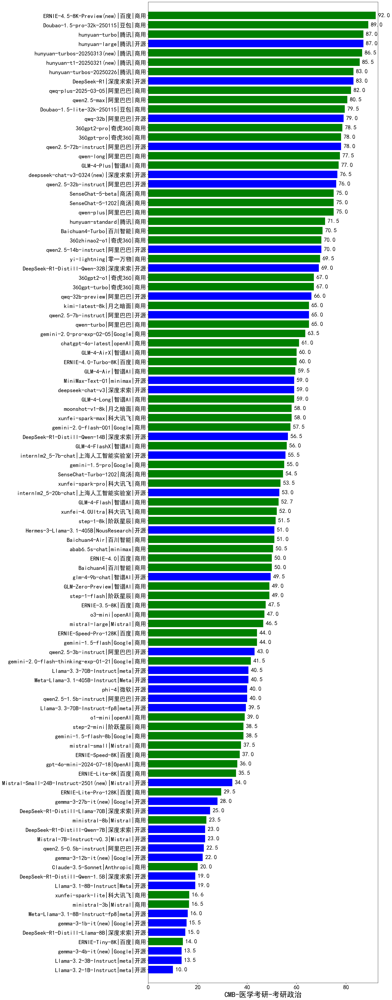

| 类别 | 大模型                         | CMB-医学考研-考研政治 | 排名 |
|-----|------------------------------|---------|----|
|商用|ERNIE-4.5-8K-Preview(new)|92.0|1|
|商用|Doubao-1.5-pro-32k-250115|89.0|2|
|开源|hunyuan-large|87.0|3|
|商用|hunyuan-turbo|87.0|4|
|商用|hunyuan-turbos-20250313(new)|86.5|5|
|商用|hunyuan-t1-20250321(new)|85.5|6|
|商用|hunyuan-turbos-20250226|83.0|7|
|开源|DeepSeek-R1|83.0|8|
|商用|qwq-plus-2025-03-05|82.0|9|
|商用|qwen2.5-max|80.5|10|
|商用|Doubao-1.5-lite-32k-250115|79.5|11|
|开源|qwq-32b|79.0|12|
|商用|360gpt2-pro|78.5|13|
|开源|qwen2.5-72b-instruct|78.0|14|
|商用|360gpt-pro|78.0|15|
|商用|qwen-long|77.5|16|
|商用|GLM-4-Plus|77.0|17|
|开源|deepseek-chat-v3-0324(new)|76.5|18|
|开源|qwen2.5-32b-instruct|76.0|19|
|商用|qwen-plus|75.0|20|
|商用|SenseChat-5-1202|75.0|21|
|商用|SenseChat-5-beta|75.0|22|
|商用|hunyuan-standard|71.5|23|
|商用|Baichuan4-Turbo|70.5|24|
|商用|360zhinao2-o1|70.0|25|
|开源|qwen2.5-14b-instruct|70.0|26|
|商用|yi-lightning|69.5|27|
|开源|DeepSeek-R1-Distill-Qwen-32B|69.0|28|
|商用|360gpt-turbo|67.0|29|
|商用|360gpt2-o1|67.0|30|
|开源|qwq-32b-preview|66.0|31|
|商用|kimi-latest-8k|65.0|32|
|商用|qwen-turbo|65.0|33|
|开源|qwen2.5-7b-instruct|65.0|34|
|商用|gemini-2.0-pro-exp-02-05|63.5|35|
|商用|chatgpt-4o-latest|61.0|36|
|商用|ERNIE-4.0-Turbo-8K|60.0|37|
|商用|GLM-4-AirX|60.0|38|
|商用|GLM-4-Air|59.5|39|
|开源|MiniMax-Text-01|59.0|40|
|商用|gemini-2.0-flash-exp|59.0|41|
|商用|abab7-chat-preview|59.0|42|
|商用|GLM-4-Long|59.0|43|
|开源|deepseek-chat-v3|59.0|44|
|商用|moonshot-v1-8k|58.0|45|
|商用|xunfei-spark-max|58.0|46|
|商用|gemini-2.0-flash-001|57.5|47|
|开源|DeepSeek-R1-Distill-Qwen-14B|56.5|48|
|商用|GLM-4-FlashX|56.0|49|
|开源|internlm2_5-7b-chat|55.5|50|
|商用|gemini-1.5-pro|55.0|51|
|商用|SenseChat-Turbo-1202|54.5|52|
|商用|xunfei-spark-pro|53.5|53|
|开源|internlm2_5-20b-chat|53.0|54|
|商用|GLM-4-Flash|52.7|55|
|商用|xunfei-4.0Ultra|52.0|56|
|商用|step-1-8k|51.5|57|
|商用|Baichuan4-Air|51.0|58|
|开源|Hermes-3-Llama-3.1-405B|51.0|59|
|商用|abab6.5s-chat|50.5|60|
|商用|Baichuan4|50.0|61|
|商用|ERNIE-4.0|50.0|62|
|开源|glm-4-9b-chat|49.5|63|
|商用|GLM-Zero-Preview|49.0|64|
|商用|step-1-flash|49.0|65|
|商用|ERNIE-3.5-8K|47.5|66|
|商用|o3-mini|47.0|67|
|商用|mistral-large|46.5|68|
|商用|ERNIE-Speed-Pro-128K|44.0|69|
|商用|gemini-1.5-flash|44.0|70|
|开源|qwen2.5-3b-instruct|43.0|71|
|商用|gemini-2.0-flash-thinking-exp-01-21|41.5|72|
|开源|Llama-3.3-70B-Instruct|40.5|73|
|开源|Meta-Llama-3.1-405B-Instruct|40.5|74|
|开源|qwen2.5-1.5b-instruct|40.0|75|
|开源|phi-4|40.0|76|
|开源|Llama-3.3-70B-Instruct-fp8|39.5|77|
|商用|o1-mini|39.0|78|
|商用|step-2-mini|38.5|79|
|商用|gemini-1.5-flash-8b|38.5|80|
|开源|Llama-3.1-Nemotron-70B-Instruct-fp8|38.0|81|
|商用|mistral-small|37.5|82|
|商用|ERNIE-Speed-8K|37.0|83|
|商用|gpt-4o-mini-2024-07-18|36.0|84|
|商用|ERNIE-Lite-8K|35.5|85|
|开源|Mistral-Small-24B-Instruct-2501(new)|34.0|86|
|商用|ERNIE-Lite-Pro-128K|29.5|87|
|开源|gemma-3-27b-it(new)|28.0|88|
|开源|DeepSeek-R1-Distill-Llama-70B|25.0|89|
|开源|gemma-2-27b-it|24.5|90|
|商用|ministral-8b|23.5|91|
|开源|Mistral-7B-Instruct-v0.3|23.0|92|
|开源|DeepSeek-R1-Distill-Qwen-7B|23.0|93|
|开源|qwen2.5-0.5b-instruct|22.5|94|
|开源|Mistral-Nemo-Instruct-2407|22.0|95|
|开源|gemma-3-12b-it(new)|22.0|96|
|开源|gemma-2-9b-it|21.0|97|
|商用|Claude-3.5-Sonnet|20.0|98|
|开源|DeepSeek-R1-Distill-Qwen-1.5B|19.0|99|
|开源|Llama-3.1-8B-Instruct|19.0|100|
|商用|xunfei-spark-lite|16.6|101|
|商用|ministral-3b|16.5|102|
|开源|Meta-Llama-3.1-8B-Instruct-fp8|16.0|103|
|开源|gemma-3-1b-it(new)|15.5|104|
|开源|DeepSeek-R1-Distill-Llama-8B|15.0|105|
|商用|ERNIE-Tiny-8K|14.0|106|
|开源|gemma-3-4b-it(new)|13.5|107|
|开源|Llama-3.2-3B-Instruct|13.5|108|
|开源|Llama-3.2-1B-Instruct|10.0|109|
|开源|qwen2.5-math-72b-instruct|/|110|

