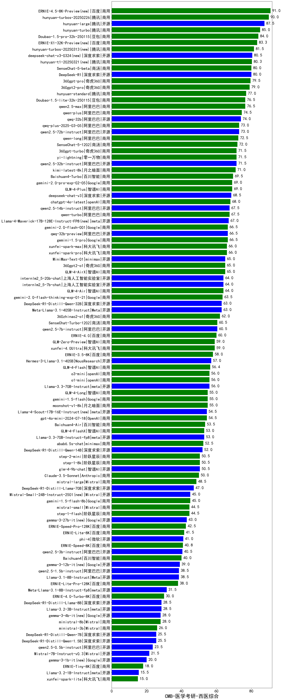

| 类别 | 大模型                         | CMB-医学考研-西医综合 | 排名 |
|-----|------------------------------|---------|----|
|商用|ERNIE-4.5-8K-Preview(new)|91.0|1|
|商用|hunyuan-turbos-20250226(new)|90.0|2|
|开源|hunyuan-large|87.5|3|
|商用|hunyuan-turbo|85.0|4|
|商用|Doubao-1.5-pro-32k-250115|84.0|5|
|商用|hunyuan-turbos-20250313(new)|81.5|6|
|商用|SenseChat-5-beta|80.0|7|
|开源|DeepSeek-R1|80.0|8|
|商用|360gpt-pro|79.5|9|
|商用|360gpt2-pro|79.0|10|
|商用|hunyuan-standard|77.0|11|
|商用|qwen2.5-max|76.5|12|
|商用|Doubao-1.5-lite-32k-250115|76.5|13|
|商用|qwen-plus|74.5|14|
|开源|qwq-32b(new)|74.0|15|
|开源|qwen2.5-72b-instruct|73.0|16|
|商用|qwq-plus-2025-03-05(new)|73.0|17|
|商用|qwen-long|72.5|18|
|商用|SenseChat-5-1202|72.0|19|
|商用|360gpt-turbo|71.5|20|
|开源|qwen2.5-32b-instruct|71.5|21|
|商用|yi-lightning|71.5|22|
|商用|kimi-latest-8k|71.0|23|
|商用|Baichuan4-Turbo|69.5|24|
|商用|GLM-4-Plus|69.0|25|
|商用|gemini-2.0-pro-exp-02-05|69.0|26|
|开源|deepseek-chat-v3|68.5|27|
|商用|chatgpt-4o-latest|68.0|28|
|商用|abab7-chat-preview|67.5|29|
|开源|qwen2.5-14b-instruct|67.5|30|
|商用|qwen-turbo|67.5|31|
|商用|gemini-1.5-pro|66.5|32|
|开源|qwq-32b-preview|66.5|33|
|商用|gemini-2.0-flash-001|66.5|34|
|商用|xunfei-spark-pro|66.0|35|
|商用|xunfei-spark-max|66.0|36|
|商用|gemini-2.0-flash-exp|66.0|37|
|商用|GLM-4-AirX|65.0|38|
|开源|MiniMax-Text-01|65.0|39|
|商用|360gpt2-o1|65.0|40|
|开源|internlm2_5-20b-chat|64.0|41|
|开源|internlm2_5-7b-chat|64.0|42|
|商用|GLM-4-Air|64.0|43|
|商用|gemini-2.0-flash-thinking-exp-01-21|63.5|44|
|开源|Meta-Llama-3.1-405B-Instruct|63.0|45|
|开源|DeepSeek-R1-Distill-Qwen-32B|63.0|46|
|商用|360zhinao2-o1|62.0|47|
|商用|SenseChat-Turbo-1202|60.5|48|
|开源|qwen2.5-7b-instruct|60.5|49|
|商用|ERNIE-4.0|60.0|50|
|商用|GLM-Zero-Preview|59.0|51|
|商用|xunfei-4.0Ultra|59.0|52|
|商用|ERNIE-3.5-8K|58.0|53|
|开源|Hermes-3-Llama-3.1-405B|57.0|54|
|商用|GLM-4-Flash|56.4|55|
|商用|o3-mini|56.0|56|
|商用|o1-mini|56.0|57|
|开源|Llama-3.3-70B-Instruct|56.0|58|
|开源|Llama-3.1-Nemotron-70B-Instruct-fp8|56.0|59|
|商用|moonshot-v1-8k|55.0|60|
|商用|gemini-1.5-flash|55.0|61|
|商用|GLM-4-Long|55.0|62|
|商用|gpt-4o-mini-2024-07-18|54.5|63|
|商用|Baichuan4-Air|53.5|64|
|开源|Llama-3.3-70B-Instruct-fp8|53.0|65|
|商用|GLM-4-FlashX|53.0|66|
|商用|abab6.5s-chat|52.5|67|
|开源|DeepSeek-R1-Distill-Qwen-14B|52.0|68|
|商用|step-1-8k|50.5|69|
|商用|step-2-mini(new)|50.5|70|
|开源|glm-4-9b-chat|50.5|71|
|商用|Claude-3.5-Sonnet|50.0|72|
|商用|mistral-large|48.5|73|
|开源|DeepSeek-R1-Distill-Llama-70B|47.0|74|
|开源|Mistral-Small-24B-Instruct-2501(new)|45.0|75|
|商用|gemini-1.5-flash-8b|45.0|76|
|商用|mistral-small|44.5|77|
|商用|step-1-flash|44.5|78|
|开源|gemma-2-27b-it|44.0|79|
|开源|gemma-3-27b-it(new)|43.0|80|
|商用|ERNIE-Speed-Pro-128K|42.5|81|
|商用|ERNIE-Lite-8K|41.5|82|
|开源|phi-4|41.0|83|
|商用|ERNIE-Speed-8K|40.8|84|
|开源|qwen2.5-3b-instruct|40.5|85|
|商用|Baichuan4|40.0|86|
|开源|gemma-2-9b-it|39.5|87|
|开源|gemma-3-12b-it(new)|39.0|88|
|开源|Llama-3.1-8B-Instruct|38.5|89|
|开源|qwen2.5-1.5b-instruct|38.5|90|
|商用|ERNIE-Lite-Pro-128K|38.0|91|
|开源|Meta-Llama-3.1-8B-Instruct-fp8|31.5|92|
|商用|ERNIE-4.0-Turbo-8K|30.0|93|
|开源|Mistral-Nemo-Instruct-2407|29.0|94|
|开源|DeepSeek-R1-Distill-Llama-8B|28.5|95|
|开源|Llama-3.2-3B-Instruct|28.5|96|
|开源|gemma-3-4b-it(new)|28.0|97|
|商用|ministral-8b|28.0|98|
|商用|ministral-3b|26.0|99|
|开源|DeepSeek-R1-Distill-Qwen-7B|25.5|100|
|开源|DeepSeek-R1-Distill-Qwen-1.5B|25.5|101|
|开源|qwen2.5-0.5b-instruct|23.5|102|
|开源|Mistral-7B-Instruct-v0.3|21.5|103|
|开源|gemma-3-1b-it(new)|20.0|104|
|商用|ERNIE-Tiny-8K|18.0|105|
|开源|Llama-3.2-1B-Instruct|15.5|106|
|商用|xunfei-spark-lite(new)|15.0|107|
|开源|qwen2.5-math-72b-instruct|/|108|

