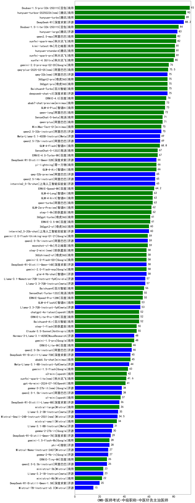

| 类别 | 大模型                         | CMB-医师考试-中级职称-中医针灸主治医师 | 排名 |
|-----|------------------------------|---------|----|
|商用|ERNIE-4.5-8K-Preview(new)|95.0|1|
|商用|Doubao-1.5-pro-32k-250115|93.0|2|
|商用|hunyuan-turbos-20250226(new)|90.0|3|
|商用|hunyuan-turbo|89.0|4|
|商用|hunyuan-turbos-20250313(new)|88.5|5|
|开源|DeepSeek-R1|88.2|6|
|商用|Doubao-1.5-lite-32k-250115|84.0|7|
|开源|hunyuan-large|83.0|8|
|商用|xunfei-spark-max|82.0|9|
|商用|qwen2.5-max|82.0|10|
|商用|hunyuan-standard|81.0|11|
|商用|xunfei-spark-pro|81.0|12|
|商用|kimi-latest-8k|81.0|13|
|商用|xunfei-4.0Ultra|80.0|14|
|商用|gemini-2.0-pro-exp-02-05|76.0|15|
|商用|qwq-plus-2025-03-05(new)|75.5|16|
|商用|Baichuan4-Turbo|75.0|17|
|商用|360gpt2-pro|75.0|18|
|商用|360gpt-pro|75.0|19|
|开源|qwq-32b(new)|75.0|20|
|开源|deepseek-chat-v3|75.0|21|
|商用|ERNIE-4.0|74.0|22|
|商用|abab7-chat-preview|73.0|23|
|商用|GLM-4-Plus|73.0|24|
|商用|qwen-long|72.0|25|
|商用|SenseChat-5-beta|71.0|26|
|商用|qwen-plus|71.0|27|
|开源|qwen2.5-32b-instruct|70.0|28|
|开源|MiniMax-Text-01|70.0|29|
|开源|Meta-Llama-3.1-405B-Instruct|69.0|30|
|开源|qwen2.5-72b-instruct|69.0|31|
|商用|GLM-4-Flash|68.8|32|
|商用|ERNIE-4.0-Turbo-8K|67.0|33|
|商用|SenseChat-5-1202|67.0|34|
|商用|GLM-4-Air|66.0|35|
|商用|yi-lightning|66.0|36|
|开源|DeepSeek-R1-Distill-Qwen-32B|66.0|37|
|开源|qwen2.5-14b-instruct|65.0|38|
|开源|qwq-32b-preview|65.0|39|
|开源|internlm2_5-7b-chat|65.0|40|
|商用|ERNIE-Speed-8K|64.2|41|
|商用|qwen-turbo|63.0|42|
|商用|GLM-4-AirX|63.0|43|
|商用|GLM-4-Long|63.0|44|
|商用|GLM-Zero-Preview|62.0|45|
|商用|step-1-8k|62.0|46|
|商用|360gpt-turbo|61.0|47|
|商用|ERNIE-3.5-8K|61.0|48|
|开源|internlm2_5-20b-chat|60.0|49|
|商用|360gpt2-o1|60.0|50|
|商用|gemini-2.0-flash-thinking-exp-01-21|59.0|51|
|商用|moonshot-v1-8k|59.0|52|
|开源|qwen2.5-7b-instruct|59.0|53|
|商用|gemini-2.0-flash-exp|58.0|54|
|开源|DeepSeek-R1-Distill-Qwen-14B|58.0|55|
|商用|step-2-mini(new)|58.0|56|
|商用|360zhinao2-o1|58.0|57|
|开源|glm-4-9b-chat|58.0|58|
|商用|gemini-2.0-flash-001|58.0|59|
|开源|Llama-3.3-70B-Instruct|57.0|60|
|开源|Llama-3.1-Nemotron-70B-Instruct-fp8|57.0|61|
|商用|Baichuan4|56.0|62|
|商用|SenseChat-Turbo-1202|55.0|63|
|商用|ERNIE-Speed-Pro-128K|55.0|64|
|商用|GLM-4-FlashX|53.0|65|
|开源|Llama-3.3-70B-Instruct-fp8|53.0|66|
|商用|Baichuan4-Air|52.0|67|
|商用|chatgpt-4o-latest|52.0|68|
|商用|ERNIE-Lite-Pro-128K|52.0|69|
|商用|step-1-flash|50.0|70|
|商用|Claude-3.5-Sonnet|50.0|71|
|商用|gemini-1.5-pro|48.0|72|
|开源|Hermes-3-Llama-3.1-405B|48.0|73|
|开源|qwen2.5-3b-instruct|46.0|74|
|商用|ERNIE-Lite-8K|46.0|75|
|商用|abab6.5s-chat|45.0|76|
|开源|DeepSeek-R1-Distill-Llama-70B|45.0|77|
|开源|Meta-Llama-3.1-8B-Instruct-fp8|44.0|78|
|商用|gemini-1.5-flash|43.0|79|
|商用|o3-mini|42.0|80|
|商用|xunfei-spark-lite(new)|41.6|81|
|商用|gpt-4o-mini-2024-07-18|41.0|82|
|开源|gemma-3-27b-it(new)|38.0|83|
|开源|qwen2.5-1.5b-instruct|38.0|84|
|商用|o1-mini|37.0|85|
|商用|mistral-large|36.0|86|
|开源|DeepSeek-R1-Distill-Llama-8B|36.0|87|
|开源|Llama-3.2-3B-Instruct|35.0|88|
|开源|Mistral-Small-24B-Instruct-2501(new)|34.5|89|
|商用|mistral-small|34.0|90|
|开源|gemma-3-12b-it(new)|32.5|91|
|开源|Llama-3.1-8B-Instruct|31.0|92|
|开源|gemma-2-27b-it|30.0|93|
|开源|DeepSeek-R1-Distill-Qwen-7B|29.0|94|
|商用|gemini-1.5-flash-8b|28.0|95|
|开源|phi-4|28.0|96|
|开源|gemma-2-9b-it|27.0|97|
|开源|Mistral-Nemo-Instruct-2407|27.0|98|
|商用|ERNIE-Tiny-8K|26.0|99|
|开源|qwen2.5-0.5b-instruct|26.0|100|
|开源|gemma-3-4b-it(new)|24.5|101|
|开源|Llama-3.2-1B-Instruct|23.0|102|
|商用|ministral-3b|23.0|103|
|商用|ministral-8b|22.0|104|
|开源|gemma-3-1b-it(new)|22.0|105|
|开源|DeepSeek-R1-Distill-Qwen-1.5B|20.0|106|
|开源|Mistral-7B-Instruct-v0.3|15.0|107|
|开源|qwen2.5-math-72b-instruct|/|108|

