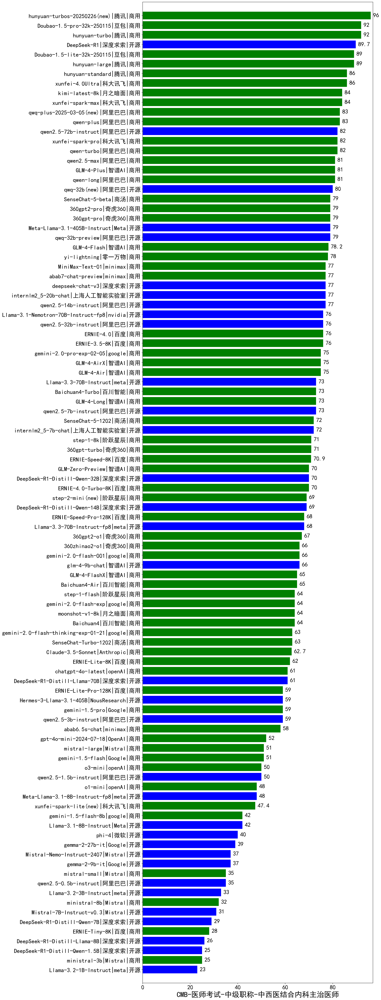

| 类别 | 大模型                         | CMB-医师考试-中级职称-中西医结合内科主治医师 | 排名 |
|-----|------------------------------|---------|----|
|商用|hunyuan-turbos-20250226(new)|96.0|1|
|商用|Doubao-1.5-pro-32k-250115|92.0|2|
|商用|hunyuan-turbo|92.0|3|
|开源|DeepSeek-R1|89.7|4|
|商用|hunyuan-large|89.0|5|
|商用|Doubao-1.5-lite-32k-250115|89.0|6|
|商用|xunfei-4.0Ultra|86.0|7|
|商用|hunyuan-standard|86.0|8|
|商用|xunfei-spark-max|84.0|9|
|商用|kimi-latest-8k|84.0|10|
|商用|qwen-plus|83.0|11|
|商用|qwq-plus-2025-03-05(new)|83.0|12|
|商用|qwen-turbo|82.0|13|
|开源|qwen2.5-72b-instruct|82.0|14|
|商用|xunfei-spark-pro|82.0|15|
|商用|qwen-long|81.0|16|
|商用|GLM-4-Plus|81.0|17|
|商用|qwen2.5-max|81.0|18|
|开源|qwq-32b(new)|80.0|19|
|开源|Meta-Llama-3.1-405B-Instruct|79.0|20|
|商用|SenseChat-5-beta|79.0|21|
|商用|360gpt2-pro|79.0|22|
|商用|360gpt-pro|79.0|23|
|开源|qwq-32b-preview|79.0|24|
|商用|GLM-4-Flash|78.2|25|
|商用|yi-lightning|78.0|26|
|商用|abab7-chat-preview|77.0|27|
|商用|MiniMax-Text-01|77.0|28|
|开源|deepseek-chat-v3|77.0|29|
|开源|internlm2_5-20b-chat|77.0|30|
|开源|qwen2.5-14b-instruct|77.0|31|
|开源|qwen2.5-32b-instruct|76.0|32|
|开源|Llama-3.1-Nemotron-70B-Instruct-fp8|76.0|33|
|商用|ERNIE-4.0|76.0|34|
|商用|ERNIE-3.5-8K|76.0|35|
|商用|gemini-2.0-pro-exp-02-05|75.0|36|
|商用|GLM-4-Air|75.0|37|
|商用|GLM-4-AirX|75.0|38|
|开源|qwen2.5-7b-instruct|73.0|39|
|商用|GLM-4-Long|73.0|40|
|开源|Llama-3.3-70B-Instruct|73.0|41|
|商用|Baichuan4-Turbo|73.0|42|
|开源|internlm2_5-7b-chat|72.0|43|
|商用|SenseChat-5-1202|72.0|44|
|商用|360gpt-turbo|71.0|45|
|商用|step-1-8k|71.0|46|
|商用|ERNIE-Speed-8K|70.9|47|
|商用|GLM-Zero-Preview|70.0|48|
|开源|DeepSeek-R1-Distill-Qwen-32B|70.0|49|
|商用|ERNIE-4.0-Turbo-8K|70.0|50|
|开源|DeepSeek-R1-Distill-Qwen-14B|69.0|51|
|商用|step-2-mini(new)|69.0|52|
|开源|Llama-3.3-70B-Instruct-fp8|68.0|53|
|商用|ERNIE-Speed-Pro-128K|68.0|54|
|商用|360gpt2-o1|67.0|55|
|商用|360zhinao2-o1|66.0|56|
|开源|glm-4-9b-chat|66.0|57|
|商用|gemini-2.0-flash-001|66.0|58|
|商用|GLM-4-FlashX|65.0|59|
|商用|Baichuan4-Air|65.0|60|
|商用|step-1-flash|64.0|61|
|商用|moonshot-v1-8k|64.0|62|
|商用|gemini-2.0-flash-exp|64.0|63|
|商用|Baichuan4|64.0|64|
|商用|SenseChat-Turbo-1202|63.0|65|
|商用|gemini-2.0-flash-thinking-exp-01-21|63.0|66|
|商用|Claude-3.5-Sonnet|62.7|67|
|商用|ERNIE-Lite-8K|62.0|68|
|商用|chatgpt-4o-latest|61.0|69|
|开源|DeepSeek-R1-Distill-Llama-70B|61.0|70|
|开源|Hermes-3-Llama-3.1-405B|59.0|71|
|开源|qwen2.5-3b-instruct|59.0|72|
|商用|gemini-1.5-pro|59.0|73|
|商用|ERNIE-Lite-Pro-128K|59.0|74|
|商用|abab6.5s-chat|58.0|75|
|商用|gpt-4o-mini-2024-07-18|52.0|76|
|商用|mistral-large|51.0|77|
|商用|gemini-1.5-flash|51.0|78|
|开源|qwen2.5-1.5b-instruct|50.0|79|
|商用|o3-mini|50.0|80|
|开源|Meta-Llama-3.1-8B-Instruct-fp8|48.0|81|
|商用|o1-mini|48.0|82|
|商用|xunfei-spark-lite(new)|47.4|83|
|开源|Mistral-Small-24B-Instruct-2501(new)|43.5|84|
|开源|gemma-3-27b-it(new)|42.5|85|
|开源|Llama-3.1-8B-Instruct|42.0|86|
|商用|gemini-1.5-flash-8b|42.0|87|
|开源|phi-4|40.0|88|
|开源|gemma-2-27b-it|39.0|89|
|开源|Mistral-Nemo-Instruct-2407|37.0|90|
|开源|gemma-2-9b-it|37.0|91|
|开源|qwen2.5-0.5b-instruct|35.0|92|
|商用|mistral-small|35.0|93|
|开源|Llama-3.2-3B-Instruct|33.0|94|
|商用|ministral-8b|32.0|95|
|开源|Mistral-7B-Instruct-v0.3|31.0|96|
|开源|DeepSeek-R1-Distill-Qwen-7B|29.0|97|
|商用|ERNIE-Tiny-8K|28.0|98|
|开源|DeepSeek-R1-Distill-Llama-8B|26.0|99|
|商用|ministral-3b|25.0|100|
|开源|DeepSeek-R1-Distill-Qwen-1.5B|25.0|101|
|开源|Llama-3.2-1B-Instruct|23.0|102|
|开源|Yi-1.5-34B-Chat|/|103|
|开源|Yi-1.5-9B-Chat|/|104|
|开源|qwen2.5-math-72b-instruct|/|105|

