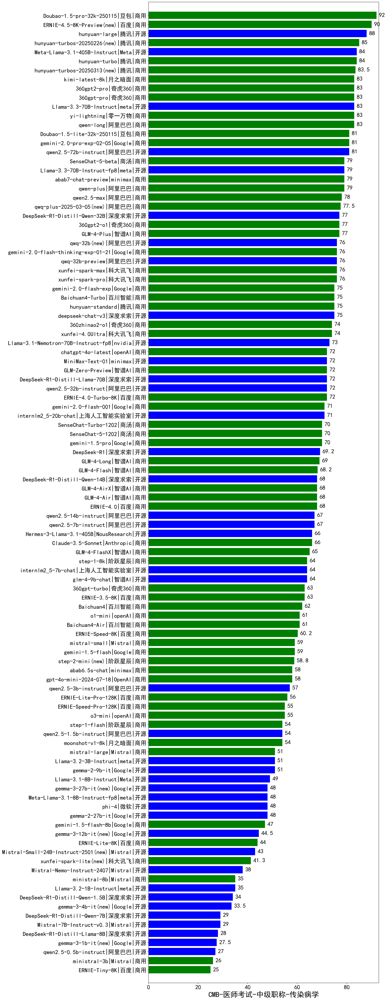

| 类别 | 大模型                         | CMB-医师考试-中级职称-传染病学 | 排名 |
|-----|------------------------------|---------|----|
|商用|Doubao-1.5-pro-32k-250115|92.0|1|
|开源|hunyuan-large|88.0|2|
|商用|hunyuan-turbos-20250226(new)|85.0|3|
|商用|hunyuan-turbo|84.0|4|
|开源|Meta-Llama-3.1-405B-Instruct|84.0|5|
|开源|Llama-3.3-70B-Instruct|83.0|6|
|商用|yi-lightning|83.0|7|
|商用|qwen-long|83.0|8|
|商用|360gpt2-pro|83.0|9|
|商用|kimi-latest-8k|83.0|10|
|商用|360gpt-pro|83.0|11|
|商用|gemini-2.0-pro-exp-02-05|81.0|12|
|开源|qwen2.5-72b-instruct|81.0|13|
|商用|Doubao-1.5-lite-32k-250115|81.0|14|
|商用|qwen-plus|79.0|15|
|开源|Llama-3.3-70B-Instruct-fp8|79.0|16|
|商用|SenseChat-5-beta|79.0|17|
|商用|abab7-chat-preview|79.0|18|
|商用|qwen2.5-max|78.0|19|
|商用|qwq-plus-2025-03-05(new)|77.5|20|
|商用|360gpt2-o1|77.0|21|
|商用|GLM-4-Plus|77.0|22|
|开源|DeepSeek-R1-Distill-Qwen-32B|77.0|23|
|商用|xunfei-spark-pro|76.0|24|
|商用|gemini-2.0-flash-thinking-exp-01-21|76.0|25|
|开源|qwq-32b-preview|76.0|26|
|商用|xunfei-spark-max|76.0|27|
|开源|qwq-32b(new)|76.0|28|
|开源|deepseek-chat-v3|75.0|29|
|商用|Baichuan4-Turbo|75.0|30|
|商用|gemini-2.0-flash-exp|75.0|31|
|商用|hunyuan-standard|75.0|32|
|商用|xunfei-4.0Ultra|74.0|33|
|商用|360zhinao2-o1|74.0|34|
|开源|Llama-3.1-Nemotron-70B-Instruct-fp8|73.0|35|
|商用|MiniMax-Text-01|72.0|36|
|商用|chatgpt-4o-latest|72.0|37|
|开源|qwen2.5-32b-instruct|72.0|38|
|商用|ERNIE-4.0-Turbo-8K|72.0|39|
|开源|DeepSeek-R1-Distill-Llama-70B|72.0|40|
|商用|GLM-Zero-Preview|72.0|41|
|商用|gemini-2.0-flash-001|71.0|42|
|开源|internlm2_5-20b-chat|71.0|43|
|商用|gemini-1.5-pro|70.0|44|
|商用|SenseChat-5-1202|70.0|45|
|商用|SenseChat-Turbo-1202|70.0|46|
|开源|DeepSeek-R1|69.2|47|
|商用|GLM-4-Long|69.0|48|
|商用|GLM-4-Flash|68.2|49|
|商用|GLM-4-AirX|68.0|50|
|商用|ERNIE-4.0|68.0|51|
|开源|DeepSeek-R1-Distill-Qwen-14B|68.0|52|
|商用|GLM-4-Air|68.0|53|
|开源|qwen2.5-14b-instruct|67.0|54|
|开源|qwen2.5-7b-instruct|67.0|55|
|商用|Claude-3.5-Sonnet|66.0|56|
|开源|Hermes-3-Llama-3.1-405B|66.0|57|
|商用|GLM-4-FlashX|65.0|58|
|开源|glm-4-9b-chat|64.0|59|
|商用|step-1-8k|64.0|60|
|开源|internlm2_5-7b-chat|64.0|61|
|商用|ERNIE-3.5-8K|63.0|62|
|商用|360gpt-turbo|63.0|63|
|商用|Baichuan4|62.0|64|
|商用|o1-mini|61.0|65|
|商用|Baichuan4-Air|61.0|66|
|商用|ERNIE-Speed-8K|60.2|67|
|商用|mistral-small|59.0|68|
|商用|gemini-1.5-flash|59.0|69|
|商用|step-2-mini(new)|58.8|70|
|商用|gpt-4o-mini-2024-07-18|58.0|71|
|商用|abab6.5s-chat|58.0|72|
|开源|qwen2.5-3b-instruct|57.0|73|
|商用|ERNIE-Lite-Pro-128K|56.0|74|
|商用|o3-mini|55.0|75|
|商用|ERNIE-Speed-Pro-128K|55.0|76|
|商用|step-1-flash|54.0|77|
|商用|moonshot-v1-8k|54.0|78|
|开源|qwen2.5-1.5b-instruct|54.0|79|
|开源|Llama-3.2-3B-Instruct|51.0|80|
|开源|gemma-2-9b-it|51.0|81|
|商用|mistral-large|51.0|82|
|开源|Llama-3.1-8B-Instruct|49.0|83|
|开源|phi-4|48.0|84|
|开源|gemma-2-27b-it|48.0|85|
|开源|Meta-Llama-3.1-8B-Instruct-fp8|48.0|86|
|开源|gemma-3-27b-it(new)|48.0|87|
|商用|gemini-1.5-flash-8b|47.0|88|
|商用|ERNIE-Lite-8K|44.0|89|
|开源|Mistral-Small-24B-Instruct-2501(new)|43.0|90|
|商用|xunfei-spark-lite(new)|41.3|91|
|开源|Mistral-Nemo-Instruct-2407|38.0|92|
|商用|ministral-8b|35.0|93|
|开源|Llama-3.2-1B-Instruct|35.0|94|
|开源|DeepSeek-R1-Distill-Qwen-1.5B|34.0|95|
|开源|DeepSeek-R1-Distill-Qwen-7B|29.0|96|
|开源|Mistral-7B-Instruct-v0.3|29.0|97|
|开源|DeepSeek-R1-Distill-Llama-8B|28.0|98|
|开源|qwen2.5-0.5b-instruct|27.0|99|
|商用|ministral-3b|26.0|100|
|商用|ERNIE-Tiny-8K|25.0|101|
|开源|Yi-1.5-9B-Chat|/|102|
|商用|qwen-turbo|/|103|
|开源|Yi-1.5-34B-Chat|/|104|
|开源|qwen2.5-math-72b-instruct|/|105|

