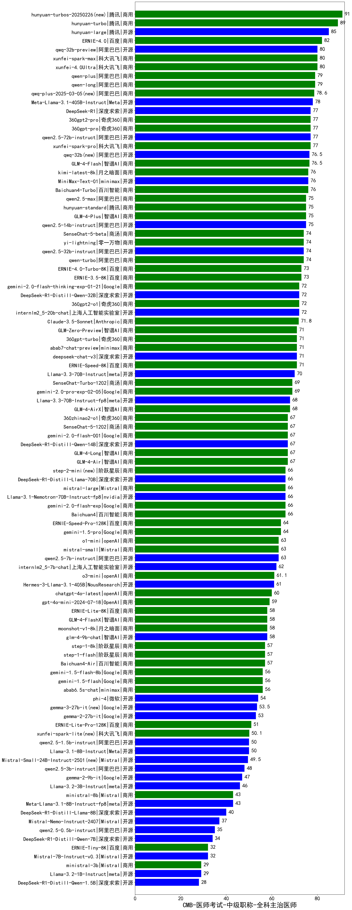

| 类别 | 大模型                         | CMB-医师考试-中级职称-全科主治医师 | 排名 |
|-----|------------------------------|---------|----|
|商用|hunyuan-turbos-20250226(new)|91.0|1|
|商用|hunyuan-turbo|89.0|2|
|开源|hunyuan-large|85.0|3|
|商用|ERNIE-4.0|82.0|4|
|商用|xunfei-4.0Ultra|80.0|5|
|开源|qwq-32b-preview|80.0|6|
|商用|xunfei-spark-max|80.0|7|
|商用|qwen-plus|79.0|8|
|商用|qwen-long|79.0|9|
|商用|qwq-plus-2025-03-05(new)|78.6|10|
|开源|Meta-Llama-3.1-405B-Instruct|78.0|11|
|开源|DeepSeek-R1|77.0|12|
|商用|360gpt-pro|77.0|13|
|开源|qwen2.5-72b-instruct|77.0|14|
|商用|360gpt2-pro|77.0|15|
|商用|xunfei-spark-pro|77.0|16|
|商用|GLM-4-Flash|76.5|17|
|开源|qwq-32b(new)|76.5|18|
|开源|MiniMax-Text-01|76.0|19|
|商用|kimi-latest-8k|76.0|20|
|商用|Baichuan4-Turbo|76.0|21|
|商用|qwen2.5-max|75.0|22|
|开源|qwen2.5-14b-instruct|75.0|23|
|商用|GLM-4-Plus|75.0|24|
|商用|hunyuan-standard|75.0|25|
|开源|qwen2.5-32b-instruct|74.0|26|
|商用|yi-lightning|74.0|27|
|商用|qwen-turbo|74.0|28|
|商用|SenseChat-5-beta|74.0|29|
|商用|ERNIE-4.0-Turbo-8K|73.0|30|
|商用|ERNIE-3.5-8K|73.0|31|
|商用|360gpt2-o1|72.0|32|
|商用|gemini-2.0-flash-thinking-exp-01-21|72.0|33|
|开源|DeepSeek-R1-Distill-Qwen-32B|72.0|34|
|开源|internlm2_5-20b-chat|72.0|35|
|商用|Claude-3.5-Sonnet|71.8|36|
|商用|ERNIE-Speed-8K|71.0|37|
|商用|abab7-chat-preview|71.0|38|
|商用|360gpt-turbo|71.0|39|
|商用|GLM-Zero-Preview|71.0|40|
|开源|deepseek-chat-v3|71.0|41|
|开源|Llama-3.3-70B-Instruct|70.0|42|
|商用|SenseChat-Turbo-1202|69.0|43|
|商用|gemini-2.0-pro-exp-02-05|69.0|44|
|商用|GLM-4-AirX|68.0|45|
|开源|Llama-3.3-70B-Instruct-fp8|68.0|46|
|商用|GLM-4-Air|67.0|47|
|商用|GLM-4-Long|67.0|48|
|商用|SenseChat-5-1202|67.0|49|
|开源|DeepSeek-R1-Distill-Qwen-14B|67.0|50|
|商用|gemini-2.0-flash-001|67.0|51|
|商用|360zhinao2-o1|67.0|52|
|商用|gemini-2.0-flash-exp|66.0|53|
|商用|mistral-large|66.0|54|
|开源|DeepSeek-R1-Distill-Llama-70B|66.0|55|
|商用|step-2-mini(new)|66.0|56|
|商用|Baichuan4|66.0|57|
|开源|Llama-3.1-Nemotron-70B-Instruct-fp8|66.0|58|
|商用|ERNIE-Speed-Pro-128K|64.0|59|
|商用|gemini-1.5-pro|64.0|60|
|商用|o1-mini|63.0|61|
|商用|mistral-small|63.0|62|
|开源|qwen2.5-7b-instruct|63.0|63|
|开源|internlm2_5-7b-chat|62.0|64|
|商用|o3-mini|61.1|65|
|开源|Hermes-3-Llama-3.1-405B|61.0|66|
|商用|chatgpt-4o-latest|60.0|67|
|商用|gpt-4o-mini-2024-07-18|59.0|68|
|商用|moonshot-v1-8k|58.0|69|
|商用|GLM-4-FlashX|58.0|70|
|开源|glm-4-9b-chat|58.0|71|
|商用|ERNIE-Lite-8K|58.0|72|
|商用|step-1-flash|57.0|73|
|商用|Baichuan4-Air|57.0|74|
|商用|step-1-8k|57.0|75|
|商用|abab6.5s-chat|56.0|76|
|商用|gemini-1.5-flash-8b|56.0|77|
|商用|gemini-1.5-flash|56.0|78|
|开源|phi-4|54.0|79|
|开源|gemma-3-27b-it(new)|53.5|80|
|开源|gemma-2-27b-it|53.0|81|
|商用|ERNIE-Lite-Pro-128K|51.0|82|
|商用|xunfei-spark-lite(new)|50.1|83|
|开源|Llama-3.1-8B-Instruct|50.0|84|
|开源|qwen2.5-1.5b-instruct|50.0|85|
|开源|Mistral-Small-24B-Instruct-2501(new)|49.5|86|
|开源|qwen2.5-3b-instruct|48.0|87|
|开源|gemma-2-9b-it|47.0|88|
|开源|Llama-3.2-3B-Instruct|46.0|89|
|开源|Meta-Llama-3.1-8B-Instruct-fp8|43.0|90|
|商用|ministral-8b|43.0|91|
|开源|DeepSeek-R1-Distill-Llama-8B|40.0|92|
|开源|Mistral-Nemo-Instruct-2407|37.0|93|
|开源|qwen2.5-0.5b-instruct|35.0|94|
|开源|DeepSeek-R1-Distill-Qwen-7B|34.0|95|
|开源|Mistral-7B-Instruct-v0.3|32.0|96|
|商用|ERNIE-Tiny-8K|32.0|97|
|开源|Llama-3.2-1B-Instruct|29.0|98|
|商用|ministral-3b|29.0|99|
|开源|DeepSeek-R1-Distill-Qwen-1.5B|28.0|100|
|开源|Yi-1.5-34B-Chat|/|101|
|开源|Yi-1.5-9B-Chat|/|102|
|开源|qwen2.5-math-72b-instruct|/|103|
|商用|Doubao-1.5-lite-32k-250115|/|104|
|商用|Doubao-1.5-pro-32k-250115|/|105|

