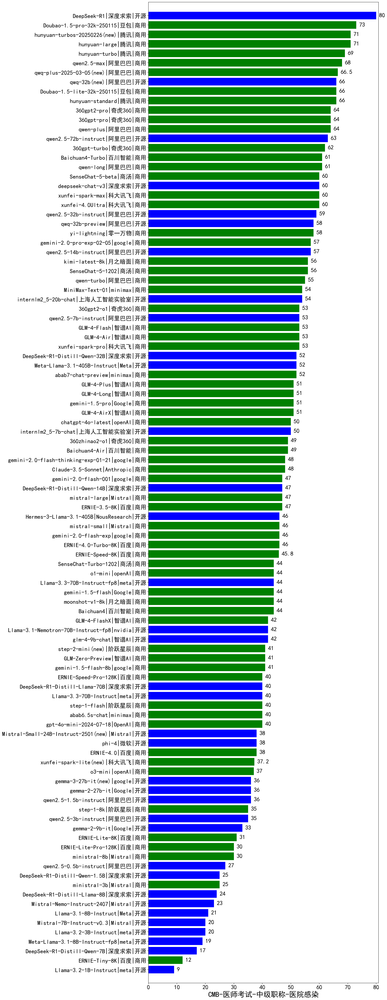

| 类别 | 大模型                         | CMB-医师考试-中级职称-医院感染 | 排名 |
|-----|------------------------------|---------|----|
|开源|DeepSeek-R1|80.0|1|
|商用|Doubao-1.5-pro-32k-250115|73.0|2|
|商用|hunyuan-turbos-20250226(new)|71.0|3|
|商用|hunyuan-large|71.0|4|
|商用|hunyuan-turbo|69.0|5|
|商用|qwen2.5-max|68.0|6|
|商用|qwq-plus-2025-03-05(new)|66.5|7|
|商用|Doubao-1.5-lite-32k-250115|66.0|8|
|商用|hunyuan-standard|66.0|9|
|开源|qwq-32b(new)|66.0|10|
|商用|360gpt-pro|64.0|11|
|商用|qwen-plus|64.0|12|
|商用|360gpt2-pro|64.0|13|
|开源|qwen2.5-72b-instruct|63.0|14|
|商用|360gpt-turbo|62.0|15|
|商用|qwen-long|61.0|16|
|商用|Baichuan4-Turbo|61.0|17|
|商用|SenseChat-5-beta|60.0|18|
|开源|deepseek-chat-v3|60.0|19|
|商用|xunfei-4.0Ultra|60.0|20|
|商用|xunfei-spark-max|60.0|21|
|开源|qwen2.5-32b-instruct|59.0|22|
|商用|yi-lightning|58.0|23|
|开源|qwq-32b-preview|58.0|24|
|开源|qwen2.5-14b-instruct|57.0|25|
|商用|gemini-2.0-pro-exp-02-05|57.0|26|
|商用|kimi-latest-8k|56.0|27|
|商用|SenseChat-5-1202|56.0|28|
|商用|qwen-turbo|55.0|29|
|开源|internlm2_5-20b-chat|54.0|30|
|商用|MiniMax-Text-01|54.0|31|
|商用|GLM-4-Flash|53.0|32|
|商用|GLM-4-Air|53.0|33|
|开源|qwen2.5-7b-instruct|53.0|34|
|商用|xunfei-spark-pro|53.0|35|
|商用|360gpt2-o1|53.0|36|
|商用|abab7-chat-preview|52.0|37|
|开源|DeepSeek-R1-Distill-Qwen-32B|52.0|38|
|开源|Meta-Llama-3.1-405B-Instruct|52.0|39|
|商用|gemini-1.5-pro|51.0|40|
|商用|GLM-4-Long|51.0|41|
|商用|GLM-4-Plus|51.0|42|
|商用|GLM-4-AirX|51.0|43|
|商用|chatgpt-4o-latest|50.0|44|
|开源|internlm2_5-7b-chat|50.0|45|
|商用|Baichuan4-Air|49.0|46|
|商用|360zhinao2-o1|49.0|47|
|商用|Claude-3.5-Sonnet|48.0|48|
|商用|gemini-2.0-flash-thinking-exp-01-21|48.0|49|
|商用|ERNIE-3.5-8K|47.0|50|
|商用|mistral-large|47.0|51|
|商用|gemini-2.0-flash-001|47.0|52|
|开源|DeepSeek-R1-Distill-Qwen-14B|47.0|53|
|开源|Hermes-3-Llama-3.1-405B|46.0|54|
|商用|mistral-small|46.0|55|
|商用|gemini-2.0-flash-exp|46.0|56|
|商用|ERNIE-4.0-Turbo-8K|46.0|57|
|商用|ERNIE-Speed-8K|45.8|58|
|商用|SenseChat-Turbo-1202|44.0|59|
|商用|o1-mini|44.0|60|
|商用|Baichuan4|44.0|61|
|商用|moonshot-v1-8k|44.0|62|
|商用|gemini-1.5-flash|44.0|63|
|开源|Llama-3.3-70B-Instruct-fp8|44.0|64|
|商用|GLM-4-FlashX|42.0|65|
|开源|glm-4-9b-chat|42.0|66|
|开源|Llama-3.1-Nemotron-70B-Instruct-fp8|42.0|67|
|商用|gemini-1.5-flash-8b|41.0|68|
|商用|step-2-mini(new)|41.0|69|
|商用|GLM-Zero-Preview|41.0|70|
|商用|gpt-4o-mini-2024-07-18|40.0|71|
|商用|abab6.5s-chat|40.0|72|
|商用|ERNIE-Speed-Pro-128K|40.0|73|
|开源|DeepSeek-R1-Distill-Llama-70B|40.0|74|
|商用|step-1-flash|40.0|75|
|开源|Llama-3.3-70B-Instruct|40.0|76|
|开源|Mistral-Small-24B-Instruct-2501(new)|38.0|77|
|开源|phi-4|38.0|78|
|商用|ERNIE-4.0|38.0|79|
|商用|xunfei-spark-lite(new)|37.2|80|
|商用|o3-mini|37.0|81|
|开源|gemma-3-27b-it(new)|36.0|82|
|开源|gemma-2-27b-it|36.0|83|
|开源|qwen2.5-1.5b-instruct|36.0|84|
|商用|step-1-8k|35.0|85|
|开源|qwen2.5-3b-instruct|35.0|86|
|开源|gemma-2-9b-it|33.0|87|
|商用|ERNIE-Lite-8K|31.0|88|
|商用|ministral-8b|30.0|89|
|商用|ERNIE-Lite-Pro-128K|30.0|90|
|开源|qwen2.5-0.5b-instruct|27.0|91|
|商用|ministral-3b|25.0|92|
|开源|DeepSeek-R1-Distill-Qwen-1.5B|25.0|93|
|开源|DeepSeek-R1-Distill-Llama-8B|24.0|94|
|开源|Mistral-Nemo-Instruct-2407|23.0|95|
|开源|Llama-3.1-8B-Instruct|21.0|96|
|开源|Mistral-7B-Instruct-v0.3|20.0|97|
|开源|Llama-3.2-3B-Instruct|20.0|98|
|开源|Meta-Llama-3.1-8B-Instruct-fp8|19.0|99|
|开源|DeepSeek-R1-Distill-Qwen-7B|17.0|100|
|商用|ERNIE-Tiny-8K|12.0|101|
|开源|Llama-3.2-1B-Instruct|9.0|102|
|开源|Yi-1.5-34B-Chat|/|103|
|开源|Yi-1.5-9B-Chat|/|104|
|开源|qwen2.5-math-72b-instruct|/|105|

