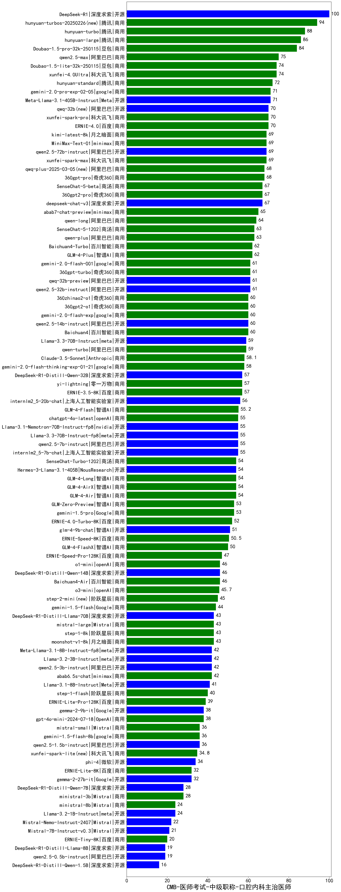

| 类别 | 大模型                         | CMB-医师考试-中级职称-口腔内科主治医师 | 排名 |
|-----|------------------------------|---------|----|
|开源|DeepSeek-R1|100.0|1|
|商用|hunyuan-turbos-20250226(new)|94.0|2|
|商用|hunyuan-turbo|88.0|3|
|开源|hunyuan-large|86.0|4|
|商用|Doubao-1.5-pro-32k-250115|84.0|5|
|商用|qwen2.5-max|75.0|6|
|商用|xunfei-4.0Ultra|74.0|7|
|商用|Doubao-1.5-lite-32k-250115|74.0|8|
|商用|hunyuan-standard|72.0|9|
|开源|Meta-Llama-3.1-405B-Instruct|71.0|10|
|商用|gemini-2.0-pro-exp-02-05|71.0|11|
|开源|qwq-32b(new)|70.0|12|
|商用|xunfei-spark-pro|70.0|13|
|商用|ERNIE-4.0|70.0|14|
|开源|qwen2.5-72b-instruct|69.0|15|
|商用|kimi-latest-8k|69.0|16|
|商用|MiniMax-Text-01|69.0|17|
|商用|xunfei-spark-max|69.0|18|
|商用|qwq-plus-2025-03-05(new)|68.0|19|
|商用|360gpt-pro|68.0|20|
|商用|360gpt2-pro|67.0|21|
|商用|SenseChat-5-beta|67.0|22|
|开源|deepseek-chat-v3|67.0|23|
|商用|abab7-chat-preview|65.0|24|
|商用|qwen-long|64.0|25|
|商用|qwen-plus|63.0|26|
|商用|SenseChat-5-1202|63.0|27|
|商用|Baichuan4-Turbo|62.0|28|
|商用|GLM-4-Plus|62.0|29|
|开源|qwen2.5-32b-instruct|61.0|30|
|商用|gemini-2.0-flash-001|61.0|31|
|商用|360gpt-turbo|61.0|32|
|开源|qwq-32b-preview|61.0|33|
|商用|360zhinao2-o1|60.0|34|
|开源|qwen2.5-14b-instruct|60.0|35|
|商用|360gpt2-o1|60.0|36|
|商用|gemini-2.0-flash-exp|60.0|37|
|商用|Baichuan4|60.0|38|
|开源|Llama-3.3-70B-Instruct|59.0|39|
|商用|qwen-turbo|59.0|40|
|商用|Claude-3.5-Sonnet|58.1|41|
|商用|gemini-2.0-flash-thinking-exp-01-21|58.0|42|
|开源|DeepSeek-R1-Distill-Qwen-32B|57.0|43|
|商用|ERNIE-3.5-8K|57.0|44|
|商用|yi-lightning|57.0|45|
|开源|internlm2_5-20b-chat|56.0|46|
|商用|GLM-4-Flash|55.2|47|
|开源|internlm2_5-7b-chat|55.0|48|
|开源|qwen2.5-7b-instruct|55.0|49|
|商用|chatgpt-4o-latest|55.0|50|
|开源|Llama-3.1-Nemotron-70B-Instruct-fp8|55.0|51|
|开源|Llama-3.3-70B-Instruct-fp8|55.0|52|
|商用|GLM-4-Long|54.0|53|
|商用|GLM-4-AirX|54.0|54|
|开源|Hermes-3-Llama-3.1-405B|54.0|55|
|商用|SenseChat-Turbo-1202|54.0|56|
|商用|GLM-4-Air|54.0|57|
|商用|gemini-1.5-pro|53.0|58|
|商用|GLM-Zero-Preview|53.0|59|
|商用|ERNIE-4.0-Turbo-8K|52.0|60|
|开源|glm-4-9b-chat|51.0|61|
|商用|ERNIE-Speed-8K|50.5|62|
|商用|GLM-4-FlashX|50.0|63|
|商用|ERNIE-Speed-Pro-128K|47.0|64|
|商用|Baichuan4-Air|46.0|65|
|开源|DeepSeek-R1-Distill-Qwen-14B|46.0|66|
|商用|o1-mini|46.0|67|
|商用|o3-mini|45.7|68|
|商用|step-2-mini(new)|45.0|69|
|商用|gemini-1.5-flash|44.0|70|
|商用|moonshot-v1-8k|43.0|71|
|商用|mistral-large|43.0|72|
|商用|step-1-8k|43.0|73|
|开源|DeepSeek-R1-Distill-Llama-70B|43.0|74|
|商用|abab6.5s-chat|42.0|75|
|开源|Llama-3.2-3B-Instruct|42.0|76|
|开源|Meta-Llama-3.1-8B-Instruct-fp8|42.0|77|
|开源|qwen2.5-3b-instruct|42.0|78|
|开源|Llama-3.1-8B-Instruct|41.0|79|
|商用|step-1-flash|40.0|80|
|商用|ERNIE-Lite-Pro-128K|39.0|81|
|开源|gemma-3-27b-it(new)|38.5|82|
|商用|gpt-4o-mini-2024-07-18|38.0|83|
|开源|gemma-2-9b-it|38.0|84|
|开源|qwen2.5-1.5b-instruct|36.0|85|
|商用|mistral-small|36.0|86|
|商用|gemini-1.5-flash-8b|36.0|87|
|开源|Mistral-Small-24B-Instruct-2501(new)|35.5|88|
|商用|xunfei-spark-lite(new)|34.8|89|
|开源|phi-4|34.0|90|
|商用|ERNIE-Lite-8K|32.0|91|
|开源|gemma-2-27b-it|32.0|92|
|商用|ministral-3b|28.0|93|
|开源|DeepSeek-R1-Distill-Qwen-7B|28.0|94|
|商用|ministral-8b|24.0|95|
|开源|Llama-3.2-1B-Instruct|24.0|96|
|开源|Mistral-Nemo-Instruct-2407|22.0|97|
|开源|Mistral-7B-Instruct-v0.3|21.0|98|
|商用|ERNIE-Tiny-8K|20.0|99|
|开源|qwen2.5-0.5b-instruct|19.0|100|
|开源|DeepSeek-R1-Distill-Llama-8B|19.0|101|
|开源|DeepSeek-R1-Distill-Qwen-1.5B|16.0|102|
|开源|Yi-1.5-34B-Chat|/|103|
|开源|Yi-1.5-9B-Chat|/|104|
|开源|qwen2.5-math-72b-instruct|/|105|

