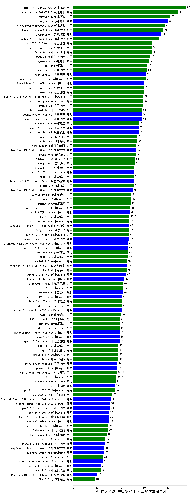

| 类别 | 大模型                         | CMB-医师考试-中级职称-口腔正畸学主治医师 | 排名 |
|-----|------------------------------|---------|----|
|商用|hunyuan-turbos-20250226(new)|88.0|1|
|商用|hunyuan-turbo|82.0|2|
|开源|hunyuan-large|80.0|3|
|商用|Doubao-1.5-pro-32k-250115|76.0|4|
|开源|DeepSeek-R1|74.0|5|
|商用|Doubao-1.5-lite-32k-250115|72.0|6|
|商用|xunfei-spark-max|66.0|7|
|商用|xunfei-4.0Ultra|66.0|8|
|商用|qwq-plus-2025-03-05(new)|66.0|9|
|商用|qwen2.5-max|65.0|10|
|商用|hunyuan-standard|64.0|11|
|商用|ERNIE-4.0|62.0|12|
|商用|qwen-turbo|62.0|13|
|开源|qwq-32b(new)|61.0|14|
|商用|gemini-2.0-pro-exp-02-05|61.0|15|
|商用|qwen-long|60.0|16|
|开源|Meta-Llama-3.1-405B-Instruct|60.0|17|
|商用|xunfei-spark-pro|60.0|18|
|商用|qwen-plus|59.0|19|
|商用|gemini-2.0-flash-thinking-exp-01-21|59.0|20|
|商用|abab7-chat-preview|59.0|21|
|开源|qwen2.5-72b-instruct|58.0|22|
|商用|Baichuan4-Turbo|58.0|23|
|开源|qwen2.5-32b-instruct|58.0|24|
|开源|deepseek-chat-v3|55.0|25|
|开源|qwq-32b-preview|55.0|26|
|商用|SenseChat-5-beta|55.0|27|
|商用|360gpt2-o1|54.0|28|
|商用|ERNIE-4.0-Turbo-8K|54.0|29|
|开源|DeepSeek-R1-Distill-Qwen-32B|53.0|30|
|商用|360gpt-pro|53.0|31|
|商用|kimi-latest-8k|53.0|32|
|商用|360gpt2-pro|52.0|33|
|商用|360zhinao2-o1|52.0|34|
|开源|internlm2_5-7b-chat|51.0|35|
|商用|GLM-4-Plus|51.0|36|
|商用|SenseChat-5-1202|51.0|37|
|商用|MiniMax-Text-01|51.0|38|
|商用|ERNIE-3.5-8K|51.0|39|
|开源|DeepSeek-R1-Distill-Qwen-14B|50.0|40|
|商用|Claude-3.5-Sonnet|49.0|41|
|商用|GLM-Zero-Preview|49.0|42|
|商用|ERNIE-Speed-8K|48.3|43|
|商用|gemini-2.0-flash-001|48.0|44|
|开源|Llama-3.3-70B-Instruct|48.0|45|
|商用|GLM-4-Flash|47.2|46|
|开源|qwen2.5-14b-instruct|47.0|47|
|商用|360gpt-turbo|47.0|48|
|商用|gemini-2.0-flash-exp|47.0|49|
|开源|DeepSeek-R1-Distill-Llama-70B|47.0|50|
|商用|chatgpt-4o-latest|47.0|51|
|商用|yi-lightning|46.0|52|
|商用|GLM-4-AirX|46.0|53|
|开源|Llama-3.3-70B-Instruct-fp8|46.0|54|
|开源|Llama-3.1-Nemotron-70B-Instruct-fp8|46.0|55|
|商用|GLM-4-Air|45.0|56|
|商用|gemini-1.5-pro|45.0|57|
|开源|internlm2_5-20b-chat|45.0|58|
|开源|gemma-3-27b-it(new)|44.5|59|
|开源|Llama-3.1-8B-Instruct|43.0|60|
|商用|step-2-mini(new)|42.0|61|
|商用|o1-mini|42.0|62|
|开源|glm-4-9b-chat|42.0|63|
|开源|Hermes-3-Llama-3.1-405B|41.0|64|
|商用|mistral-large|41.0|65|
|商用|SenseChat-Turbo-1202|41.0|66|
|商用|GLM-4-Long|40.0|67|
|商用|mistral-small|39.0|68|
|开源|qwen2.5-3b-instruct|39.0|69|
|商用|ERNIE-Lite-8K|39.0|70|
|商用|ERNIE-Lite-Pro-128K|39.0|71|
|开源|gemma-2-27b-it|39.0|72|
|开源|Meta-Llama-3.1-8B-Instruct-fp8|39.0|73|
|商用|step-1-8k|38.0|74|
|商用|gemini-1.5-flash|38.0|75|
|商用|Baichuan4|38.0|76|
|商用|GLM-4-FlashX|38.0|77|
|开源|gemma-2-9b-it|37.0|78|
|开源|qwen2.5-7b-instruct|37.0|79|
|商用|xunfei-spark-lite(new)|36.9|80|
|商用|o3-mini|36.4|81|
|商用|abab6.5s-chat|36.0|82|
|商用|gpt-4o-mini-2024-07-18|35.0|83|
|开源|phi-4|35.0|84|
|商用|moonshot-v1-8k|33.0|85|
|开源|Mistral-Small-24B-Instruct-2501(new)|32.0|86|
|开源|Mistral-Nemo-Instruct-2407|31.0|87|
|开源|qwen2.5-1.5b-instruct|31.0|88|
|开源|DeepSeek-R1-Distill-Qwen-7B|30.0|89|
|开源|Llama-3.2-3B-Instruct|30.0|90|
|商用|gemini-1.5-flash-8b|29.0|91|
|商用|Baichuan4-Air|29.0|92|
|商用|ERNIE-Speed-Pro-128K|28.0|93|
|开源|qwen2.5-0.5b-instruct|27.0|94|
|商用|ministral-3b|27.0|95|
|开源|Llama-3.2-1B-Instruct|26.0|96|
|开源|DeepSeek-R1-Distill-Qwen-1.5B|26.0|97|
|开源|Mistral-7B-Instruct-v0.3|25.0|98|
|商用|ministral-8b|25.0|99|
|商用|step-1-flash|23.0|100|
|开源|DeepSeek-R1-Distill-Llama-8B|20.0|101|
|商用|ERNIE-Tiny-8K|18.0|102|
|开源|Yi-1.5-34B-Chat|/|103|
|开源|Yi-1.5-9B-Chat|/|104|
|开源|qwen2.5-math-72b-instruct|/|105|

