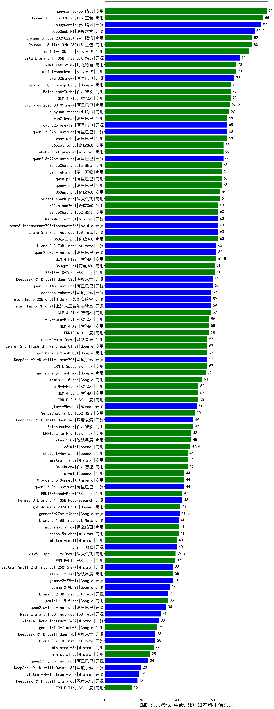

| 类别 | 大模型                         | CMB-医师考试-中级职称-妇产科主治医师 | 排名 |
|-----|------------------------------|---------|----|
|商用|ERNIE-4.5-8K-Preview(new)|91.0|1|
|商用|hunyuan-turbo|90.0|2|
|商用|Doubao-1.5-pro-32k-250115|88.0|3|
|开源|hunyuan-large|87.0|4|
|开源|DeepSeek-R1|83.3|5|
|商用|Doubao-1.5-lite-32k-250115|82.0|6|
|商用|hunyuan-turbos-20250313(new)|82.0|7|
|商用|hunyuan-turbos-20250226(new)|82.0|8|
|商用|xunfei-4.0Ultra|80.0|9|
|开源|Meta-Llama-3.1-405B-Instruct|75.0|10|
|商用|xunfei-spark-max|73.0|11|
|商用|kimi-latest-8k|73.0|12|
|开源|qwq-32b(new)|72.0|13|
|商用|GLM-4-Plus|70.0|14|
|商用|Baichuan4-Turbo|70.0|15|
|商用|gemini-2.0-pro-exp-02-05|70.0|16|
|商用|qwq-plus-2025-03-05(new)|69.5|17|
|商用|hunyuan-standard|69.0|18|
|商用|qwen2.5-max|68.0|19|
|开源|qwq-32b-preview|68.0|20|
|开源|qwen2.5-32b-instruct|68.0|21|
|商用|qwen-turbo|68.0|22|
|商用|abab7-chat-preview|66.0|23|
|商用|360gpt-turbo|66.0|24|
|开源|qwen2.5-72b-instruct|66.0|25|
|商用|qwen-plus|65.0|26|
|商用|yi-lightning|65.0|27|
|商用|qwen-long|65.0|28|
|商用|SenseChat-5-beta|65.0|29|
|商用|360gpt-pro|64.0|30|
|商用|xunfei-spark-pro|64.0|31|
|开源|Llama-3.3-70B-Instruct-fp8|63.0|32|
|商用|SenseChat-5-1202|63.0|33|
|开源|MiniMax-Text-01|63.0|34|
|商用|360gpt2-pro|63.0|35|
|商用|360zhinao2-o1|63.0|36|
|开源|Llama-3.1-Nemotron-70B-Instruct-fp8|63.0|37|
|开源|qwen2.5-7b-instruct|62.0|38|
|开源|Llama-3.3-70B-Instruct|62.0|39|
|商用|GLM-4-Flash|61.8|40|
|商用|ERNIE-4.0-Turbo-8K|61.0|41|
|商用|360gpt2-o1|61.0|42|
|开源|DeepSeek-R1-Distill-Qwen-32B|60.0|43|
|开源|qwen2.5-14b-instruct|60.0|44|
|商用|GLM-4-AirX|59.0|45|
|开源|internlm2_5-7b-chat|59.0|46|
|开源|deepseek-chat-v3|59.0|47|
|开源|internlm2_5-20b-chat|59.0|48|
|商用|GLM-Zero-Preview|58.0|49|
|商用|ERNIE-4.0|58.0|50|
|商用|GLM-4-Air|58.0|51|
|商用|ERNIE-Speed-8K|57.0|52|
|商用|gemini-2.0-flash-thinking-exp-01-21|57.0|53|
|商用|gemini-2.0-flash-001|57.0|54|
|开源|DeepSeek-R1-Distill-Llama-70B|57.0|55|
|商用|step-2-mini(new)|57.0|56|
|商用|gemini-2.0-flash-exp|56.0|57|
|商用|gemini-1.5-pro|54.0|58|
|商用|GLM-4-Long|52.0|59|
|商用|ERNIE-3.5-8K|52.0|60|
|商用|GLM-4-FlashX|52.0|61|
|开源|glm-4-9b-chat|51.0|62|
|商用|SenseChat-Turbo-1202|50.0|63|
|商用|Baichuan4-Air|49.0|64|
|开源|DeepSeek-R1-Distill-Qwen-14B|49.0|65|
|商用|ERNIE-Lite-Pro-128K|48.0|66|
|商用|step-1-8k|48.0|67|
|商用|o3-mini|47.4|68|
|商用|Baichuan4|46.0|69|
|商用|mistral-large|46.0|70|
|商用|chatgpt-4o-latest|46.0|71|
|商用|Claude-3.5-Sonnet|44.0|72|
|开源|qwen2.5-3b-instruct|44.0|73|
|商用|o1-mini|44.0|74|
|开源|Hermes-3-Llama-3.1-405B|43.0|75|
|商用|ERNIE-Speed-Pro-128K|43.0|76|
|商用|gpt-4o-mini-2024-07-18|42.0|77|
|开源|gemma-3-27b-it(new)|41.5|78|
|商用|abab6.5s-chat|41.0|79|
|商用|moonshot-v1-8k|41.0|80|
|开源|Llama-3.1-8B-Instruct|41.0|81|
|开源|phi-4|40.0|82|
|商用|mistral-small|40.0|83|
|商用|xunfei-spark-lite(new)|39.2|84|
|商用|ERNIE-Lite-8K|39.0|85|
|开源|gemma-2-27b-it|38.0|86|
|开源|Mistral-Small-24B-Instruct-2501(new)|38.0|87|
|商用|step-1-flash|38.0|88|
|开源|gemma-2-9b-it|36.0|89|
|开源|gemma-3-12b-it(new)|35.0|90|
|开源|Llama-3.2-3B-Instruct|35.0|91|
|商用|gemini-1.5-flash|35.0|92|
|开源|qwen2.5-1.5b-instruct|34.0|93|
|开源|Meta-Llama-3.1-8B-Instruct-fp8|31.0|94|
|开源|Mistral-Nemo-Instruct-2407|30.0|95|
|开源|gemma-3-4b-it(new)|29.5|96|
|商用|gemini-1.5-flash-8b|29.0|97|
|开源|Llama-3.2-1B-Instruct|28.0|98|
|开源|DeepSeek-R1-Distill-Qwen-7B|28.0|99|
|商用|ministral-8b|27.0|100|
|开源|gemma-3-1b-it(new)|26.5|101|
|商用|ministral-3b|25.0|102|
|开源|qwen2.5-0.5b-instruct|24.0|103|
|开源|DeepSeek-R1-Distill-Qwen-1.5B|20.0|104|
|开源|Mistral-7B-Instruct-v0.3|19.0|105|
|开源|DeepSeek-R1-Distill-Llama-8B|18.0|106|
|商用|ERNIE-Tiny-8K|15.0|107|
|开源|qwen2.5-math-72b-instruct|/|108|

