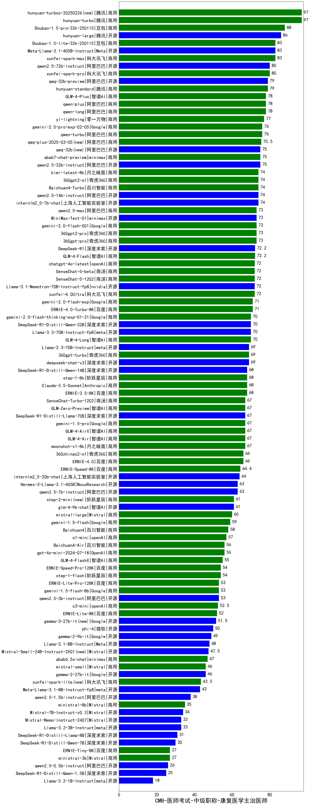

| 类别 | 大模型                         | CMB-医师考试-中级职称-康复医学主治医师 | 排名 |
|-----|------------------------------|---------|----|
|商用|ERNIE-4.5-8K-Preview(new)|99.0|1|
|商用|hunyuan-turbo|97.0|2|
|商用|hunyuan-turbos-20250226(new)|97.0|3|
|商用|Doubao-1.5-pro-32k-250115|88.0|4|
|商用|hunyuan-turbos-20250313(new)|86.5|5|
|开源|hunyuan-large|86.0|6|
|开源|Meta-Llama-3.1-405B-Instruct|83.0|7|
|商用|Doubao-1.5-lite-32k-250115|83.0|8|
|商用|xunfei-spark-max|83.0|9|
|商用|xunfei-spark-pro|80.0|10|
|开源|qwen2.5-72b-instruct|80.0|11|
|开源|qwq-32b-preview|79.0|12|
|商用|hunyuan-standard|79.0|13|
|商用|qwen-plus|78.0|14|
|商用|GLM-4-Plus|78.0|15|
|商用|qwen-long|78.0|16|
|商用|yi-lightning|77.0|17|
|商用|qwen-turbo|76.0|18|
|商用|gemini-2.0-pro-exp-02-05|76.0|19|
|商用|qwq-plus-2025-03-05(new)|75.5|20|
|开源|qwq-32b(new)|75.0|21|
|商用|abab7-chat-preview|75.0|22|
|开源|qwen2.5-32b-instruct|75.0|23|
|开源|internlm2_5-7b-chat|74.0|24|
|开源|qwen2.5-14b-instruct|74.0|25|
|商用|kimi-latest-8k|74.0|26|
|商用|360gpt2-o1|74.0|27|
|商用|Baichuan4-Turbo|74.0|28|
|商用|360gpt-pro|73.0|29|
|商用|qwen2.5-max|73.0|30|
|开源|MiniMax-Text-01|73.0|31|
|商用|gemini-2.0-flash-001|73.0|32|
|商用|360gpt2-pro|73.0|33|
|商用|GLM-4-Flash|72.2|34|
|开源|DeepSeek-R1|72.2|35|
|商用|xunfei-4.0Ultra|72.0|36|
|商用|chatgpt-4o-latest|72.0|37|
|商用|SenseChat-5-1202|72.0|38|
|商用|SenseChat-5-beta|72.0|39|
|开源|Llama-3.1-Nemotron-70B-Instruct-fp8|72.0|40|
|商用|gemini-2.0-flash-exp|71.0|41|
|商用|ERNIE-4.0-Turbo-8K|71.0|42|
|商用|GLM-4-Long|70.0|43|
|商用|gemini-2.0-flash-thinking-exp-01-21|70.0|44|
|开源|DeepSeek-R1-Distill-Qwen-32B|70.0|45|
|开源|Llama-3.3-70B-Instruct-fp8|70.0|46|
|商用|360gpt-turbo|69.0|47|
|开源|Llama-3.3-70B-Instruct|69.0|48|
|开源|deepseek-chat-v3|69.0|49|
|商用|ERNIE-3.5-8K|68.0|50|
|商用|Claude-3.5-Sonnet|68.0|51|
|开源|DeepSeek-R1-Distill-Qwen-14B|68.0|52|
|商用|step-1-8k|68.0|53|
|商用|GLM-4-Air|67.0|54|
|商用|moonshot-v1-8k|67.0|55|
|商用|GLM-4-AirX|67.0|56|
|商用|gemini-1.5-pro|67.0|57|
|开源|DeepSeek-R1-Distill-Llama-70B|67.0|58|
|商用|GLM-Zero-Preview|67.0|59|
|商用|SenseChat-Turbo-1202|67.0|60|
|商用|360zhinao2-o1|66.0|61|
|商用|ERNIE-4.0|66.0|62|
|商用|ERNIE-Speed-8K|64.4|63|
|开源|internlm2_5-20b-chat|64.0|64|
|开源|qwen2.5-7b-instruct|63.0|65|
|开源|Hermes-3-Llama-3.1-405B|63.0|66|
|商用|step-2-mini(new)|61.0|67|
|开源|glm-4-9b-chat|61.0|68|
|商用|mistral-large|60.0|69|
|商用|gemini-1.5-flash|59.0|70|
|商用|Baichuan4|58.0|71|
|商用|o1-mini|57.0|72|
|商用|gpt-4o-mini-2024-07-18|56.0|73|
|商用|Baichuan4-Air|56.0|74|
|商用|GLM-4-FlashX|55.0|75|
|商用|ERNIE-Speed-Pro-128K|54.0|76|
|商用|step-1-flash|54.0|77|
|商用|gemini-1.5-flash-8b|53.0|78|
|商用|ERNIE-Lite-Pro-128K|53.0|79|
|开源|qwen2.5-3b-instruct|53.0|80|
|商用|o3-mini|52.5|81|
|商用|ERNIE-Lite-8K|52.0|82|
|开源|gemma-3-27b-it(new)|51.5|83|
|开源|phi-4|50.0|84|
|开源|gemma-2-9b-it|49.0|85|
|开源|Llama-3.1-8B-Instruct|48.0|86|
|开源|Mistral-Small-24B-Instruct-2501(new)|47.5|87|
|商用|abab6.5s-chat|47.0|88|
|商用|mistral-small|46.0|89|
|开源|gemma-2-27b-it|46.0|90|
|开源|gemma-3-12b-it(new)|44.0|91|
|商用|xunfei-spark-lite(new)|43.5|92|
|开源|Meta-Llama-3.1-8B-Instruct-fp8|43.0|93|
|开源|qwen2.5-1.5b-instruct|38.0|94|
|商用|ministral-8b|35.0|95|
|开源|Mistral-7B-Instruct-v0.3|34.0|96|
|开源|Mistral-Nemo-Instruct-2407|33.0|97|
|开源|Llama-3.2-3B-Instruct|33.0|98|
|开源|DeepSeek-R1-Distill-Llama-8B|31.0|99|
|开源|DeepSeek-R1-Distill-Qwen-7B|30.0|100|
|开源|gemma-3-4b-it(new)|29.5|101|
|商用|ministral-3b|27.0|102|
|商用|ERNIE-Tiny-8K|27.0|103|
|开源|qwen2.5-0.5b-instruct|26.0|104|
|开源|DeepSeek-R1-Distill-Qwen-1.5B|25.0|105|
|开源|Llama-3.2-1B-Instruct|18.0|106|
|开源|gemma-3-1b-it(new)|16.5|107|
|开源|qwen2.5-math-72b-instruct|/|108|

