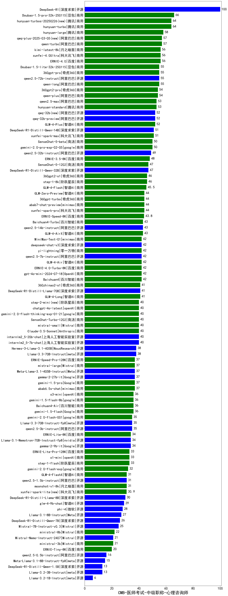

| 类别 | 大模型                         | CMB-医师考试-中级职称-心理咨询师 | 排名 |
|-----|------------------------------|---------|----|
|开源|DeepSeek-R1|100.0|1|
|商用|ERNIE-4.5-8K-Preview(new)|68.0|2|
|商用|Doubao-1.5-pro-32k-250115|66.0|3|
|商用|hunyuan-turbos-20250226(new)|64.0|4|
|商用|hunyuan-turbo|64.0|5|
|商用|hunyuan-turbos-20250313(new)|63.0|6|
|开源|hunyuan-large|58.0|7|
|商用|qwen-turbo|57.0|8|
|商用|qwq-plus-2025-03-05(new)|57.0|9|
|商用|kimi-latest-8k|56.0|10|
|商用|xunfei-4.0Ultra|56.0|11|
|商用|ERNIE-4.0|56.0|12|
|开源|qwen2.5-72b-instruct|55.0|13|
|商用|qwen-long|55.0|14|
|商用|360gpt-pro|55.0|15|
|商用|Doubao-1.5-lite-32k-250115|55.0|16|
|商用|360gpt2-pro|54.0|17|
|商用|qwen-plus|54.0|18|
|商用|hunyuan-standard|53.0|19|
|商用|qwen2.5-max|53.0|20|
|开源|qwq-32b(new)|52.0|21|
|商用|GLM-4-Plus|52.0|22|
|开源|qwq-32b-preview|52.0|23|
|商用|xunfei-spark-max|51.0|24|
|开源|DeepSeek-R1-Distill-Qwen-14B|51.0|25|
|商用|gemini-2.0-pro-exp-02-05|50.0|26|
|商用|SenseChat-5-beta|50.0|27|
|开源|qwen2.5-32b-instruct|49.0|28|
|商用|ERNIE-3.5-8K|48.0|29|
|开源|DeepSeek-R1-Distill-Qwen-32B|47.0|30|
|商用|SenseChat-5-1202|47.0|31|
|商用|360gpt2-o1|46.0|32|
|商用|step-1-8k|46.0|33|
|商用|GLM-4-Flash|45.5|34|
|商用|GLM-Zero-Preview|44.0|35|
|商用|xunfei-spark-pro|44.0|36|
|商用|abab7-chat-preview|44.0|37|
|商用|360gpt-turbo|44.0|38|
|商用|ERNIE-Speed-8K|43.8|39|
|商用|GLM-4-AirX|43.0|40|
|商用|Baichuan4-Turbo|43.0|41|
|开源|qwen2.5-14b-instruct|43.0|42|
|开源|deepseek-chat-v3|42.0|43|
|商用|yi-lightning|42.0|44|
|商用|Baichuan4|42.0|45|
|商用|ERNIE-4.0-Turbo-8K|42.0|46|
|商用|GLM-4-Air|42.0|47|
|开源|qwen2.5-7b-instruct|42.0|48|
|开源|MiniMax-Text-01|42.0|49|
|商用|gpt-4o-mini-2024-07-18|42.0|50|
|开源|DeepSeek-R1-Distill-Llama-70B|41.0|51|
|商用|360zhinao2-o1|41.0|52|
|商用|GLM-4-Long|41.0|53|
|开源|internlm2_5-20b-chat|40.0|54|
|商用|Claude-3.5-Sonnet|40.0|55|
|商用|SenseChat-Turbo-1202|40.0|56|
|商用|mistral-small|40.0|57|
|商用|step-2-mini(new)|40.0|58|
|商用|chatgpt-4o-latest|40.0|59|
|商用|gemini-2.0-flash-thinking-exp-01-21|40.0|60|
|开源|internlm2_5-7b-chat|40.0|61|
|开源|Llama-3.3-70B-Instruct|38.0|62|
|开源|Hermes-3-Llama-3.1-405B|38.0|63|
|商用|mistral-large|37.0|64|
|开源|gemma-2-27b-it|37.0|65|
|商用|ERNIE-Speed-Pro-128K|37.0|66|
|商用|abab6.5s-chat|37.0|67|
|开源|Meta-Llama-3.1-405B-Instruct|37.0|68|
|商用|gemini-1.5-pro|37.0|69|
|商用|Baichuan4-Air|36.0|70|
|商用|o3-mini|36.0|71|
|商用|gemini-1.5-flash-8b|36.0|72|
|商用|gemini-1.5-flash|36.0|73|
|开源|qwen2.5-3b-instruct|35.0|74|
|开源|Llama-3.3-70B-Instruct-fp8|35.0|75|
|商用|gemini-2.0-flash-001|35.0|76|
|开源|gemma-2-9b-it|34.0|77|
|商用|ERNIE-Lite-8K|34.0|78|
|开源|Llama-3.1-Nemotron-70B-Instruct-fp8|34.0|79|
|开源|Mistral-Small-24B-Instruct-2501(new)|33.5|80|
|商用|ERNIE-Lite-Pro-128K|33.0|81|
|商用|step-1-flash|33.0|82|
|商用|o1-mini|33.0|83|
|开源|gemma-3-27b-it(new)|32.0|84|
|商用|gemini-2.0-flash-exp|32.0|85|
|开源|qwen2.5-1.5b-instruct|31.0|86|
|商用|moonshot-v1-8k|31.0|87|
|商用|GLM-4-FlashX|31.0|88|
|商用|xunfei-spark-lite(new)|30.9|89|
|开源|gemma-3-12b-it(new)|30.5|90|
|开源|DeepSeek-R1-Distill-Llama-8B|30.0|91|
|开源|glm-4-9b-chat|29.0|92|
|开源|phi-4|28.0|93|
|开源|Llama-3.1-8B-Instruct|27.0|94|
|开源|DeepSeek-R1-Distill-Qwen-7B|26.0|95|
|开源|Mistral-7B-Instruct-v0.3|25.0|96|
|商用|ministral-8b|22.0|97|
|开源|gemma-3-4b-it(new)|22.0|98|
|商用|ministral-3b|21.0|99|
|开源|Mistral-Nemo-Instruct-2407|21.0|100|
|商用|ERNIE-Tiny-8K|20.0|101|
|开源|qwen2.5-0.5b-instruct|16.0|102|
|开源|Meta-Llama-3.1-8B-Instruct-fp8|15.0|103|
|开源|gemma-3-1b-it(new)|14.5|104|
|开源|DeepSeek-R1-Distill-Qwen-1.5B|13.0|105|
|开源|Llama-3.2-3B-Instruct|13.0|106|
|开源|Llama-3.2-1B-Instruct|6.0|107|
|开源|qwen2.5-math-72b-instruct|/|108|
|开源|Yi-1.5-34B-Chat|/|109|
|开源|Yi-1.5-9B-Chat|/|110|

