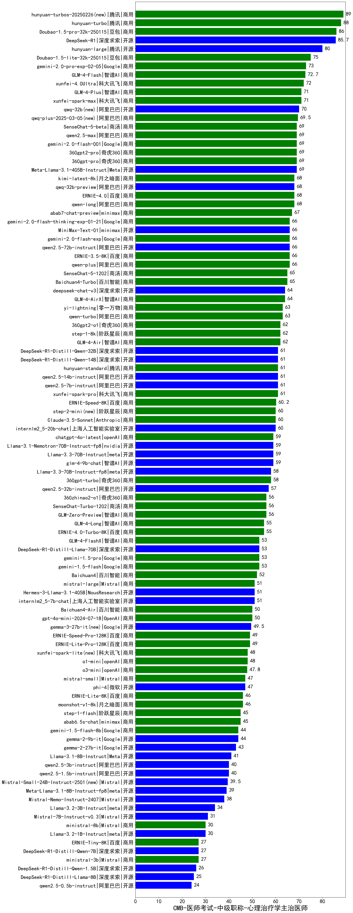

| 类别 | 大模型                         | CMB-医师考试-中级职称-心理治疗学主治医师 | 排名 |
|-----|------------------------------|---------|----|
|商用|ERNIE-4.5-8K-Preview(new)|97.0|1|
|商用|hunyuan-turbos-20250226(new)|89.0|2|
|商用|hunyuan-turbo|88.0|3|
|商用|Doubao-1.5-pro-32k-250115|86.0|4|
|开源|DeepSeek-R1|85.7|5|
|开源|hunyuan-large|80.0|6|
|商用|hunyuan-turbos-20250313(new)|79.0|7|
|商用|Doubao-1.5-lite-32k-250115|75.0|8|
|商用|gemini-2.0-pro-exp-02-05|73.0|9|
|商用|GLM-4-Flash|72.7|10|
|商用|xunfei-4.0Ultra|72.0|11|
|商用|xunfei-spark-max|71.0|12|
|商用|GLM-4-Plus|71.0|13|
|开源|qwq-32b(new)|70.0|14|
|商用|qwq-plus-2025-03-05(new)|69.5|15|
|开源|Meta-Llama-3.1-405B-Instruct|69.0|16|
|商用|SenseChat-5-beta|69.0|17|
|商用|360gpt-pro|69.0|18|
|商用|qwen2.5-max|69.0|19|
|商用|gemini-2.0-flash-001|69.0|20|
|商用|360gpt2-pro|69.0|21|
|商用|kimi-latest-8k|68.0|22|
|商用|ERNIE-4.0|68.0|23|
|开源|qwq-32b-preview|68.0|24|
|商用|qwen-long|68.0|25|
|商用|abab7-chat-preview|67.0|26|
|商用|gemini-2.0-flash-exp|66.0|27|
|商用|qwen-plus|66.0|28|
|开源|MiniMax-Text-01|66.0|29|
|商用|gemini-2.0-flash-thinking-exp-01-21|66.0|30|
|商用|ERNIE-3.5-8K|66.0|31|
|开源|qwen2.5-72b-instruct|66.0|32|
|商用|SenseChat-5-1202|65.0|33|
|商用|Baichuan4-Turbo|65.0|34|
|商用|GLM-4-AirX|64.0|35|
|开源|deepseek-chat-v3|64.0|36|
|商用|qwen-turbo|63.0|37|
|商用|yi-lightning|63.0|38|
|商用|GLM-4-Air|62.0|39|
|商用|360gpt2-o1|62.0|40|
|商用|step-1-8k|62.0|41|
|开源|DeepSeek-R1-Distill-Qwen-32B|61.0|42|
|商用|hunyuan-standard|61.0|43|
|商用|xunfei-spark-pro|61.0|44|
|开源|qwen2.5-7b-instruct|61.0|45|
|开源|qwen2.5-14b-instruct|61.0|46|
|开源|DeepSeek-R1-Distill-Qwen-14B|61.0|47|
|商用|ERNIE-Speed-8K|60.2|48|
|商用|step-2-mini(new)|60.0|49|
|开源|internlm2_5-20b-chat|60.0|50|
|商用|Claude-3.5-Sonnet|60.0|51|
|开源|Llama-3.3-70B-Instruct|59.0|52|
|开源|Llama-3.1-Nemotron-70B-Instruct-fp8|59.0|53|
|开源|glm-4-9b-chat|59.0|54|
|商用|chatgpt-4o-latest|59.0|55|
|商用|360gpt-turbo|58.0|56|
|开源|Llama-3.3-70B-Instruct-fp8|58.0|57|
|开源|qwen2.5-32b-instruct|57.0|58|
|商用|GLM-Zero-Preview|56.0|59|
|商用|SenseChat-Turbo-1202|56.0|60|
|商用|360zhinao2-o1|56.0|61|
|商用|GLM-4-Long|55.0|62|
|商用|ERNIE-4.0-Turbo-8K|55.0|63|
|商用|GLM-4-FlashX|53.0|64|
|开源|DeepSeek-R1-Distill-Llama-70B|53.0|65|
|商用|gemini-1.5-pro|53.0|66|
|商用|gemini-1.5-flash|53.0|67|
|商用|Baichuan4|52.0|68|
|开源|Hermes-3-Llama-3.1-405B|51.0|69|
|商用|mistral-large|51.0|70|
|开源|internlm2_5-7b-chat|51.0|71|
|商用|Baichuan4-Air|50.0|72|
|商用|gpt-4o-mini-2024-07-18|50.0|73|
|开源|gemma-3-27b-it(new)|49.5|74|
|商用|ERNIE-Speed-Pro-128K|49.0|75|
|商用|ERNIE-Lite-Pro-128K|49.0|76|
|开源|gemma-3-12b-it(new)|48.5|77|
|商用|o1-mini|48.0|78|
|商用|xunfei-spark-lite(new)|48.0|79|
|商用|o3-mini|47.8|80|
|商用|mistral-small|47.0|81|
|开源|phi-4|47.0|82|
|商用|moonshot-v1-8k|46.0|83|
|商用|ERNIE-Lite-8K|46.0|84|
|商用|step-1-flash|45.0|85|
|商用|abab6.5s-chat|45.0|86|
|开源|gemma-2-9b-it|44.0|87|
|商用|gemini-1.5-flash-8b|44.0|88|
|开源|gemma-2-27b-it|43.0|89|
|开源|Llama-3.1-8B-Instruct|41.0|90|
|开源|qwen2.5-3b-instruct|40.0|91|
|开源|qwen2.5-1.5b-instruct|40.0|92|
|开源|Mistral-Small-24B-Instruct-2501(new)|39.5|93|
|开源|Meta-Llama-3.1-8B-Instruct-fp8|39.0|94|
|开源|Mistral-Nemo-Instruct-2407|38.0|95|
|开源|Llama-3.2-3B-Instruct|34.0|96|
|开源|Mistral-7B-Instruct-v0.3|31.0|97|
|开源|gemma-3-4b-it(new)|30.5|98|
|开源|Llama-3.2-1B-Instruct|30.0|99|
|商用|ministral-8b|30.0|100|
|开源|DeepSeek-R1-Distill-Qwen-7B|27.0|101|
|商用|ministral-3b|27.0|102|
|商用|ERNIE-Tiny-8K|27.0|103|
|开源|DeepSeek-R1-Distill-Qwen-1.5B|26.0|104|
|开源|DeepSeek-R1-Distill-Llama-8B|25.0|105|
|开源|gemma-3-1b-it(new)|25.0|106|
|开源|qwen2.5-0.5b-instruct|24.0|107|
|开源|qwen2.5-math-72b-instruct|/|108|
|开源|Yi-1.5-34B-Chat|/|109|
|开源|Yi-1.5-9B-Chat|/|110|

