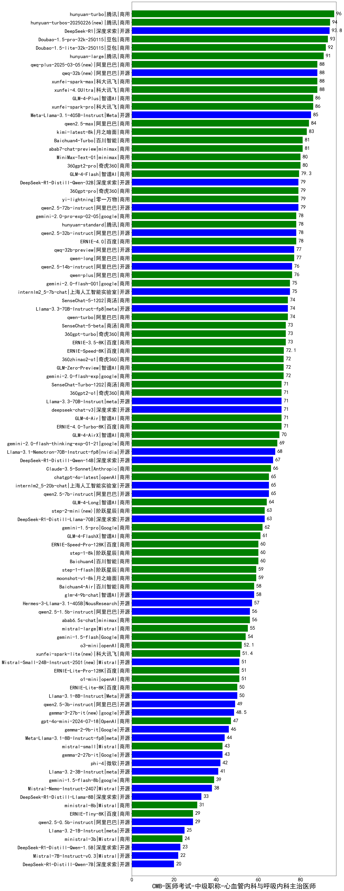

| 类别 | 大模型                         | CMB-医师考试-中级职称-心血管内科与呼吸内科主治医师 | 排名 |
|-----|------------------------------|---------|----|
|商用|ERNIE-4.5-8K-Preview(new)|98.0|1|
|商用|hunyuan-turbo|96.0|2|
|商用|hunyuan-turbos-20250226(new)|94.0|3|
|开源|DeepSeek-R1|93.8|4|
|商用|Doubao-1.5-pro-32k-250115|93.0|5|
|商用|Doubao-1.5-lite-32k-250115|92.0|6|
|商用|hunyuan-turbos-20250313(new)|91.5|7|
|开源|hunyuan-large|91.0|8|
|商用|qwq-plus-2025-03-05(new)|88.0|9|
|开源|qwq-32b(new)|88.0|10|
|商用|xunfei-4.0Ultra|88.0|11|
|商用|xunfei-spark-max|88.0|12|
|商用|xunfei-spark-pro|86.0|13|
|商用|GLM-4-Plus|86.0|14|
|开源|Meta-Llama-3.1-405B-Instruct|85.0|15|
|商用|qwen2.5-max|84.0|16|
|商用|kimi-latest-8k|83.0|17|
|商用|abab7-chat-preview|81.0|18|
|商用|Baichuan4-Turbo|81.0|19|
|商用|360gpt2-pro|80.0|20|
|开源|MiniMax-Text-01|80.0|21|
|商用|GLM-4-Flash|79.3|22|
|开源|qwen2.5-72b-instruct|79.0|23|
|开源|DeepSeek-R1-Distill-Qwen-32B|79.0|24|
|商用|360gpt-pro|79.0|25|
|商用|yi-lightning|79.0|26|
|商用|gemini-2.0-pro-exp-02-05|78.0|27|
|开源|qwen2.5-32b-instruct|78.0|28|
|商用|hunyuan-standard|78.0|29|
|商用|ERNIE-4.0|78.0|30|
|开源|qwq-32b-preview|77.0|31|
|商用|qwen-long|77.0|32|
|商用|qwen-plus|76.0|33|
|开源|qwen2.5-14b-instruct|76.0|34|
|开源|internlm2_5-7b-chat|75.0|35|
|商用|gemini-2.0-flash-001|75.0|36|
|开源|Llama-3.3-70B-Instruct-fp8|74.0|37|
|商用|qwen-turbo|74.0|38|
|商用|SenseChat-5-1202|74.0|39|
|商用|SenseChat-5-beta|73.0|40|
|商用|ERNIE-3.5-8K|73.0|41|
|商用|360gpt-turbo|73.0|42|
|商用|ERNIE-Speed-8K|72.1|43|
|商用|gemini-2.0-flash-exp|72.0|44|
|商用|360zhinao2-o1|72.0|45|
|商用|GLM-Zero-Preview|72.0|46|
|开源|Llama-3.3-70B-Instruct|71.0|47|
|商用|360gpt2-o1|71.0|48|
|商用|SenseChat-Turbo-1202|71.0|49|
|开源|deepseek-chat-v3|71.0|50|
|商用|GLM-4-Air|71.0|51|
|商用|ERNIE-4.0-Turbo-8K|71.0|52|
|商用|GLM-4-AirX|70.0|53|
|商用|gemini-2.0-flash-thinking-exp-01-21|69.0|54|
|开源|Llama-3.1-Nemotron-70B-Instruct-fp8|68.0|55|
|开源|DeepSeek-R1-Distill-Qwen-14B|67.0|56|
|商用|Claude-3.5-Sonnet|66.0|57|
|开源|internlm2_5-20b-chat|65.0|58|
|商用|chatgpt-4o-latest|65.0|59|
|开源|qwen2.5-7b-instruct|65.0|60|
|商用|GLM-4-Long|64.0|61|
|开源|DeepSeek-R1-Distill-Llama-70B|63.0|62|
|商用|step-2-mini(new)|63.0|63|
|商用|gemini-1.5-pro|62.0|64|
|商用|GLM-4-FlashX|61.0|65|
|商用|step-1-8k|60.0|66|
|商用|Baichuan4|60.0|67|
|商用|ERNIE-Speed-Pro-128K|60.0|68|
|商用|step-1-flash|59.0|69|
|商用|moonshot-v1-8k|59.0|70|
|开源|glm-4-9b-chat|58.0|71|
|商用|Baichuan4-Air|58.0|72|
|开源|Hermes-3-Llama-3.1-405B|57.0|73|
|开源|qwen2.5-1.5b-instruct|56.0|74|
|商用|abab6.5s-chat|56.0|75|
|商用|mistral-large|55.0|76|
|商用|gemini-1.5-flash|54.0|77|
|商用|o3-mini|52.1|78|
|商用|xunfei-spark-lite(new)|51.4|79|
|商用|o1-mini|51.0|80|
|商用|ERNIE-Lite-Pro-128K|51.0|81|
|开源|Mistral-Small-24B-Instruct-2501(new)|51.0|82|
|开源|Llama-3.1-8B-Instruct|50.0|83|
|商用|ERNIE-Lite-8K|50.0|84|
|开源|qwen2.5-3b-instruct|49.0|85|
|开源|gemma-3-27b-it(new)|48.5|86|
|商用|gpt-4o-mini-2024-07-18|47.0|87|
|开源|gemma-3-12b-it(new)|47.0|88|
|开源|gemma-2-9b-it|46.0|89|
|开源|Meta-Llama-3.1-8B-Instruct-fp8|44.0|90|
|开源|gemma-2-27b-it|43.0|91|
|商用|mistral-small|43.0|92|
|开源|phi-4|42.0|93|
|开源|Llama-3.2-3B-Instruct|41.0|94|
|商用|gemini-1.5-flash-8b|39.0|95|
|开源|Mistral-Nemo-Instruct-2407|38.0|96|
|开源|DeepSeek-R1-Distill-Llama-8B|33.0|97|
|商用|ministral-8b|31.0|98|
|开源|gemma-3-4b-it(new)|30.0|99|
|商用|ERNIE-Tiny-8K|29.0|100|
|开源|qwen2.5-0.5b-instruct|29.0|101|
|开源|Llama-3.2-1B-Instruct|25.0|102|
|商用|ministral-3b|24.0|103|
|开源|DeepSeek-R1-Distill-Qwen-1.5B|23.0|104|
|开源|gemma-3-1b-it(new)|22.5|105|
|开源|Mistral-7B-Instruct-v0.3|22.0|106|
|开源|DeepSeek-R1-Distill-Qwen-7B|20.0|107|
|开源|qwen2.5-math-72b-instruct|/|108|
|开源|Yi-1.5-34B-Chat|/|109|
|开源|Yi-1.5-9B-Chat|/|110|

