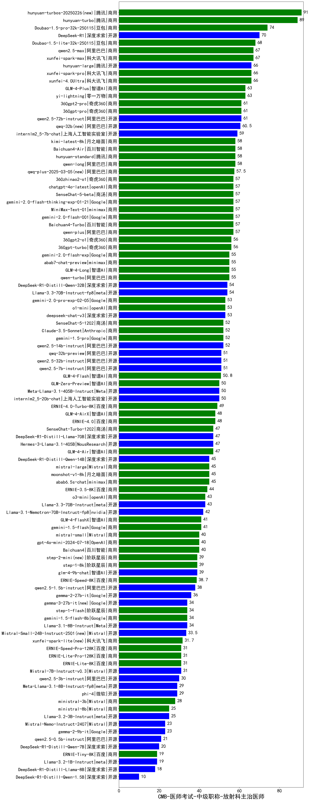

| 类别 | 大模型                         | CMB-医师考试-中级职称-放射科主治医师 | 排名 |
|-----|------------------------------|---------|----|
|商用|ERNIE-4.5-8K-Preview(new)|91.0|1|
|商用|hunyuan-turbos-20250226(new)|91.0|2|
|商用|hunyuan-turbo|89.0|3|
|商用|Doubao-1.5-pro-32k-250115|74.0|4|
|开源|DeepSeek-R1|70.0|5|
|商用|hunyuan-turbos-20250313(new)|69.0|6|
|商用|Doubao-1.5-lite-32k-250115|68.0|7|
|商用|qwen2.5-max|67.0|8|
|商用|xunfei-spark-max|67.0|9|
|商用|xunfei-spark-pro|66.0|10|
|商用|xunfei-4.0Ultra|66.0|11|
|开源|hunyuan-large|66.0|12|
|商用|yi-lightning|63.0|13|
|商用|GLM-4-Plus|63.0|14|
|商用|360gpt2-pro|61.0|15|
|开源|qwen2.5-72b-instruct|61.0|16|
|商用|360gpt-pro|61.0|17|
|开源|qwq-32b(new)|60.5|18|
|开源|internlm2_5-7b-chat|59.0|19|
|商用|kimi-latest-8k|58.0|20|
|商用|Baichuan4-Air|58.0|21|
|商用|qwen-long|58.0|22|
|商用|hunyuan-standard|58.0|23|
|商用|qwq-plus-2025-03-05(new)|57.5|24|
|商用|gemini-2.0-flash-001|57.0|25|
|商用|chatgpt-4o-latest|57.0|26|
|商用|Baichuan4-Turbo|57.0|27|
|开源|MiniMax-Text-01|57.0|28|
|商用|gemini-2.0-flash-thinking-exp-01-21|57.0|29|
|商用|SenseChat-5-beta|57.0|30|
|商用|360zhinao2-o1|57.0|31|
|商用|qwen-plus|57.0|32|
|商用|360gpt-turbo|56.0|33|
|商用|360gpt2-o1|56.0|34|
|商用|qwen-turbo|55.0|35|
|商用|GLM-4-Long|55.0|36|
|商用|abab7-chat-preview|55.0|37|
|商用|gemini-2.0-flash-exp|55.0|38|
|开源|Llama-3.3-70B-Instruct-fp8|54.0|39|
|开源|DeepSeek-R1-Distill-Qwen-32B|54.0|40|
|商用|gemini-2.0-pro-exp-02-05|53.0|41|
|商用|o1-mini|53.0|42|
|开源|deepseek-chat-v3|53.0|43|
|开源|qwen2.5-14b-instruct|52.0|44|
|商用|gemini-1.5-pro|52.0|45|
|商用|Claude-3.5-Sonnet|52.0|46|
|商用|SenseChat-5-1202|52.0|47|
|开源|qwen2.5-32b-instruct|51.0|48|
|开源|qwen2.5-7b-instruct|51.0|49|
|开源|qwq-32b-preview|51.0|50|
|商用|GLM-4-Flash|50.8|51|
|开源|internlm2_5-20b-chat|50.0|52|
|商用|GLM-Zero-Preview|50.0|53|
|开源|Meta-Llama-3.1-405B-Instruct|50.0|54|
|商用|ERNIE-4.0-Turbo-8K|49.0|55|
|商用|ERNIE-4.0|48.0|56|
|商用|GLM-4-AirX|48.0|57|
|商用|SenseChat-Turbo-1202|47.0|58|
|开源|Hermes-3-Llama-3.1-405B|47.0|59|
|商用|GLM-4-Air|47.0|60|
|开源|DeepSeek-R1-Distill-Llama-70B|47.0|61|
|商用|mistral-large|45.0|62|
|商用|abab6.5s-chat|45.0|63|
|开源|DeepSeek-R1-Distill-Qwen-14B|45.0|64|
|商用|moonshot-v1-8k|45.0|65|
|商用|ERNIE-3.5-8K|44.0|66|
|开源|Llama-3.3-70B-Instruct|43.0|67|
|商用|o3-mini|43.0|68|
|开源|Llama-3.1-Nemotron-70B-Instruct-fp8|42.0|69|
|商用|GLM-4-FlashX|41.0|70|
|商用|gemini-1.5-flash|41.0|71|
|商用|Baichuan4|40.0|72|
|商用|mistral-small|40.0|73|
|商用|gpt-4o-mini-2024-07-18|40.0|74|
|开源|glm-4-9b-chat|39.0|75|
|商用|step-2-mini(new)|39.0|76|
|商用|step-1-8k|39.0|77|
|商用|ERNIE-Speed-8K|38.7|78|
|开源|qwen2.5-1.5b-instruct|38.0|79|
|开源|gemma-2-27b-it|36.0|80|
|开源|Llama-3.1-8B-Instruct|34.0|81|
|商用|gemini-1.5-flash-8b|34.0|82|
|开源|gemma-3-27b-it(new)|34.0|83|
|商用|step-1-flash|34.0|84|
|开源|Mistral-Small-24B-Instruct-2501(new)|33.5|85|
|商用|xunfei-spark-lite(new)|31.7|86|
|开源|Mistral-7B-Instruct-v0.3|31.0|87|
|商用|ERNIE-Speed-Pro-128K|31.0|88|
|商用|ERNIE-Lite-8K|31.0|89|
|商用|ERNIE-Lite-Pro-128K|31.0|90|
|开源|qwen2.5-3b-instruct|30.0|91|
|开源|Meta-Llama-3.1-8B-Instruct-fp8|29.0|92|
|开源|gemma-3-12b-it(new)|29.0|93|
|开源|phi-4|29.0|94|
|商用|ministral-3b|28.0|95|
|开源|Llama-3.2-3B-Instruct|25.0|96|
|商用|ministral-8b|25.0|97|
|开源|Mistral-Nemo-Instruct-2407|23.0|98|
|开源|gemma-2-9b-it|23.0|99|
|开源|qwen2.5-0.5b-instruct|21.0|100|
|开源|DeepSeek-R1-Distill-Qwen-7B|20.0|101|
|开源|Llama-3.2-1B-Instruct|19.0|102|
|商用|ERNIE-Tiny-8K|19.0|103|
|开源|DeepSeek-R1-Distill-Llama-8B|18.0|104|
|开源|gemma-3-4b-it(new)|17.0|105|
|开源|gemma-3-1b-it(new)|16.5|106|
|开源|DeepSeek-R1-Distill-Qwen-1.5B|10.0|107|
|开源|qwen2.5-math-72b-instruct|/|108|

