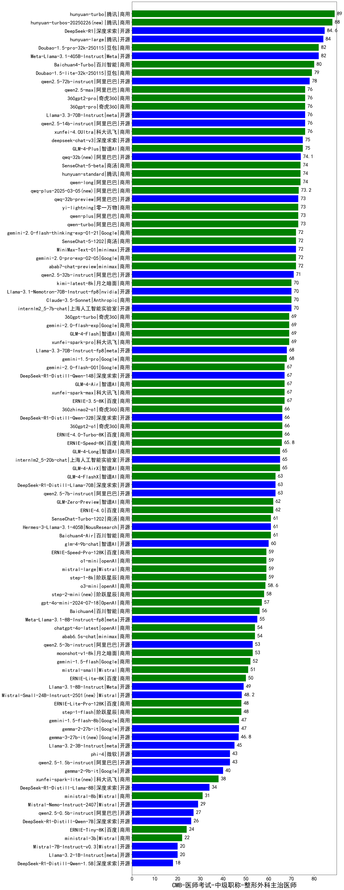

| 类别 | 大模型                         | CMB-医师考试-中级职称-整形外科主治医师 | 排名 |
|-----|------------------------------|---------|----|
|商用|hunyuan-turbo|89.0|1|
|商用|hunyuan-turbos-20250226(new)|88.0|2|
|开源|DeepSeek-R1|84.6|3|
|商用|hunyuan-large|84.0|4|
|开源|Meta-Llama-3.1-405B-Instruct|82.0|5|
|商用|Doubao-1.5-pro-32k-250115|82.0|6|
|商用|Baichuan4-Turbo|80.0|7|
|商用|Doubao-1.5-lite-32k-250115|79.0|8|
|开源|qwen2.5-72b-instruct|78.0|9|
|商用|xunfei-4.0Ultra|76.0|10|
|开源|qwen2.5-14b-instruct|76.0|11|
|商用|qwen2.5-max|76.0|12|
|商用|360gpt2-pro|76.0|13|
|开源|Llama-3.3-70B-Instruct|76.0|14|
|商用|360gpt-pro|76.0|15|
|商用|GLM-4-Plus|75.0|16|
|开源|deepseek-chat-v3|75.0|17|
|开源|qwq-32b(new)|74.1|18|
|商用|SenseChat-5-beta|74.0|19|
|商用|qwen-long|74.0|20|
|商用|hunyuan-standard|74.0|21|
|商用|qwq-plus-2025-03-05(new)|73.2|22|
|商用|yi-lightning|73.0|23|
|开源|qwq-32b-preview|73.0|24|
|商用|qwen-plus|73.0|25|
|商用|qwen-turbo|73.0|26|
|商用|abab7-chat-preview|72.0|27|
|商用|gemini-2.0-flash-thinking-exp-01-21|72.0|28|
|商用|gemini-2.0-pro-exp-02-05|72.0|29|
|商用|MiniMax-Text-01|72.0|30|
|商用|SenseChat-5-1202|72.0|31|
|开源|qwen2.5-32b-instruct|71.0|32|
|商用|kimi-latest-8k|70.0|33|
|商用|Claude-3.5-Sonnet|70.0|34|
|开源|Llama-3.1-Nemotron-70B-Instruct-fp8|70.0|35|
|开源|internlm2_5-7b-chat|70.0|36|
|商用|360gpt-turbo|69.0|37|
|商用|GLM-4-Flash|69.0|38|
|商用|xunfei-spark-pro|69.0|39|
|商用|gemini-2.0-flash-exp|69.0|40|
|开源|Llama-3.3-70B-Instruct-fp8|68.0|41|
|商用|gemini-1.5-pro|68.0|42|
|开源|DeepSeek-R1-Distill-Qwen-14B|67.0|43|
|商用|ERNIE-3.5-8K|67.0|44|
|商用|xunfei-spark-max|67.0|45|
|商用|GLM-4-Air|67.0|46|
|商用|gemini-2.0-flash-001|67.0|47|
|开源|DeepSeek-R1-Distill-Qwen-32B|66.0|48|
|商用|360gpt2-o1|66.0|49|
|商用|360zhinao2-o1|66.0|50|
|商用|ERNIE-4.0-Turbo-8K|66.0|51|
|商用|ERNIE-Speed-8K|65.8|52|
|商用|GLM-4-AirX|65.0|53|
|开源|internlm2_5-20b-chat|65.0|54|
|商用|GLM-4-Long|65.0|55|
|开源|DeepSeek-R1-Distill-Llama-70B|63.0|56|
|商用|GLM-4-FlashX|63.0|57|
|开源|qwen2.5-7b-instruct|63.0|58|
|商用|GLM-Zero-Preview|62.0|59|
|商用|ERNIE-4.0|62.0|60|
|商用|SenseChat-Turbo-1202|61.0|61|
|开源|Hermes-3-Llama-3.1-405B|61.0|62|
|商用|Baichuan4-Air|61.0|63|
|开源|glm-4-9b-chat|60.0|64|
|商用|ERNIE-Speed-Pro-128K|59.0|65|
|商用|o1-mini|59.0|66|
|商用|step-1-8k|59.0|67|
|商用|mistral-large|59.0|68|
|商用|o3-mini|58.6|69|
|商用|step-2-mini(new)|58.0|70|
|商用|gpt-4o-mini-2024-07-18|57.0|71|
|商用|Baichuan4|56.0|72|
|开源|Meta-Llama-3.1-8B-Instruct-fp8|55.0|73|
|商用|chatgpt-4o-latest|54.0|74|
|商用|abab6.5s-chat|54.0|75|
|开源|qwen2.5-3b-instruct|53.0|76|
|商用|moonshot-v1-8k|53.0|77|
|商用|gemini-1.5-flash|52.0|78|
|商用|mistral-small|51.0|79|
|商用|ERNIE-Lite-8K|50.0|80|
|开源|Llama-3.1-8B-Instruct|49.0|81|
|商用|ERNIE-Lite-Pro-128K|48.0|82|
|商用|step-1-flash|48.0|83|
|开源|gemma-2-27b-it|47.0|84|
|商用|gemini-1.5-flash-8b|47.0|85|
|开源|Llama-3.2-3B-Instruct|45.0|86|
|开源|qwen2.5-1.5b-instruct|43.0|87|
|开源|phi-4|43.0|88|
|开源|gemma-2-9b-it|40.0|89|
|商用|xunfei-spark-lite(new)|38.0|90|
|开源|DeepSeek-R1-Distill-Llama-8B|34.0|91|
|商用|ministral-8b|31.0|92|
|开源|Mistral-Nemo-Instruct-2407|29.0|93|
|开源|qwen2.5-0.5b-instruct|27.0|94|
|开源|DeepSeek-R1-Distill-Qwen-7B|26.0|95|
|商用|ERNIE-Tiny-8K|24.0|96|
|商用|ministral-3b|22.0|97|
|开源|Llama-3.2-1B-Instruct|20.0|98|
|开源|Mistral-7B-Instruct-v0.3|20.0|99|
|开源|DeepSeek-R1-Distill-Qwen-1.5B|18.0|100|
|开源|Yi-1.5-9B-Chat|/|101|
|开源|Yi-1.5-34B-Chat|/|102|
|开源|qwen2.5-math-72b-instruct|/|103|

