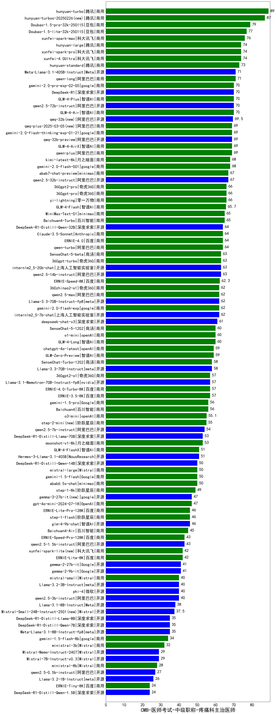

| 类别 | 大模型                         | CMB-医师考试-中级职称-疼痛科主治医师 | 排名 |
|-----|------------------------------|---------|----|
|商用|hunyuan-turbo|89.0|1|
|商用|hunyuan-turbos-20250226(new)|87.0|2|
|商用|Doubao-1.5-pro-32k-250115|79.0|3|
|商用|Doubao-1.5-lite-32k-250115|77.0|4|
|商用|xunfei-spark-max|76.0|5|
|商用|xunfei-4.0Ultra|74.0|6|
|商用|xunfei-spark-pro|74.0|7|
|商用|hunyuan-large|74.0|8|
|商用|hunyuan-standard|73.0|9|
|开源|Meta-Llama-3.1-405B-Instruct|71.0|10|
|商用|qwen-long|71.0|11|
|商用|GLM-4-Plus|70.0|12|
|开源|DeepSeek-R1|70.0|13|
|商用|GLM-4-Air|70.0|14|
|开源|qwen2.5-72b-instruct|70.0|15|
|商用|gemini-2.0-pro-exp-02-05|70.0|16|
|开源|qwq-32b(new)|69.5|17|
|商用|GLM-4-AirX|69.0|18|
|商用|qwen-plus|69.0|19|
|开源|qwq-32b-preview|69.0|20|
|商用|gemini-2.0-flash-thinking-exp-01-21|69.0|21|
|商用|qwq-plus-2025-03-05(new)|69.0|22|
|商用|kimi-latest-8k|68.0|23|
|商用|gemini-2.0-flash-001|68.0|24|
|开源|qwen2.5-32b-instruct|67.0|25|
|商用|abab7-chat-preview|67.0|26|
|商用|360gpt-pro|66.0|27|
|商用|360gpt2-pro|66.0|28|
|商用|yi-lightning|66.0|29|
|商用|GLM-4-Flash|65.7|30|
|商用|Baichuan4-Turbo|65.0|31|
|商用|MiniMax-Text-01|65.0|32|
|开源|DeepSeek-R1-Distill-Qwen-32B|64.0|33|
|商用|ERNIE-4.0|64.0|34|
|商用|qwen-turbo|64.0|35|
|商用|Claude-3.5-Sonnet|64.0|36|
|开源|internlm2_5-20b-chat|63.0|37|
|开源|qwen2.5-14b-instruct|63.0|38|
|商用|360gpt-turbo|63.0|39|
|商用|SenseChat-5-beta|63.0|40|
|商用|ERNIE-Speed-8K|62.3|41|
|商用|qwen2.5-max|62.0|42|
|开源|internlm2_5-7b-chat|62.0|43|
|开源|Llama-3.3-70B-Instruct-fp8|62.0|44|
|商用|gemini-2.0-flash-exp|62.0|45|
|商用|360zhinao2-o1|62.0|46|
|开源|deepseek-chat-v3|61.0|47|
|商用|o1-mini|60.0|48|
|商用|GLM-4-Long|60.0|49|
|商用|SenseChat-5-1202|60.0|50|
|商用|GLM-Zero-Preview|59.0|51|
|商用|chatgpt-4o-latest|59.0|52|
|商用|SenseChat-Turbo-1202|58.0|53|
|开源|Llama-3.3-70B-Instruct|58.0|54|
|商用|360gpt2-o1|57.0|55|
|商用|ERNIE-4.0-Turbo-8K|57.0|56|
|开源|Llama-3.1-Nemotron-70B-Instruct-fp8|57.0|57|
|商用|ERNIE-3.5-8K|57.0|58|
|商用|Baichuan4|56.0|59|
|商用|gemini-1.5-pro|56.0|60|
|商用|o3-mini|55.1|61|
|商用|step-2-mini(new)|55.0|62|
|开源|qwen2.5-7b-instruct|54.0|63|
|开源|DeepSeek-R1-Distill-Llama-70B|53.0|64|
|商用|moonshot-v1-8k|53.0|65|
|商用|GLM-4-FlashX|51.0|66|
|开源|Hermes-3-Llama-3.1-405B|51.0|67|
|开源|DeepSeek-R1-Distill-Qwen-14B|50.0|68|
|商用|gemini-1.5-flash|50.0|69|
|商用|abab6.5s-chat|50.0|70|
|商用|mistral-large|50.0|71|
|商用|step-1-8k|49.0|72|
|商用|gpt-4o-mini-2024-07-18|47.0|73|
|商用|step-1-flash|46.0|74|
|商用|ERNIE-Lite-Pro-128K|46.0|75|
|开源|glm-4-9b-chat|46.0|76|
|商用|Baichuan4-Air|45.0|77|
|开源|qwen2.5-1.5b-instruct|43.0|78|
|商用|ERNIE-Speed-Pro-128K|43.0|79|
|商用|xunfei-spark-lite(new)|42.0|80|
|商用|ERNIE-Lite-8K|42.0|81|
|开源|gemma-2-27b-it|41.0|82|
|开源|gemma-2-9b-it|41.0|83|
|开源|qwen2.5-3b-instruct|40.0|84|
|开源|phi-4|40.0|85|
|开源|Llama-3.2-3B-Instruct|40.0|86|
|商用|mistral-small|40.0|87|
|开源|Llama-3.1-8B-Instruct|38.0|88|
|开源|Meta-Llama-3.1-8B-Instruct-fp8|35.0|89|
|开源|DeepSeek-R1-Distill-Llama-8B|35.0|90|
|开源|DeepSeek-R1-Distill-Qwen-7B|35.0|91|
|商用|gemini-1.5-flash-8b|34.0|92|
|商用|ministral-3b|32.0|93|
|开源|Mistral-7B-Instruct-v0.3|29.0|94|
|开源|Mistral-Nemo-Instruct-2407|29.0|95|
|商用|ministral-8b|28.0|96|
|开源|qwen2.5-0.5b-instruct|27.0|97|
|开源|Llama-3.2-1B-Instruct|26.0|98|
|开源|DeepSeek-R1-Distill-Qwen-1.5B|24.0|99|
|商用|ERNIE-Tiny-8K|24.0|100|
|开源|Yi-1.5-9B-Chat|/|101|
|开源|Yi-1.5-34B-Chat|/|102|
|开源|qwen2.5-math-72b-instruct|/|103|

