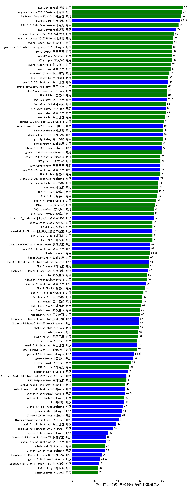

| 类别 | 大模型                         | CMB-医师考试-中级职称-病理科主治医师 | 排名 |
|-----|------------------------------|---------|----|
|商用|hunyuan-turbo|98.0|1|
|商用|hunyuan-turbos-20250226|97.0|2|
|商用|Doubao-1.5-pro-32k-250115|96.0|3|
|商用|ERNIE-4.5-8K-Preview(new)|94.0|4|
|开源|DeepSeek-R1|93.0|5|
|开源|hunyuan-large|92.0|6|
|商用|Doubao-1.5-lite-32k-250115|90.0|7|
|商用|xunfei-spark-max|89.0|8|
|商用|hunyuan-turbos-20250313(new)|89.0|9|
|商用|360gpt2-pro|88.0|10|
|商用|360gpt-pro|88.0|11|
|商用|gemini-2.0-flash-thinking-exp-01-21|88.0|12|
|商用|qwen2.5-max|88.0|13|
|商用|hunyuan-t1-20250321(new)|87.9|14|
|商用|xunfei-spark-pro|87.0|15|
|商用|qwen-long|87.0|16|
|商用|xunfei-4.0Ultra|86.0|17|
|开源|qwen2.5-72b-instruct|85.0|18|
|商用|kimi-latest-8k|85.0|19|
|商用|abab7-chat-preview|84.0|20|
|商用|qwq-plus-2025-03-05|84.0|21|
|开源|deepseek-chat-v3-0324(new)|84.0|22|
|商用|GLM-4-Plus|84.0|23|
|开源|qwq-32b|83.5|24|
|开源|MiniMax-Text-01|83.0|25|
|商用|qwen-plus|83.0|26|
|商用|SenseChat-5-beta|83.0|27|
|商用|qwen-turbo|82.0|28|
|商用|gemini-2.0-pro-exp-02-05|81.0|29|
|商用|hunyuan-standard|80.0|30|
|开源|Meta-Llama-3.1-405B-Instruct|80.0|31|
|开源|deepseek-chat-v3|80.0|32|
|商用|yi-lightning|80.0|33|
|开源|Llama-3.3-70B-Instruct|79.0|34|
|商用|SenseChat-5-1202|79.0|35|
|开源|qwq-32b-preview|78.0|36|
|商用|GLM-4-AirX|78.0|37|
|开源|qwen2.5-32b-instruct|78.0|38|
|商用|360gpt2-o1|78.0|39|
|商用|gemini-2.0-flash-001|78.0|40|
|商用|gemini-2.0-flash-exp|77.0|41|
|开源|Llama-3.3-70B-Instruct-fp8|77.0|42|
|商用|Baichuan4-Turbo|76.0|43|
|商用|ERNIE-4.0|76.0|44|
|商用|GLM-4-Air|75.0|45|
|商用|gemini-1.5-pro|74.0|46|
|商用|360gpt-turbo|73.0|47|
|商用|360zhinao2-o1|72.0|48|
|商用|GLM-Zero-Preview|72.0|49|
|开源|internlm2_5-7b-chat|72.0|50|
|开源|internlm2_5-20b-chat|71.0|51|
|商用|ERNIE-3.5-8K|71.0|52|
|商用|GLM-4-Long|71.0|53|
|商用|ERNIE-4.0-Turbo-8K|71.0|54|
|商用|chatgpt-4o-latest|71.0|55|
|开源|DeepSeek-R1-Distill-Llama-70B|69.0|56|
|开源|qwen2.5-14b-instruct|69.0|57|
|商用|SenseChat-Turbo-1202|68.0|58|
|开源|Llama-3.1-Nemotron-70B-Instruct-fp8|68.0|59|
|开源|DeepSeek-R1-Distill-Qwen-32B|67.0|60|
|商用|o3-mini|66.0|61|
|商用|step-1-8k|66.0|62|
|商用|Claude-3.5-Sonnet|66.0|63|
|开源|qwen2.5-7b-instruct|65.0|64|
|商用|GLM-4-FlashX|64.0|65|
|商用|gemini-1.5-flash|63.0|66|
|商用|GLM-4-Flash|62.4|67|
|商用|Baichuan4|62.0|68|
|商用|Baichuan4-Air|62.0|69|
|商用|ERNIE-Lite-Pro-128K|61.0|70|
|商用|step-2-mini|60.0|71|
|商用|moonshot-v1-8k|60.0|72|
|商用|abab6.5s-chat|59.0|73|
|开源|Hermes-3-Llama-3.1-405B|59.0|74|
|开源|DeepSeek-R1-Distill-Qwen-14B|59.0|75|
|商用|step-1-flash|58.0|76|
|商用|o1-mini|58.0|77|
|商用|gpt-4o-mini-2024-07-18|57.0|78|
|开源|qwen2.5-3b-instruct|57.0|79|
|商用|mistral-large|57.0|80|
|开源|gemma-3-27b-it(new)|54.5|81|
|开源|glm-4-9b-chat|54.0|82|
|商用|mistral-small|52.0|83|
|商用|ERNIE-Speed-8K|50.5|84|
|商用|ERNIE-Lite-8K|50.0|85|
|开源|gemma-2-27b-it|49.0|86|
|开源|Mistral-Small-24B-Instruct-2501(new)|48.0|87|
|商用|ERNIE-Speed-Pro-128K|48.0|88|
|开源|Meta-Llama-3.1-8B-Instruct-fp8|47.0|89|
|开源|gemma-3-12b-it(new)|46.5|90|
|开源|phi-4|46.0|91|
|商用|gemini-1.5-flash-8b|46.0|92|
|开源|Llama-3.1-8B-Instruct|45.0|93|
|开源|gemma-2-9b-it|44.0|94|
|开源|Llama-3.2-3B-Instruct|43.0|95|
|开源|Mistral-Nemo-Instruct-2407|41.0|96|
|开源|qwen2.5-1.5b-instruct|39.0|97|
|开源|Mistral-7B-Instruct-v0.3|36.0|98|
|开源|gemma-3-4b-it(new)|32.0|99|
|开源|qwen2.5-0.5b-instruct|30.0|100|
|开源|DeepSeek-R1-Distill-Qwen-7B|30.0|101|
|开源|Llama-3.2-1B-Instruct|29.0|102|
|商用|ministral-8b|29.0|103|
|开源|DeepSeek-R1-Distill-Llama-8B|26.0|104|
|开源|gemma-3-1b-it(new)|24.5|105|
|开源|DeepSeek-R1-Distill-Qwen-1.5B|24.0|106|
|商用|ERNIE-Tiny-8K|23.0|107|
|商用|ministral-3b|23.0|108|
|商用|xunfei-spark-lite|18.7|109|
|开源|qwen2.5-math-72b-instruct|/|110|

