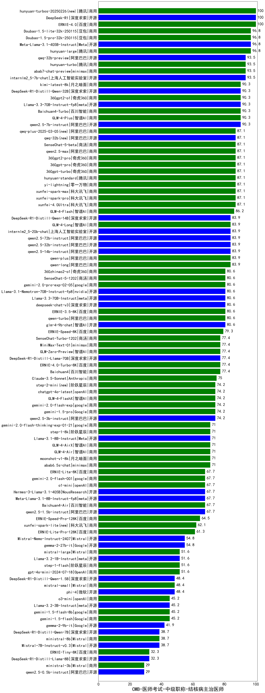

| 类别 | 大模型                         | CMB-医师考试-中级职称-结核病主治医师 | 排名 |
|-----|------------------------------|---------|----|
|商用|ERNIE-4.0|100.0|1|
|开源|DeepSeek-R1|100.0|2|
|商用|hunyuan-turbos-20250226(new)|100.0|3|
|开源|hunyuan-large|96.8|4|
|商用|Doubao-1.5-pro-32k-250115|96.8|5|
|商用|hunyuan-turbos-20250313(new)|96.8|6|
|开源|Meta-Llama-3.1-405B-Instruct|96.8|7|
|商用|Doubao-1.5-lite-32k-250115|96.8|8|
|商用|abab7-chat-preview|93.5|9|
|开源|qwq-32b-preview|93.5|10|
|商用|hunyuan-turbo|93.5|11|
|开源|internlm2_5-7b-chat|93.5|12|
|商用|ERNIE-4.5-8K-Preview(new)|93.5|13|
|商用|360gpt2-o1|90.3|14|
|商用|Baichuan4-Turbo|90.3|15|
|商用|GLM-4-Plus|90.3|16|
|开源|qwen2.5-7b-instruct|90.3|17|
|商用|kimi-latest-8k|90.3|18|
|开源|Llama-3.3-70B-Instruct-fp8|90.3|19|
|开源|DeepSeek-R1-Distill-Qwen-32B|90.3|20|
|商用|xunfei-spark-max|87.1|21|
|商用|xunfei-spark-pro|87.1|22|
|商用|360gpt2-pro|87.1|23|
|商用|qwen2.5-max|87.1|24|
|商用|SenseChat-5-beta|87.1|25|
|商用|xunfei-4.0Ultra|87.1|26|
|开源|qwq-32b(new)|87.1|27|
|商用|qwq-plus-2025-03-05(new)|87.1|28|
|商用|360gpt-turbo|87.1|29|
|商用|360gpt-pro|87.1|30|
|商用|yi-lightning|87.1|31|
|商用|hunyuan-standard|87.1|32|
|商用|GLM-4-Flash|86.2|33|
|开源|qwen2.5-32b-instruct|83.9|34|
|开源|internlm2_5-20b-chat|83.9|35|
|商用|GLM-4-Long|83.9|36|
|商用|qwen-long|83.9|37|
|商用|qwen-plus|83.9|38|
|开源|qwen2.5-72b-instruct|83.9|39|
|开源|qwen2.5-14b-instruct|83.9|40|
|开源|DeepSeek-R1-Distill-Qwen-14B|83.9|41|
|商用|qwen-turbo|80.6|42|
|开源|deepseek-chat-v3|80.6|43|
|商用|ERNIE-3.5-8K|80.6|44|
|商用|gemini-2.0-pro-exp-02-05|80.6|45|
|商用|360zhinao2-o1|80.6|46|
|开源|glm-4-9b-chat|80.6|47|
|开源|Llama-3.3-70B-Instruct|80.6|48|
|开源|Llama-3.1-Nemotron-70B-Instruct-fp8|80.6|49|
|商用|SenseChat-5-1202|80.6|50|
|商用|ERNIE-Speed-8K|79.3|51|
|商用|Baichuan4|77.4|52|
|商用|SenseChat-Turbo-1202|77.4|53|
|开源|MiniMax-Text-01|77.4|54|
|商用|GLM-Zero-Preview|77.4|55|
|开源|DeepSeek-R1-Distill-Llama-70B|77.4|56|
|商用|ERNIE-4.0-Turbo-8K|77.4|57|
|商用|Claude-3.5-Sonnet|75.0|58|
|开源|qwen2.5-3b-instruct|74.2|59|
|商用|gemini-1.5-pro|74.2|60|
|商用|gemini-2.0-flash-exp|74.2|61|
|商用|GLM-4-FlashX|74.2|62|
|商用|chatgpt-4o-latest|74.2|63|
|商用|step-2-mini(new)|74.2|64|
|商用|step-1-8k|71.0|65|
|商用|gemini-2.0-flash-thinking-exp-01-21|71.0|66|
|商用|abab6.5s-chat|71.0|67|
|商用|GLM-4-Air|71.0|68|
|商用|moonshot-v1-8k|71.0|69|
|商用|GLM-4-AirX|71.0|70|
|开源|Llama-3.1-8B-Instruct|71.0|71|
|商用|Baichuan4-Air|67.7|72|
|商用|ERNIE-Lite-8K|67.7|73|
|商用|gemini-2.0-flash-001|67.7|74|
|开源|qwen2.5-1.5b-instruct|67.7|75|
|开源|Meta-Llama-3.1-8B-Instruct-fp8|67.7|76|
|商用|o1-mini|67.7|77|
|开源|Hermes-3-Llama-3.1-405B|67.7|78|
|商用|ERNIE-Speed-Pro-128K|64.5|79|
|商用|xunfei-spark-lite(new)|62.1|80|
|商用|ERNIE-Lite-Pro-128K|61.3|81|
|开源|gemma-2-27b-it|54.8|82|
|开源|Mistral-Nemo-Instruct-2407|54.8|83|
|商用|gpt-4o-mini-2024-07-18|51.6|84|
|开源|Mistral-Small-24B-Instruct-2501(new)|51.6|85|
|开源|gemma-3-27b-it(new)|51.6|86|
|商用|step-1-flash|51.6|87|
|开源|Llama-3.2-1B-Instruct|51.6|88|
|商用|mistral-large|51.6|89|
|商用|mistral-small|48.4|90|
|开源|phi-4|48.4|91|
|开源|DeepSeek-R1-Distill-Qwen-1.5B|48.4|92|
|开源|gemma-3-12b-it(new)|45.2|93|
|开源|Llama-3.2-3B-Instruct|45.2|94|
|商用|gemini-1.5-flash-8b|45.2|95|
|商用|gemini-1.5-flash|45.2|96|
|商用|o3-mini|45.2|97|
|开源|gemma-2-9b-it|41.9|98|
|开源|Mistral-7B-Instruct-v0.3|38.7|99|
|开源|DeepSeek-R1-Distill-Qwen-7B|38.7|100|
|商用|ministral-8b|38.7|101|
|商用|ERNIE-Tiny-8K|32.3|102|
|开源|gemma-3-4b-it(new)|32.3|103|
|开源|DeepSeek-R1-Distill-Llama-8B|32.3|104|
|商用|ministral-3b|29.0|105|
|开源|qwen2.5-0.5b-instruct|29.0|106|
|开源|gemma-3-1b-it(new)|22.6|107|
|开源|qwen2.5-math-72b-instruct|/|108|

