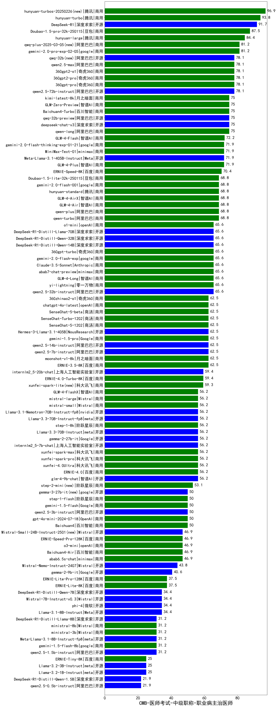

| 类别 | 大模型                         | CMB-医师考试-中级职称-职业病主治医师 | 排名 |
|-----|------------------------------|---------|----|
|商用|hunyuan-turbos-20250226(new)|96.9|1|
|商用|hunyuan-turbo|93.8|2|
|商用|ERNIE-4.5-8K-Preview(new)|93.8|3|
|开源|DeepSeek-R1|91.7|4|
|商用|Doubao-1.5-pro-32k-250115|87.5|5|
|开源|hunyuan-large|84.4|6|
|商用|hunyuan-turbos-20250313(new)|84.4|7|
|商用|gemini-2.0-pro-exp-02-05|81.2|8|
|商用|qwq-plus-2025-03-05(new)|81.2|9|
|商用|360gpt2-pro|78.1|10|
|开源|qwen2.5-72b-instruct|78.1|11|
|商用|qwen2.5-max|78.1|12|
|商用|360gpt-pro|78.1|13|
|商用|360gpt2-o1|78.1|14|
|开源|qwq-32b(new)|78.1|15|
|商用|Baichuan4-Turbo|75.0|16|
|开源|deepseek-chat-v3|75.0|17|
|商用|GLM-Zero-Preview|75.0|18|
|商用|kimi-latest-8k|75.0|19|
|商用|qwen-long|75.0|20|
|开源|qwq-32b-preview|75.0|21|
|商用|GLM-4-Flash|72.2|22|
|开源|MiniMax-Text-01|71.9|23|
|商用|GLM-4-Plus|71.9|24|
|开源|Meta-Llama-3.1-405B-Instruct|71.9|25|
|商用|gemini-2.0-flash-thinking-exp-01-21|71.9|26|
|商用|ERNIE-Speed-8K|70.4|27|
|商用|gemini-2.0-flash-001|68.8|28|
|商用|GLM-4-AirX|68.8|29|
|商用|hunyuan-standard|68.8|30|
|商用|GLM-4-Air|68.8|31|
|商用|qwen-plus|68.8|32|
|商用|qwen-turbo|68.8|33|
|商用|Doubao-1.5-lite-32k-250115|68.8|34|
|开源|qwen2.5-32b-instruct|65.6|35|
|商用|yi-lightning|65.6|36|
|商用|gemini-2.0-flash-exp|65.6|37|
|商用|360gpt-turbo|65.6|38|
|开源|DeepSeek-R1-Distill-Qwen-14B|65.6|39|
|开源|DeepSeek-R1-Distill-Qwen-32B|65.6|40|
|开源|DeepSeek-R1-Distill-Llama-70B|65.6|41|
|商用|abab7-chat-preview|65.6|42|
|商用|Claude-3.5-Sonnet|65.6|43|
|商用|GLM-4-Long|65.6|44|
|商用|o1-mini|65.6|45|
|商用|SenseChat-5-1202|62.5|46|
|商用|SenseChat-Turbo-1202|62.5|47|
|商用|ERNIE-3.5-8K|62.5|48|
|商用|gemini-1.5-pro|62.5|49|
|开源|qwen2.5-7b-instruct|62.5|50|
|开源|qwen2.5-14b-instruct|62.5|51|
|商用|moonshot-v1-8k|62.5|52|
|商用|chatgpt-4o-latest|62.5|53|
|商用|SenseChat-5-beta|62.5|54|
|商用|360zhinao2-o1|62.5|55|
|开源|Hermes-3-Llama-3.1-405B|62.5|56|
|开源|internlm2_5-20b-chat|59.4|57|
|商用|ERNIE-4.0-Turbo-8K|59.4|58|
|商用|xunfei-spark-lite(new)|59.3|59|
|开源|Llama-3.3-70B-Instruct|56.2|60|
|商用|ERNIE-4.0|56.2|61|
|开源|Llama-3.3-70B-Instruct-fp8|56.2|62|
|商用|step-1-8k|56.2|63|
|开源|Llama-3.1-Nemotron-70B-Instruct-fp8|56.2|64|
|商用|GLM-4-FlashX|56.2|65|
|商用|mistral-small|56.2|66|
|商用|mistral-large|56.2|67|
|开源|gemma-2-27b-it|56.2|68|
|商用|xunfei-4.0Ultra|56.2|69|
|开源|internlm2_5-7b-chat|56.2|70|
|商用|xunfei-spark-max|56.2|71|
|开源|glm-4-9b-chat|56.2|72|
|商用|xunfei-spark-pro|56.2|73|
|商用|step-2-mini(new)|53.1|74|
|商用|gpt-4o-mini-2024-07-18|50.0|75|
|商用|Baichuan4|50.0|76|
|开源|gemma-3-27b-it(new)|50.0|77|
|商用|step-1-flash|50.0|78|
|开源|qwen2.5-3b-instruct|50.0|79|
|商用|gemini-1.5-flash|50.0|80|
|商用|Baichuan4-Air|46.9|81|
|商用|abab6.5s-chat|46.9|82|
|开源|Mistral-Small-24B-Instruct-2501(new)|46.9|83|
|商用|o3-mini|46.9|84|
|商用|ERNIE-Speed-Pro-128K|46.9|85|
|开源|gemma-3-12b-it(new)|46.9|86|
|开源|Mistral-Nemo-Instruct-2407|43.8|87|
|开源|gemma-2-9b-it|40.6|88|
|商用|ERNIE-Lite-Pro-128K|37.5|89|
|商用|ERNIE-Lite-8K|37.5|90|
|开源|phi-4|34.4|91|
|开源|Llama-3.1-8B-Instruct|34.4|92|
|开源|Mistral-7B-Instruct-v0.3|34.4|93|
|开源|DeepSeek-R1-Distill-Qwen-7B|34.4|94|
|开源|qwen2.5-1.5b-instruct|31.2|95|
|开源|DeepSeek-R1-Distill-Llama-8B|31.2|96|
|商用|ministral-3b|31.2|97|
|开源|Meta-Llama-3.1-8B-Instruct-fp8|31.2|98|
|商用|ministral-8b|31.2|99|
|商用|gemini-1.5-flash-8b|31.2|100|
|开源|gemma-3-1b-it(new)|28.1|101|
|开源|gemma-3-4b-it(new)|28.1|102|
|开源|Llama-3.2-1B-Instruct|25.0|103|
|开源|Llama-3.2-3B-Instruct|25.0|104|
|商用|ERNIE-Tiny-8K|25.0|105|
|开源|qwen2.5-0.5b-instruct|21.9|106|
|开源|DeepSeek-R1-Distill-Qwen-1.5B|21.9|107|
|开源|qwen2.5-math-72b-instruct|/|108|

