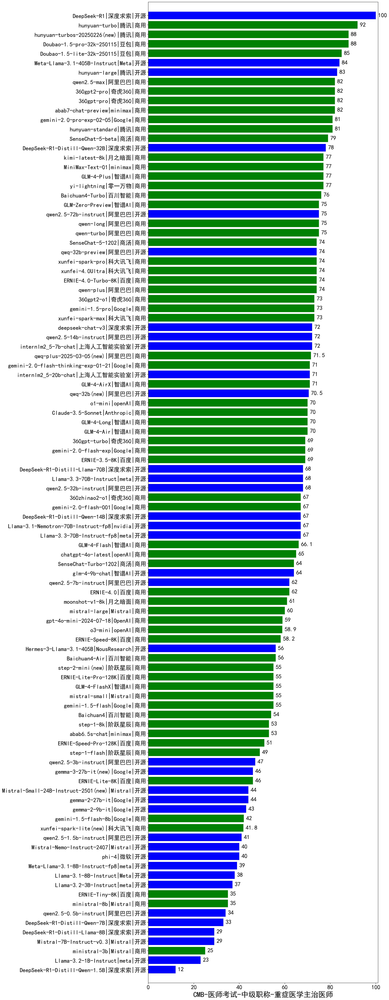

| 类别 | 大模型                         | CMB-医师考试-中级职称-重症医学主治医师 | 排名 |
|-----|------------------------------|---------|----|
|开源|DeepSeek-R1|100.0|1|
|商用|hunyuan-turbo|92.0|2|
|商用|hunyuan-turbos-20250226(new)|88.0|3|
|商用|Doubao-1.5-pro-32k-250115|88.0|4|
|商用|Doubao-1.5-lite-32k-250115|85.0|5|
|开源|Meta-Llama-3.1-405B-Instruct|84.0|6|
|商用|hunyuan-large|83.0|7|
|商用|360gpt-pro|82.0|8|
|商用|abab7-chat-preview|82.0|9|
|商用|qwen2.5-max|82.0|10|
|商用|360gpt2-pro|82.0|11|
|商用|hunyuan-standard|81.0|12|
|商用|gemini-2.0-pro-exp-02-05|81.0|13|
|商用|SenseChat-5-beta|79.0|14|
|开源|DeepSeek-R1-Distill-Qwen-32B|78.0|15|
|商用|GLM-4-Plus|77.0|16|
|商用|MiniMax-Text-01|77.0|17|
|商用|kimi-latest-8k|77.0|18|
|商用|yi-lightning|77.0|19|
|商用|Baichuan4-Turbo|76.0|20|
|商用|qwen-turbo|75.0|21|
|开源|qwen2.5-72b-instruct|75.0|22|
|商用|GLM-Zero-Preview|75.0|23|
|商用|qwen-long|75.0|24|
|商用|xunfei-4.0Ultra|74.0|25|
|商用|ERNIE-4.0-Turbo-8K|74.0|26|
|商用|xunfei-spark-pro|74.0|27|
|商用|SenseChat-5-1202|74.0|28|
|开源|qwq-32b-preview|74.0|29|
|商用|qwen-plus|74.0|30|
|商用|gemini-1.5-pro|73.0|31|
|商用|360gpt2-o1|73.0|32|
|商用|xunfei-spark-max|73.0|33|
|开源|qwen2.5-14b-instruct|72.0|34|
|开源|deepseek-chat-v3|72.0|35|
|开源|internlm2_5-7b-chat|72.0|36|
|商用|qwq-plus-2025-03-05(new)|71.5|37|
|开源|internlm2_5-20b-chat|71.0|38|
|商用|GLM-4-AirX|71.0|39|
|商用|gemini-2.0-flash-thinking-exp-01-21|71.0|40|
|开源|qwq-32b(new)|70.5|41|
|商用|Claude-3.5-Sonnet|70.0|42|
|商用|GLM-4-Air|70.0|43|
|商用|GLM-4-Long|70.0|44|
|商用|o1-mini|70.0|45|
|商用|ERNIE-3.5-8K|69.0|46|
|商用|360gpt-turbo|69.0|47|
|商用|gemini-2.0-flash-exp|69.0|48|
|开源|qwen2.5-32b-instruct|68.0|49|
|开源|DeepSeek-R1-Distill-Llama-70B|68.0|50|
|开源|Llama-3.3-70B-Instruct|68.0|51|
|商用|360zhinao2-o1|67.0|52|
|开源|Llama-3.3-70B-Instruct-fp8|67.0|53|
|开源|DeepSeek-R1-Distill-Qwen-14B|67.0|54|
|开源|Llama-3.1-Nemotron-70B-Instruct-fp8|67.0|55|
|商用|gemini-2.0-flash-001|67.0|56|
|商用|GLM-4-Flash|66.1|57|
|商用|chatgpt-4o-latest|65.0|58|
|商用|SenseChat-Turbo-1202|64.0|59|
|开源|glm-4-9b-chat|64.0|60|
|商用|ERNIE-4.0|62.0|61|
|开源|qwen2.5-7b-instruct|62.0|62|
|商用|moonshot-v1-8k|61.0|63|
|商用|mistral-large|60.0|64|
|商用|gpt-4o-mini-2024-07-18|59.0|65|
|商用|o3-mini|58.9|66|
|商用|ERNIE-Speed-8K|58.2|67|
|商用|Baichuan4-Air|56.0|68|
|开源|Hermes-3-Llama-3.1-405B|56.0|69|
|商用|ERNIE-Lite-Pro-128K|55.0|70|
|商用|gemini-1.5-flash|55.0|71|
|商用|mistral-small|55.0|72|
|商用|step-2-mini(new)|55.0|73|
|商用|GLM-4-FlashX|55.0|74|
|商用|Baichuan4|54.0|75|
|商用|step-1-8k|53.0|76|
|商用|abab6.5s-chat|53.0|77|
|商用|ERNIE-Speed-Pro-128K|51.0|78|
|商用|step-1-flash|49.0|79|
|开源|qwen2.5-3b-instruct|47.0|80|
|商用|ERNIE-Lite-8K|46.0|81|
|开源|gemma-2-27b-it|44.0|82|
|开源|gemma-2-9b-it|43.0|83|
|商用|gemini-1.5-flash-8b|42.0|84|
|商用|xunfei-spark-lite(new)|41.8|85|
|开源|qwen2.5-1.5b-instruct|41.0|86|
|开源|Mistral-Nemo-Instruct-2407|40.0|87|
|开源|phi-4|40.0|88|
|开源|Meta-Llama-3.1-8B-Instruct-fp8|39.0|89|
|开源|Llama-3.1-8B-Instruct|38.0|90|
|开源|Llama-3.2-3B-Instruct|37.0|91|
|商用|ERNIE-Tiny-8K|35.0|92|
|商用|ministral-8b|35.0|93|
|开源|qwen2.5-0.5b-instruct|34.0|94|
|开源|DeepSeek-R1-Distill-Qwen-7B|33.0|95|
|开源|Mistral-7B-Instruct-v0.3|29.0|96|
|开源|DeepSeek-R1-Distill-Llama-8B|29.0|97|
|商用|ministral-3b|25.0|98|
|开源|Llama-3.2-1B-Instruct|23.0|99|
|开源|DeepSeek-R1-Distill-Qwen-1.5B|12.0|100|
|开源|Yi-1.5-9B-Chat|/|101|
|开源|Yi-1.5-34B-Chat|/|102|
|开源|qwen2.5-math-72b-instruct|/|103|

