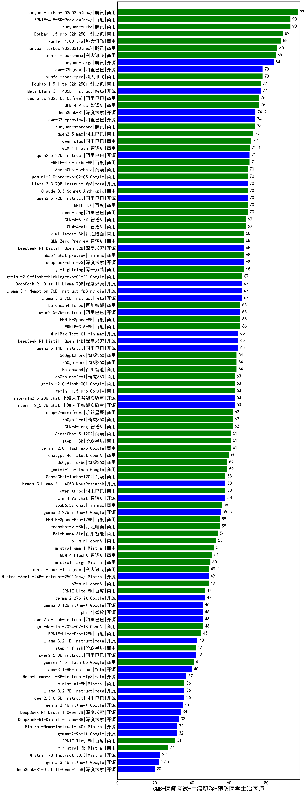

| 类别 | 大模型                         | CMB-医师考试-中级职称-预防医学主治医师 | 排名 |
|-----|------------------------------|---------|----|
|商用|hunyuan-turbos-20250226(new)|97.0|1|
|商用|hunyuan-turbo|93.0|2|
|商用|Doubao-1.5-pro-32k-250115|89.0|3|
|商用|xunfei-4.0Ultra|88.0|4|
|商用|xunfei-spark-max|85.0|5|
|开源|hunyuan-large|84.0|6|
|开源|qwq-32b(new)|78.0|7|
|商用|xunfei-spark-pro|78.0|8|
|开源|Meta-Llama-3.1-405B-Instruct|77.0|9|
|商用|Doubao-1.5-lite-32k-250115|77.0|10|
|商用|GLM-4-Plus|76.0|11|
|商用|qwq-plus-2025-03-05(new)|76.0|12|
|开源|DeepSeek-R1|74.2|13|
|开源|qwq-32b-preview|74.0|14|
|商用|hunyuan-standard|74.0|15|
|商用|qwen2.5-max|73.0|16|
|商用|qwen-plus|72.0|17|
|商用|GLM-4-Flash|71.1|18|
|商用|ERNIE-4.0-Turbo-8K|71.0|19|
|开源|qwen2.5-32b-instruct|71.0|20|
|开源|qwen2.5-72b-instruct|70.0|21|
|商用|qwen-long|70.0|22|
|商用|Claude-3.5-Sonnet|70.0|23|
|商用|gemini-2.0-pro-exp-02-05|70.0|24|
|商用|ERNIE-4.0|70.0|25|
|开源|Llama-3.3-70B-Instruct-fp8|70.0|26|
|商用|SenseChat-5-beta|70.0|27|
|商用|GLM-4-AirX|69.0|28|
|商用|GLM-4-Air|69.0|29|
|开源|DeepSeek-R1-Distill-Qwen-32B|68.0|30|
|商用|kimi-latest-8k|68.0|31|
|商用|GLM-Zero-Preview|68.0|32|
|开源|deepseek-chat-v3|68.0|33|
|商用|abab7-chat-preview|68.0|34|
|商用|yi-lightning|68.0|35|
|开源|Llama-3.3-70B-Instruct|67.0|36|
|开源|Llama-3.1-Nemotron-70B-Instruct-fp8|67.0|37|
|开源|DeepSeek-R1-Distill-Llama-70B|67.0|38|
|商用|gemini-2.0-flash-thinking-exp-01-21|67.0|39|
|商用|ERNIE-Speed-8K|66.0|40|
|开源|qwen2.5-7b-instruct|66.0|41|
|商用|Baichuan4-Turbo|66.0|42|
|商用|ERNIE-3.5-8K|66.0|43|
|开源|qwen2.5-14b-instruct|65.0|44|
|商用|MiniMax-Text-01|65.0|45|
|开源|DeepSeek-R1-Distill-Qwen-14B|65.0|46|
|商用|Baichuan4|64.0|47|
|商用|360gpt2-pro|64.0|48|
|商用|360gpt-pro|64.0|49|
|开源|internlm2_5-7b-chat|63.0|50|
|商用|gemini-2.0-flash-001|63.0|51|
|商用|360zhinao2-o1|63.0|52|
|商用|gemini-1.5-pro|63.0|53|
|开源|internlm2_5-20b-chat|63.0|54|
|商用|GLM-4-Long|62.0|55|
|商用|step-2-mini(new)|62.0|56|
|商用|360gpt2-o1|62.0|57|
|商用|step-1-8k|61.0|58|
|商用|SenseChat-5-1202|61.0|59|
|商用|gemini-2.0-flash-exp|61.0|60|
|商用|chatgpt-4o-latest|60.0|61|
|商用|gemini-1.5-flash|59.0|62|
|商用|360gpt-turbo|59.0|63|
|开源|Hermes-3-Llama-3.1-405B|58.0|64|
|商用|SenseChat-Turbo-1202|58.0|65|
|开源|glm-4-9b-chat|58.0|66|
|商用|qwen-turbo|58.0|67|
|商用|abab6.5s-chat|56.0|68|
|开源|gemma-3-27b-it(new)|55.5|69|
|商用|moonshot-v1-8k|55.0|70|
|商用|ERNIE-Speed-Pro-128K|55.0|71|
|商用|Baichuan4-Air|54.0|72|
|商用|o1-mini|53.0|73|
|商用|mistral-small|52.0|74|
|商用|GLM-4-FlashX|51.0|75|
|商用|mistral-large|50.0|76|
|商用|xunfei-spark-lite(new)|49.1|77|
|开源|Mistral-Small-24B-Instruct-2501(new)|49.0|78|
|商用|o3-mini|49.0|79|
|开源|gemma-2-27b-it|47.0|80|
|商用|ERNIE-Lite-8K|47.0|81|
|开源|phi-4|46.0|82|
|商用|gpt-4o-mini-2024-07-18|46.0|83|
|开源|qwen2.5-1.5b-instruct|46.0|84|
|商用|ERNIE-Lite-Pro-128K|45.0|85|
|开源|Llama-3.2-1B-Instruct|43.0|86|
|开源|qwen2.5-3b-instruct|42.0|87|
|商用|step-1-flash|42.0|88|
|商用|gemini-1.5-flash-8b|41.0|89|
|开源|Llama-3.1-8B-Instruct|40.0|90|
|开源|Meta-Llama-3.1-8B-Instruct-fp8|37.0|91|
|开源|Llama-3.2-3B-Instruct|36.0|92|
|开源|qwen2.5-0.5b-instruct|36.0|93|
|商用|ministral-8b|36.0|94|
|开源|DeepSeek-R1-Distill-Qwen-7B|34.0|95|
|开源|DeepSeek-R1-Distill-Llama-8B|33.0|96|
|开源|gemma-2-9b-it|32.0|97|
|开源|Mistral-Nemo-Instruct-2407|32.0|98|
|商用|ERNIE-Tiny-8K|31.0|99|
|商用|ministral-3b|27.0|100|
|开源|Mistral-7B-Instruct-v0.3|23.0|101|
|开源|DeepSeek-R1-Distill-Qwen-1.5B|20.0|102|
|开源|Yi-1.5-34B-Chat|/|103|
|开源|Yi-1.5-9B-Chat|/|104|
|开源|qwen2.5-math-72b-instruct|/|105|

