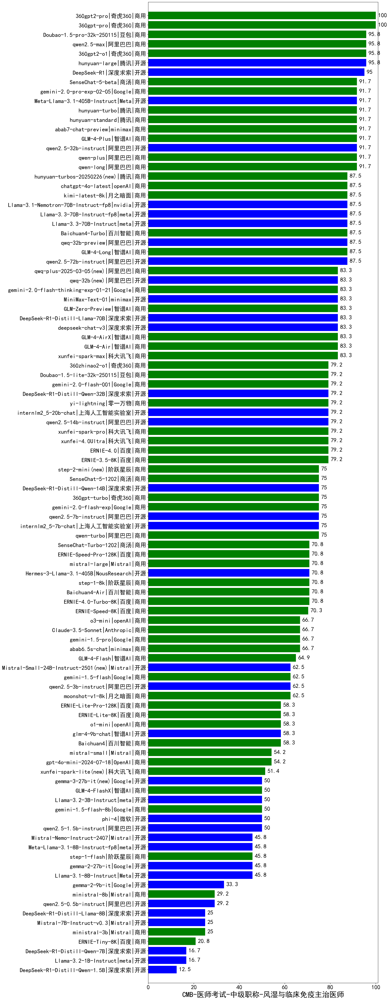

| 类别 | 大模型                         | CMB-医师考试-中级职称-风湿与临床免疫主治医师 | 排名 |
|-----|------------------------------|---------|----|
|商用|360gpt-pro|100.0|1|
|商用|360gpt2-pro|100.0|2|
|商用|360gpt2-o1|95.8|3|
|商用|Doubao-1.5-pro-32k-250115|95.8|4|
|商用|qwen2.5-max|95.8|5|
|开源|hunyuan-large|95.8|6|
|开源|DeepSeek-R1|95.0|7|
|商用|qwen-plus|91.7|8|
|商用|hunyuan-turbo|91.7|9|
|开源|Meta-Llama-3.1-405B-Instruct|91.7|10|
|商用|gemini-2.0-pro-exp-02-05|91.7|11|
|商用|hunyuan-standard|91.7|12|
|开源|qwen2.5-32b-instruct|91.7|13|
|商用|GLM-4-Plus|91.7|14|
|商用|qwen-long|91.7|15|
|商用|abab7-chat-preview|91.7|16|
|商用|SenseChat-5-beta|91.7|17|
|商用|GLM-4-Long|87.5|18|
|开源|Llama-3.3-70B-Instruct-fp8|87.5|19|
|开源|Llama-3.3-70B-Instruct|87.5|20|
|商用|Baichuan4-Turbo|87.5|21|
|商用|hunyuan-turbos-20250226(new)|87.5|22|
|商用|kimi-latest-8k|87.5|23|
|开源|Llama-3.1-Nemotron-70B-Instruct-fp8|87.5|24|
|商用|chatgpt-4o-latest|87.5|25|
|开源|qwq-32b-preview|87.5|26|
|开源|qwen2.5-72b-instruct|87.5|27|
|商用|GLM-4-AirX|83.3|28|
|商用|xunfei-spark-max|83.3|29|
|开源|deepseek-chat-v3|83.3|30|
|商用|qwq-plus-2025-03-05(new)|83.3|31|
|开源|DeepSeek-R1-Distill-Llama-70B|83.3|32|
|商用|GLM-4-Air|83.3|33|
|开源|MiniMax-Text-01|83.3|34|
|开源|qwq-32b(new)|83.3|35|
|商用|gemini-2.0-flash-thinking-exp-01-21|83.3|36|
|商用|GLM-Zero-Preview|83.3|37|
|开源|qwen2.5-14b-instruct|79.2|38|
|商用|xunfei-spark-pro|79.2|39|
|商用|xunfei-4.0Ultra|79.2|40|
|商用|ERNIE-4.0|79.2|41|
|开源|DeepSeek-R1-Distill-Qwen-32B|79.2|42|
|商用|360zhinao2-o1|79.2|43|
|商用|Doubao-1.5-lite-32k-250115|79.2|44|
|商用|gemini-2.0-flash-001|79.2|45|
|商用|ERNIE-3.5-8K|79.2|46|
|商用|yi-lightning|79.2|47|
|开源|internlm2_5-20b-chat|79.2|48|
|开源|qwen2.5-7b-instruct|75.0|49|
|商用|step-2-mini(new)|75.0|50|
|商用|qwen-turbo|75.0|51|
|开源|internlm2_5-7b-chat|75.0|52|
|商用|360gpt-turbo|75.0|53|
|商用|gemini-2.0-flash-exp|75.0|54|
|开源|DeepSeek-R1-Distill-Qwen-14B|75.0|55|
|商用|SenseChat-5-1202|75.0|56|
|商用|step-1-8k|70.8|57|
|商用|ERNIE-4.0-Turbo-8K|70.8|58|
|开源|Hermes-3-Llama-3.1-405B|70.8|59|
|商用|Baichuan4-Air|70.8|60|
|商用|mistral-large|70.8|61|
|商用|ERNIE-Speed-Pro-128K|70.8|62|
|商用|SenseChat-Turbo-1202|70.8|63|
|商用|ERNIE-Speed-8K|70.3|64|
|商用|Claude-3.5-Sonnet|66.7|65|
|商用|abab6.5s-chat|66.7|66|
|商用|gemini-1.5-pro|66.7|67|
|商用|o3-mini|66.7|68|
|商用|GLM-4-Flash|64.9|69|
|开源|Mistral-Small-24B-Instruct-2501(new)|62.5|70|
|开源|qwen2.5-3b-instruct|62.5|71|
|商用|moonshot-v1-8k|62.5|72|
|商用|gemini-1.5-flash|62.5|73|
|商用|Baichuan4|58.3|74|
|商用|o1-mini|58.3|75|
|商用|ERNIE-Lite-8K|58.3|76|
|商用|ERNIE-Lite-Pro-128K|58.3|77|
|开源|glm-4-9b-chat|58.3|78|
|商用|mistral-small|54.2|79|
|商用|gpt-4o-mini-2024-07-18|54.2|80|
|商用|xunfei-spark-lite(new)|51.4|81|
|商用|gemini-1.5-flash-8b|50.0|82|
|商用|GLM-4-FlashX|50.0|83|
|开源|gemma-3-27b-it(new)|50.0|84|
|开源|Llama-3.2-3B-Instruct|50.0|85|
|开源|phi-4|50.0|86|
|开源|qwen2.5-1.5b-instruct|50.0|87|
|开源|Llama-3.1-8B-Instruct|45.8|88|
|开源|Mistral-Nemo-Instruct-2407|45.8|89|
|开源|Meta-Llama-3.1-8B-Instruct-fp8|45.8|90|
|开源|gemma-2-27b-it|45.8|91|
|商用|step-1-flash|45.8|92|
|开源|gemma-2-9b-it|33.3|93|
|开源|qwen2.5-0.5b-instruct|29.2|94|
|商用|ministral-8b|29.2|95|
|商用|ministral-3b|25.0|96|
|开源|Mistral-7B-Instruct-v0.3|25.0|97|
|开源|DeepSeek-R1-Distill-Llama-8B|25.0|98|
|商用|ERNIE-Tiny-8K|20.8|99|
|开源|Llama-3.2-1B-Instruct|16.7|100|
|开源|DeepSeek-R1-Distill-Qwen-7B|16.7|101|
|开源|DeepSeek-R1-Distill-Qwen-1.5B|12.5|102|
|开源|Yi-1.5-34B-Chat|/|103|
|开源|Yi-1.5-9B-Chat|/|104|
|开源|qwen2.5-math-72b-instruct|/|105|

