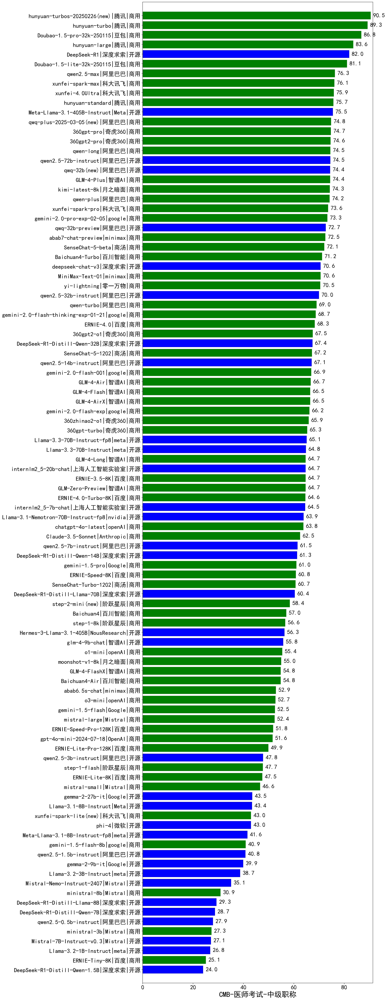

| 类别 | 大模型                         | CMB-医师考试-中级职称 | 排名 |
|-----|------------------------------|---------|----|
|商用|ERNIE-4.5-8K-Preview(new)|94.1|1|
|商用|hunyuan-turbos-20250226(new)|90.5|2|
|商用|hunyuan-turbo|89.3|3|
|商用|Doubao-1.5-pro-32k-250115|86.8|4|
|开源|hunyuan-large|83.6|5|
|商用|hunyuan-turbos-20250313(new)|83.5|6|
|开源|DeepSeek-R1|82.0|7|
|商用|Doubao-1.5-lite-32k-250115|81.1|8|
|商用|qwen2.5-max|76.3|9|
|商用|xunfei-spark-max|76.1|10|
|商用|xunfei-4.0Ultra|75.9|11|
|商用|hunyuan-standard|75.7|12|
|开源|Meta-Llama-3.1-405B-Instruct|75.5|13|
|商用|qwq-plus-2025-03-05(new)|74.8|14|
|商用|360gpt-pro|74.7|15|
|商用|360gpt2-pro|74.6|16|
|商用|qwen-long|74.5|17|
|开源|qwen2.5-72b-instruct|74.5|18|
|开源|qwq-32b(new)|74.4|19|
|商用|GLM-4-Plus|74.4|20|
|商用|kimi-latest-8k|74.3|21|
|商用|qwen-plus|74.2|22|
|商用|xunfei-spark-pro|73.6|23|
|商用|gemini-2.0-pro-exp-02-05|73.3|24|
|开源|qwq-32b-preview|72.7|25|
|商用|abab7-chat-preview|72.5|26|
|商用|SenseChat-5-beta|72.1|27|
|商用|Baichuan4-Turbo|71.2|28|
|开源|deepseek-chat-v3|70.6|29|
|开源|MiniMax-Text-01|70.6|30|
|商用|yi-lightning|70.5|31|
|开源|qwen2.5-32b-instruct|70.0|32|
|商用|qwen-turbo|69.0|33|
|商用|gemini-2.0-flash-thinking-exp-01-21|68.7|34|
|商用|ERNIE-4.0|68.3|35|
|商用|360gpt2-o1|67.5|36|
|开源|DeepSeek-R1-Distill-Qwen-32B|67.4|37|
|商用|SenseChat-5-1202|67.2|38|
|开源|qwen2.5-14b-instruct|67.1|39|
|商用|gemini-2.0-flash-001|66.9|40|
|商用|GLM-4-Air|66.7|41|
|商用|GLM-4-Flash|66.5|42|
|商用|GLM-4-AirX|66.5|43|
|商用|gemini-2.0-flash-exp|66.2|44|
|商用|360zhinao2-o1|65.9|45|
|商用|360gpt-turbo|65.3|46|
|开源|Llama-3.3-70B-Instruct-fp8|65.1|47|
|开源|Llama-3.3-70B-Instruct|64.8|48|
|商用|GLM-4-Long|64.7|49|
|开源|internlm2_5-20b-chat|64.7|50|
|商用|ERNIE-3.5-8K|64.7|51|
|商用|GLM-Zero-Preview|64.7|52|
|商用|ERNIE-4.0-Turbo-8K|64.6|53|
|开源|internlm2_5-7b-chat|64.5|54|
|开源|Llama-3.1-Nemotron-70B-Instruct-fp8|63.9|55|
|商用|chatgpt-4o-latest|63.8|56|
|商用|Claude-3.5-Sonnet|62.5|57|
|开源|qwen2.5-7b-instruct|61.5|58|
|开源|DeepSeek-R1-Distill-Qwen-14B|61.3|59|
|商用|gemini-1.5-pro|61.0|60|
|商用|ERNIE-Speed-8K|60.8|61|
|商用|SenseChat-Turbo-1202|60.7|62|
|开源|DeepSeek-R1-Distill-Llama-70B|60.4|63|
|商用|step-2-mini(new)|58.4|64|
|商用|Baichuan4|57.0|65|
|商用|step-1-8k|56.6|66|
|开源|Hermes-3-Llama-3.1-405B|56.3|67|
|开源|glm-4-9b-chat|55.8|68|
|商用|o1-mini|55.4|69|
|商用|moonshot-v1-8k|55.0|70|
|商用|GLM-4-FlashX|54.8|71|
|商用|Baichuan4-Air|54.8|72|
|商用|abab6.5s-chat|52.9|73|
|商用|o3-mini|52.7|74|
|商用|gemini-1.5-flash|52.5|75|
|商用|mistral-large|52.4|76|
|商用|ERNIE-Speed-Pro-128K|51.8|77|
|商用|gpt-4o-mini-2024-07-18|51.6|78|
|商用|ERNIE-Lite-Pro-128K|49.9|79|
|开源|qwen2.5-3b-instruct|47.8|80|
|商用|step-1-flash|47.7|81|
|商用|ERNIE-Lite-8K|47.5|82|
|开源|gemma-3-27b-it(new)|46.9|83|
|商用|mistral-small|46.6|84|
|开源|Mistral-Small-24B-Instruct-2501(new)|44.0|85|
|开源|gemma-2-27b-it|43.5|86|
|开源|Llama-3.1-8B-Instruct|43.4|87|
|商用|xunfei-spark-lite(new)|43.0|88|
|开源|phi-4|43.0|89|
|开源|gemma-3-12b-it(new)|42.7|90|
|开源|Meta-Llama-3.1-8B-Instruct-fp8|41.6|91|
|商用|gemini-1.5-flash-8b|40.9|92|
|开源|qwen2.5-1.5b-instruct|40.8|93|
|开源|gemma-2-9b-it|39.9|94|
|开源|Llama-3.2-3B-Instruct|38.7|95|
|开源|Mistral-Nemo-Instruct-2407|35.1|96|
|商用|ministral-8b|30.9|97|
|开源|gemma-3-4b-it(new)|29.5|98|
|开源|DeepSeek-R1-Distill-Llama-8B|29.3|99|
|开源|DeepSeek-R1-Distill-Qwen-7B|28.7|100|
|开源|qwen2.5-0.5b-instruct|27.9|101|
|商用|ministral-3b|27.3|102|
|开源|Mistral-7B-Instruct-v0.3|27.1|103|
|开源|Llama-3.2-1B-Instruct|26.8|104|
|商用|ERNIE-Tiny-8K|25.1|105|
|开源|DeepSeek-R1-Distill-Qwen-1.5B|24.0|106|
|开源|gemma-3-1b-it(new)|22.7|107|
|开源|qwen2.5-math-72b-instruct|/|108|
|开源|Yi-1.5-34B-Chat|/|109|
|开源|Yi-1.5-9B-Chat|/|110|

