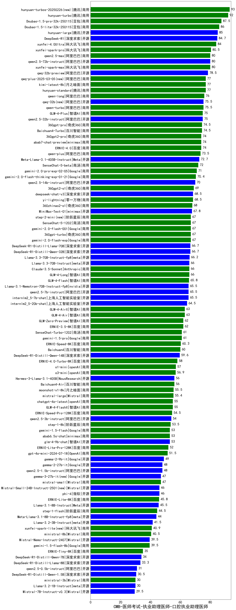

| 类别 | 大模型                         | CMB-医师考试-执业助理医师-口腔执业助理医师 | 排名 |
|-----|------------------------------|---------|----|
|商用|ERNIE-4.5-8K-Preview(new)|95.0|1|
|商用|hunyuan-turbos-20250226(new)|93.0|2|
|商用|hunyuan-turbo|92.0|3|
|商用|Doubao-1.5-pro-32k-250115|87.5|4|
|商用|Doubao-1.5-lite-32k-250115|86.0|5|
|开源|hunyuan-large|85.0|6|
|商用|hunyuan-turbos-20250313(new)|85.0|7|
|开源|DeepSeek-R1|84.7|8|
|商用|xunfei-4.0Ultra|84.0|9|
|商用|xunfei-spark-pro|80.5|10|
|商用|xunfei-spark-max|80.0|11|
|商用|qwen2.5-max|80.0|12|
|开源|qwen2.5-72b-instruct|80.0|13|
|开源|qwq-32b-preview|78.5|14|
|商用|qwq-plus-2025-03-05(new)|77.0|15|
|商用|hunyuan-standard|77.0|16|
|商用|kimi-latest-8k|77.0|17|
|商用|qwen-long|76.0|18|
|开源|qwq-32b(new)|75.5|19|
|商用|qwen-turbo|75.5|20|
|开源|qwen2.5-32b-instruct|75.0|21|
|商用|GLM-4-Plus|75.0|22|
|商用|Baichuan4-Turbo|74.5|23|
|商用|360gpt-pro|74.5|24|
|商用|abab7-chat-preview|74.0|25|
|商用|360gpt2-pro|74.0|26|
|商用|ERNIE-4.0|74.0|27|
|商用|qwen-plus|73.5|28|
|开源|Meta-Llama-3.1-405B-Instruct|72.7|29|
|商用|SenseChat-5-beta|72.0|30|
|商用|gemini-2.0-pro-exp-02-05|71.0|31|
|商用|gemini-2.0-flash-thinking-exp-01-21|70.4|32|
|开源|qwen2.5-14b-instruct|70.0|33|
|商用|360gpt2-o1|69.0|34|
|开源|deepseek-chat-v3|68.5|35|
|商用|yi-lightning|68.5|36|
|商用|360zhinao2-o1|68.0|37|
|开源|MiniMax-Text-01|67.8|38|
|商用|step-2-mini(new)|67.0|39|
|商用|360gpt-turbo|67.0|40|
|商用|gemini-2.0-flash-exp|67.0|41|
|商用|SenseChat-5-1202|67.0|42|
|商用|gemini-2.0-flash-001|67.0|43|
|开源|DeepSeek-R1-Distill-Llama-70B|66.7|44|
|开源|DeepSeek-R1-Distill-Qwen-32B|66.7|45|
|开源|Llama-3.3-70B-Instruct-fp8|66.2|46|
|商用|Claude-3.5-Sonnet|66.0|47|
|商用|GLM-4-Long|66.0|48|
|开源|Llama-3.3-70B-Instruct|66.0|49|
|商用|GLM-4-Flash|65.8|50|
|开源|Llama-3.1-Nemotron-70B-Instruct-fp8|65.5|51|
|开源|internlm2_5-7b-chat|65.5|52|
|开源|qwen2.5-7b-instruct|65.5|53|
|开源|internlm2_5-20b-chat|64.5|54|
|商用|GLM-4-AirX|63.0|55|
|商用|GLM-4-Air|63.0|56|
|商用|ERNIE-3.5-8K|62.0|57|
|商用|GLM-Zero-Preview|62.0|58|
|商用|SenseChat-Turbo-1202|61.0|59|
|商用|gemini-1.5-pro|61.0|60|
|商用|ERNIE-Speed-8K|60.3|61|
|商用|Baichuan4|60.0|62|
|开源|DeepSeek-R1-Distill-Qwen-14B|59.6|63|
|商用|ERNIE-4.0-Turbo-8K|58.0|64|
|商用|o1-mini|57.0|65|
|商用|o3-mini|56.9|66|
|商用|Baichuan4-Air|56.0|67|
|开源|Hermes-3-Llama-3.1-405B|56.0|68|
|商用|moonshot-v1-8k|55.5|69|
|商用|mistral-large|55.4|70|
|商用|chatgpt-4o-latest|55.0|71|
|商用|GLM-4-FlashX|55.0|72|
|商用|ERNIE-Speed-Pro-128K|54.5|73|
|开源|qwen2.5-3b-instruct|54.0|74|
|商用|step-1-8k|53.5|75|
|商用|abab6.5s-chat|53.0|76|
|商用|gemini-1.5-flash|53.0|77|
|开源|glm-4-9b-chat|53.0|78|
|商用|ERNIE-Lite-Pro-128K|52.0|79|
|商用|gpt-4o-mini-2024-07-18|51.5|80|
|开源|gemma-2-9b-it|49.0|81|
|开源|qwen2.5-1.5b-instruct|48.0|82|
|开源|gemma-2-27b-it|48.0|83|
|开源|gemma-3-27b-it(new)|47.0|84|
|商用|mistral-small|47.0|85|
|开源|phi-4|46.0|86|
|开源|Mistral-Small-24B-Instruct-2501(new)|46.0|87|
|商用|ERNIE-Lite-8K|45.8|88|
|开源|Llama-3.1-8B-Instruct|45.5|89|
|商用|step-1-flash|44.5|90|
|开源|Meta-Llama-3.1-8B-Instruct-fp8|44.0|91|
|开源|Llama-3.2-3B-Instruct|41.5|92|
|商用|xunfei-spark-lite(new)|40.9|93|
|商用|ministral-8b|40.5|94|
|开源|gemma-3-12b-it(new)|39.5|95|
|商用|gemini-1.5-flash-8b|39.5|96|
|开源|Mistral-Nemo-Instruct-2407|39.5|97|
|商用|ERNIE-Tiny-8K|35.0|98|
|开源|DeepSeek-R1-Distill-Qwen-7B|34.0|99|
|开源|gemma-3-4b-it(new)|33.5|100|
|开源|DeepSeek-R1-Distill-Llama-8B|33.3|101|
|开源|qwen2.5-0.5b-instruct|31.0|102|
|开源|DeepSeek-R1-Distill-Qwen-1.5B|30.5|103|
|开源|Llama-3.2-1B-Instruct|30.0|104|
|商用|ministral-3b|30.0|105|
|开源|Mistral-7B-Instruct-v0.3|29.5|106|
|开源|gemma-3-1b-it(new)|24.0|107|
|开源|qwen2.5-math-72b-instruct|/|108|
|开源|Yi-1.5-34B-Chat|/|109|
|开源|Yi-1.5-9B-Chat|/|110|

