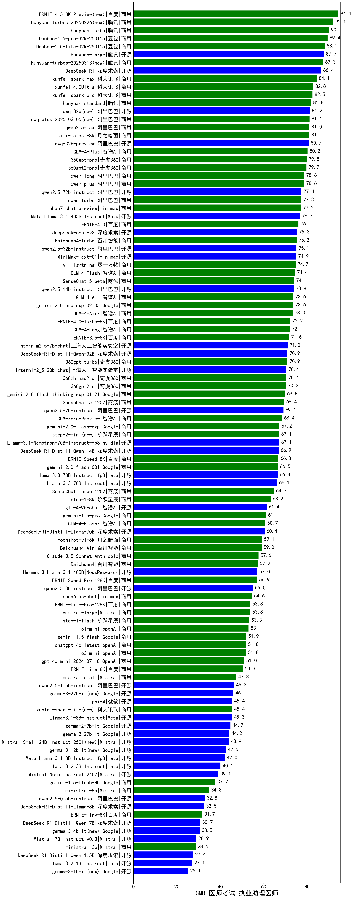

| 类别 | 大模型                         | CMB-医师考试-执业助理医师 | 排名 |
|-----|------------------------------|---------|----|
|商用|hunyuan-turbos-20250226(new)|92.1|1|
|商用|hunyuan-turbo|90.0|2|
|商用|Doubao-1.5-pro-32k-250115|89.4|3|
|商用|Doubao-1.5-lite-32k-250115|88.1|4|
|商用|hunyuan-large|87.7|5|
|开源|DeepSeek-R1|86.4|6|
|商用|xunfei-spark-max|84.4|7|
|商用|xunfei-4.0Ultra|82.8|8|
|商用|xunfei-spark-pro|82.5|9|
|商用|hunyuan-standard|81.8|10|
|开源|qwq-32b(new)|81.2|11|
|商用|qwq-plus-2025-03-05(new)|81.1|12|
|商用|qwen2.5-max|81.0|13|
|商用|kimi-latest-8k|81.0|14|
|开源|qwq-32b-preview|80.7|15|
|商用|GLM-4-Plus|80.2|16|
|商用|360gpt-pro|79.8|17|
|商用|360gpt2-pro|79.7|18|
|商用|qwen-long|78.6|19|
|商用|qwen-plus|78.6|20|
|开源|qwen2.5-72b-instruct|77.4|21|
|商用|qwen-turbo|77.3|22|
|商用|abab7-chat-preview|77.2|23|
|开源|Meta-Llama-3.1-405B-Instruct|76.7|24|
|商用|ERNIE-4.0|76.0|25|
|开源|deepseek-chat-v3|75.3|26|
|商用|Baichuan4-Turbo|75.2|27|
|开源|qwen2.5-32b-instruct|75.1|28|
|商用|MiniMax-Text-01|74.9|29|
|商用|yi-lightning|74.7|30|
|商用|GLM-4-Flash|74.4|31|
|商用|SenseChat-5-beta|74.0|32|
|开源|qwen2.5-14b-instruct|73.8|33|
|商用|GLM-4-Air|73.6|34|
|商用|gemini-2.0-pro-exp-02-05|73.6|35|
|商用|GLM-4-AirX|73.3|36|
|商用|ERNIE-4.0-Turbo-8K|72.2|37|
|商用|GLM-4-Long|72.0|38|
|商用|ERNIE-3.5-8K|71.6|39|
|开源|internlm2_5-7b-chat|71.0|40|
|开源|DeepSeek-R1-Distill-Qwen-32B|70.9|41|
|商用|360gpt-turbo|70.9|42|
|开源|internlm2_5-20b-chat|70.4|43|
|商用|360zhinao2-o1|70.4|44|
|商用|360gpt2-o1|70.2|45|
|商用|gemini-2.0-flash-thinking-exp-01-21|69.8|46|
|商用|SenseChat-5-1202|69.4|47|
|开源|qwen2.5-7b-instruct|69.1|48|
|商用|GLM-Zero-Preview|68.4|49|
|商用|gemini-2.0-flash-exp|67.2|50|
|商用|step-2-mini(new)|67.1|51|
|开源|Llama-3.1-Nemotron-70B-Instruct-fp8|67.1|52|
|开源|DeepSeek-R1-Distill-Qwen-14B|66.9|53|
|商用|ERNIE-Speed-8K|66.8|54|
|商用|gemini-2.0-flash-001|66.5|55|
|开源|Llama-3.3-70B-Instruct-fp8|66.4|56|
|开源|Llama-3.3-70B-Instruct|66.1|57|
|商用|SenseChat-Turbo-1202|64.7|58|
|商用|step-1-8k|63.2|59|
|开源|glm-4-9b-chat|61.4|60|
|商用|gemini-1.5-pro|61.0|61|
|商用|GLM-4-FlashX|60.7|62|
|开源|DeepSeek-R1-Distill-Llama-70B|60.4|63|
|商用|moonshot-v1-8k|59.1|64|
|商用|Baichuan4-Air|59.0|65|
|商用|Claude-3.5-Sonnet|57.6|66|
|商用|Baichuan4|57.2|67|
|开源|Hermes-3-Llama-3.1-405B|57.0|68|
|商用|ERNIE-Speed-Pro-128K|56.9|69|
|开源|qwen2.5-3b-instruct|55.0|70|
|商用|abab6.5s-chat|54.6|71|
|商用|ERNIE-Lite-Pro-128K|53.8|72|
|商用|mistral-large|53.8|73|
|商用|step-1-flash|53.3|74|
|商用|o1-mini|53.0|75|
|商用|gemini-1.5-flash|51.9|76|
|商用|chatgpt-4o-latest|51.8|77|
|商用|o3-mini|51.8|78|
|商用|gpt-4o-mini-2024-07-18|51.0|79|
|商用|ERNIE-Lite-8K|50.3|80|
|商用|mistral-small|47.3|81|
|开源|qwen2.5-1.5b-instruct|46.2|82|
|开源|gemma-3-27b-it(new)|46.0|83|
|开源|phi-4|45.4|84|
|商用|xunfei-spark-lite(new)|45.4|85|
|开源|Llama-3.1-8B-Instruct|45.3|86|
|开源|gemma-2-9b-it|44.7|87|
|开源|gemma-2-27b-it|44.2|88|
|开源|Mistral-Small-24B-Instruct-2501(new)|43.9|89|
|开源|Meta-Llama-3.1-8B-Instruct-fp8|42.0|90|
|开源|Llama-3.2-3B-Instruct|40.1|91|
|开源|Mistral-Nemo-Instruct-2407|39.1|92|
|商用|gemini-1.5-flash-8b|37.7|93|
|商用|ministral-8b|34.8|94|
|开源|qwen2.5-0.5b-instruct|32.8|95|
|开源|DeepSeek-R1-Distill-Llama-8B|32.5|96|
|商用|ERNIE-Tiny-8K|31.7|97|
|开源|DeepSeek-R1-Distill-Qwen-7B|30.7|98|
|开源|Mistral-7B-Instruct-v0.3|28.9|99|
|商用|ministral-3b|28.6|100|
|开源|DeepSeek-R1-Distill-Qwen-1.5B|27.4|101|
|开源|Llama-3.2-1B-Instruct|27.1|102|
|开源|Yi-1.5-34B-Chat|/|103|
|开源|Yi-1.5-9B-Chat|/|104|
|开源|qwen2.5-math-72b-instruct|/|105|

