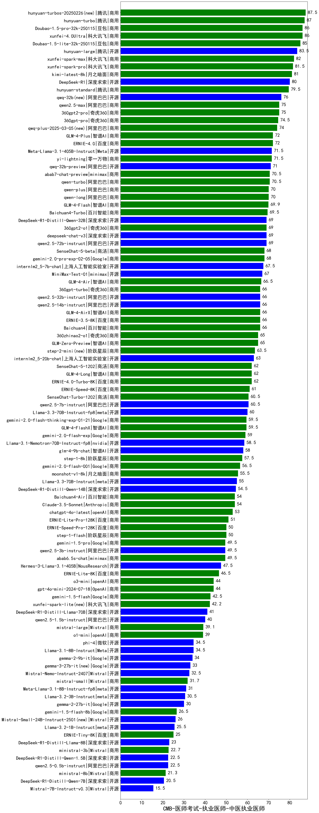

| 类别 | 大模型                         | CMB-医师考试-执业医师-中医执业医师 | 排名 |
|-----|------------------------------|---------|----|
|商用|hunyuan-turbos-20250226(new)|87.5|1|
|商用|hunyuan-turbo|87.0|2|
|商用|xunfei-4.0Ultra|86.0|3|
|商用|Doubao-1.5-pro-32k-250115|86.0|4|
|商用|Doubao-1.5-lite-32k-250115|85.0|5|
|商用|hunyuan-large|83.5|6|
|商用|xunfei-spark-max|82.0|7|
|商用|xunfei-spark-pro|81.5|8|
|商用|kimi-latest-8k|81.0|9|
|开源|DeepSeek-R1|80.0|10|
|商用|hunyuan-standard|79.5|11|
|开源|qwq-32b(new)|76.0|12|
|商用|360gpt2-pro|75.0|13|
|商用|qwen2.5-max|75.0|14|
|商用|360gpt-pro|74.5|15|
|商用|qwq-plus-2025-03-05(new)|74.0|16|
|商用|GLM-4-Plus|72.0|17|
|商用|ERNIE-4.0|72.0|18|
|开源|Meta-Llama-3.1-405B-Instruct|71.5|19|
|商用|yi-lightning|71.5|20|
|开源|qwq-32b-preview|71.0|21|
|商用|qwen-turbo|70.5|22|
|商用|abab7-chat-preview|70.5|23|
|商用|qwen-plus|70.0|24|
|商用|qwen-long|70.0|25|
|商用|GLM-4-Flash|69.9|26|
|商用|Baichuan4-Turbo|69.5|27|
|商用|360gpt2-o1|69.0|28|
|开源|qwen2.5-72b-instruct|69.0|29|
|开源|deepseek-chat-v3|69.0|30|
|开源|DeepSeek-R1-Distill-Qwen-32B|69.0|31|
|商用|SenseChat-5-beta|68.0|32|
|商用|gemini-2.0-pro-exp-02-05|68.0|33|
|开源|internlm2_5-7b-chat|67.5|34|
|商用|MiniMax-Text-01|67.0|35|
|商用|GLM-4-Air|66.5|36|
|商用|ERNIE-3.5-8K|66.0|37|
|开源|qwen2.5-32b-instruct|66.0|38|
|商用|GLM-4-AirX|66.0|39|
|商用|360gpt-turbo|66.0|40|
|开源|qwen2.5-14b-instruct|66.0|41|
|商用|Baichuan4|66.0|42|
|商用|GLM-Zero-Preview|65.0|43|
|商用|360zhinao2-o1|65.0|44|
|商用|step-2-mini(new)|63.5|45|
|开源|internlm2_5-20b-chat|63.0|46|
|商用|ERNIE-4.0-Turbo-8K|62.0|47|
|商用|SenseChat-5-1202|62.0|48|
|商用|GLM-4-Long|62.0|49|
|商用|ERNIE-Speed-8K|61.0|50|
|商用|SenseChat-Turbo-1202|60.5|51|
|开源|qwen2.5-7b-instruct|60.5|52|
|开源|Llama-3.3-70B-Instruct-fp8|60.0|53|
|商用|GLM-4-FlashX|59.5|54|
|商用|gemini-2.0-flash-thinking-exp-01-21|59.5|55|
|商用|gemini-2.0-flash-exp|59.0|56|
|开源|Llama-3.1-Nemotron-70B-Instruct-fp8|58.5|57|
|开源|glm-4-9b-chat|58.0|58|
|商用|step-1-8k|57.5|59|
|商用|gemini-2.0-flash-001|56.5|60|
|商用|moonshot-v1-8k|55.5|61|
|开源|Llama-3.3-70B-Instruct|55.0|62|
|开源|DeepSeek-R1-Distill-Qwen-14B|54.5|63|
|商用|Baichuan4-Air|54.0|64|
|商用|Claude-3.5-Sonnet|54.0|65|
|商用|chatgpt-4o-latest|53.0|66|
|商用|ERNIE-Lite-Pro-128K|51.0|67|
|商用|step-1-flash|50.0|68|
|商用|ERNIE-Speed-Pro-128K|50.0|69|
|开源|qwen2.5-3b-instruct|49.5|70|
|商用|gemini-1.5-pro|49.5|71|
|商用|abab6.5s-chat|49.5|72|
|开源|Hermes-3-Llama-3.1-405B|47.5|73|
|商用|ERNIE-Lite-8K|46.5|74|
|商用|o3-mini|44.0|75|
|商用|gpt-4o-mini-2024-07-18|44.0|76|
|商用|gemini-1.5-flash|42.5|77|
|商用|xunfei-spark-lite(new)|42.2|78|
|开源|DeepSeek-R1-Distill-Llama-70B|41.0|79|
|开源|qwen2.5-1.5b-instruct|40.0|80|
|商用|mistral-large|39.1|81|
|商用|o1-mini|39.0|82|
|开源|phi-4|34.5|83|
|开源|Llama-3.1-8B-Instruct|34.5|84|
|开源|gemma-2-9b-it|34.0|85|
|开源|Mistral-Nemo-Instruct-2407|32.5|86|
|商用|mistral-small|31.7|87|
|开源|Meta-Llama-3.1-8B-Instruct-fp8|31.0|88|
|开源|Llama-3.2-3B-Instruct|30.5|89|
|开源|gemma-2-27b-it|30.0|90|
|商用|gemini-1.5-flash-8b|26.5|91|
|开源|Llama-3.2-1B-Instruct|25.5|92|
|商用|ERNIE-Tiny-8K|25.0|93|
|开源|DeepSeek-R1-Distill-Llama-8B|23.0|94|
|商用|ministral-3b|22.7|95|
|开源|qwen2.5-0.5b-instruct|22.5|96|
|开源|DeepSeek-R1-Distill-Qwen-1.5B|22.5|97|
|商用|ministral-8b|21.3|98|
|开源|DeepSeek-R1-Distill-Qwen-7B|20.5|99|
|开源|Mistral-7B-Instruct-v0.3|15.5|100|
|开源|Yi-1.5-9B-Chat|/|101|
|开源|Yi-1.5-34B-Chat|/|102|
|开源|qwen2.5-math-72b-instruct|/|103|

