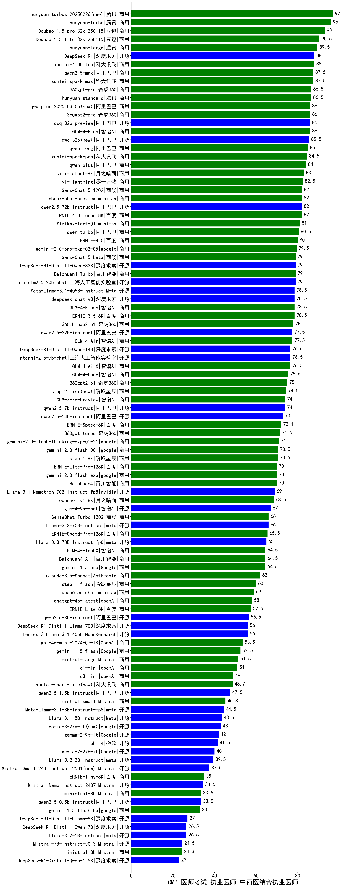

| 类别 | 大模型                         | CMB-医师考试-执业医师-中西医结合执业医师 | 排名 |
|-----|------------------------------|---------|----|
|商用|hunyuan-turbos-20250226(new)|97.0|1|
|商用|hunyuan-turbo|96.0|2|
|商用|ERNIE-4.5-8K-Preview(new)|96.0|3|
|商用|hunyuan-turbos-20250313(new)|94.0|4|
|商用|Doubao-1.5-pro-32k-250115|93.0|5|
|商用|Doubao-1.5-lite-32k-250115|90.5|6|
|开源|hunyuan-large|89.5|7|
|开源|DeepSeek-R1|88.0|8|
|商用|xunfei-4.0Ultra|88.0|9|
|商用|qwen2.5-max|87.5|10|
|商用|xunfei-spark-max|87.5|11|
|商用|hunyuan-standard|86.5|12|
|商用|360gpt-pro|86.5|13|
|商用|GLM-4-Plus|86.0|14|
|开源|qwq-32b-preview|86.0|15|
|商用|360gpt2-pro|86.0|16|
|商用|qwq-plus-2025-03-05(new)|86.0|17|
|开源|qwq-32b(new)|85.5|18|
|商用|qwen-long|85.0|19|
|商用|xunfei-spark-pro|84.5|20|
|商用|qwen-plus|84.0|21|
|商用|kimi-latest-8k|83.0|22|
|商用|yi-lightning|82.5|23|
|商用|SenseChat-5-1202|82.0|24|
|开源|qwen2.5-72b-instruct|82.0|25|
|商用|abab7-chat-preview|82.0|26|
|商用|ERNIE-4.0-Turbo-8K|82.0|27|
|开源|MiniMax-Text-01|81.0|28|
|商用|qwen-turbo|80.5|29|
|商用|ERNIE-4.0|80.0|30|
|商用|gemini-2.0-pro-exp-02-05|79.5|31|
|商用|Baichuan4-Turbo|79.0|32|
|开源|internlm2_5-20b-chat|79.0|33|
|开源|DeepSeek-R1-Distill-Qwen-32B|79.0|34|
|商用|SenseChat-5-beta|79.0|35|
|商用|ERNIE-3.5-8K|78.5|36|
|开源|Meta-Llama-3.1-405B-Instruct|78.5|37|
|商用|GLM-4-Flash|78.5|38|
|开源|deepseek-chat-v3|78.5|39|
|商用|360zhinao2-o1|78.0|40|
|商用|GLM-4-Air|77.5|41|
|开源|qwen2.5-32b-instruct|77.5|42|
|开源|internlm2_5-7b-chat|76.5|43|
|商用|GLM-4-AirX|76.5|44|
|开源|DeepSeek-R1-Distill-Qwen-14B|76.5|45|
|商用|GLM-4-Long|75.5|46|
|商用|360gpt2-o1|75.0|47|
|商用|step-2-mini(new)|74.5|48|
|商用|GLM-Zero-Preview|74.0|49|
|开源|qwen2.5-7b-instruct|74.0|50|
|开源|qwen2.5-14b-instruct|73.0|51|
|商用|ERNIE-Speed-8K|72.1|52|
|商用|360gpt-turbo|71.5|53|
|商用|gemini-2.0-flash-thinking-exp-01-21|71.0|54|
|商用|gemini-2.0-flash-001|70.5|55|
|商用|step-1-8k|70.5|56|
|商用|ERNIE-Lite-Pro-128K|70.0|57|
|商用|gemini-2.0-flash-exp|70.0|58|
|商用|Baichuan4|70.0|59|
|开源|Llama-3.1-Nemotron-70B-Instruct-fp8|69.0|60|
|商用|moonshot-v1-8k|68.5|61|
|开源|glm-4-9b-chat|67.0|62|
|商用|SenseChat-Turbo-1202|66.0|63|
|开源|Llama-3.3-70B-Instruct|66.0|64|
|商用|ERNIE-Speed-Pro-128K|65.5|65|
|开源|Llama-3.3-70B-Instruct-fp8|65.0|66|
|商用|Baichuan4-Air|64.5|67|
|商用|GLM-4-FlashX|64.5|68|
|商用|gemini-1.5-pro|64.5|69|
|商用|Claude-3.5-Sonnet|62.0|70|
|商用|step-1-flash|60.0|71|
|商用|abab6.5s-chat|59.0|72|
|商用|chatgpt-4o-latest|58.0|73|
|商用|ERNIE-Lite-8K|57.5|74|
|开源|qwen2.5-3b-instruct|56.5|75|
|开源|DeepSeek-R1-Distill-Llama-70B|56.0|76|
|开源|Hermes-3-Llama-3.1-405B|56.0|77|
|商用|gpt-4o-mini-2024-07-18|53.5|78|
|商用|gemini-1.5-flash|52.5|79|
|商用|mistral-large|51.5|80|
|商用|o1-mini|51.0|81|
|商用|o3-mini|49.0|82|
|商用|xunfei-spark-lite(new)|48.7|83|
|开源|qwen2.5-1.5b-instruct|47.5|84|
|商用|mistral-small|45.3|85|
|开源|Meta-Llama-3.1-8B-Instruct-fp8|44.5|86|
|开源|Llama-3.1-8B-Instruct|43.5|87|
|开源|gemma-3-27b-it(new)|43.0|88|
|开源|gemma-2-9b-it|42.0|89|
|开源|phi-4|41.5|90|
|开源|gemma-2-27b-it|40.0|91|
|开源|gemma-3-12b-it(new)|40.0|92|
|开源|Llama-3.2-3B-Instruct|39.5|93|
|开源|Mistral-Small-24B-Instruct-2501(new)|37.5|94|
|商用|ERNIE-Tiny-8K|35.0|95|
|开源|Mistral-Nemo-Instruct-2407|34.5|96|
|商用|ministral-8b|33.5|97|
|开源|qwen2.5-0.5b-instruct|33.5|98|
|商用|gemini-1.5-flash-8b|33.0|99|
|开源|gemma-3-4b-it(new)|32.0|100|
|开源|DeepSeek-R1-Distill-Llama-8B|27.0|101|
|开源|Llama-3.2-1B-Instruct|26.5|102|
|开源|DeepSeek-R1-Distill-Qwen-7B|26.5|103|
|开源|Mistral-7B-Instruct-v0.3|24.5|104|
|开源|gemma-3-1b-it(new)|24.5|105|
|商用|ministral-3b|24.3|106|
|开源|DeepSeek-R1-Distill-Qwen-1.5B|23.0|107|
|开源|qwen2.5-math-72b-instruct|/|108|

