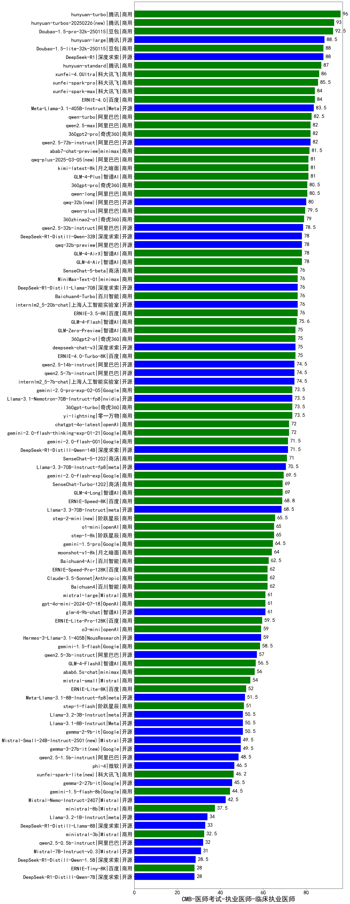

| 类别 | 大模型                         | CMB-医师考试-执业医师-临床执业医师 | 排名 |
|-----|------------------------------|---------|----|
|商用|hunyuan-turbo|96.0|1|
|商用|hunyuan-turbos-20250226(new)|93.0|2|
|商用|Doubao-1.5-pro-32k-250115|92.5|3|
|开源|hunyuan-large|88.5|4|
|商用|Doubao-1.5-lite-32k-250115|88.0|5|
|开源|DeepSeek-R1|88.0|6|
|商用|hunyuan-standard|87.0|7|
|商用|xunfei-4.0Ultra|86.0|8|
|商用|xunfei-spark-pro|85.5|9|
|商用|ERNIE-4.0|84.0|10|
|商用|xunfei-spark-max|84.0|11|
|开源|Meta-Llama-3.1-405B-Instruct|83.5|12|
|商用|qwen-turbo|82.5|13|
|商用|360gpt2-pro|82.0|14|
|商用|qwen2.5-max|82.0|15|
|开源|qwen2.5-72b-instruct|82.0|16|
|商用|abab7-chat-preview|81.5|17|
|商用|qwq-plus-2025-03-05(new)|81.0|18|
|商用|GLM-4-Plus|81.0|19|
|商用|kimi-latest-8k|81.0|20|
|商用|qwen-long|80.5|21|
|商用|360gpt-pro|80.5|22|
|开源|qwq-32b(new)|80.0|23|
|商用|qwen-plus|79.5|24|
|商用|360zhinao2-o1|79.0|25|
|开源|qwen2.5-32b-instruct|78.5|26|
|商用|GLM-4-AirX|78.0|27|
|开源|qwq-32b-preview|78.0|28|
|开源|DeepSeek-R1-Distill-Qwen-32B|78.0|29|
|商用|GLM-4-Air|78.0|30|
|商用|Baichuan4-Turbo|76.0|31|
|开源|DeepSeek-R1-Distill-Llama-70B|76.0|32|
|开源|internlm2_5-20b-chat|76.0|33|
|商用|ERNIE-3.5-8K|76.0|34|
|商用|MiniMax-Text-01|76.0|35|
|商用|SenseChat-5-beta|76.0|36|
|商用|GLM-4-Flash|75.6|37|
|商用|360gpt2-o1|75.0|38|
|商用|GLM-Zero-Preview|75.0|39|
|开源|deepseek-chat-v3|75.0|40|
|商用|ERNIE-4.0-Turbo-8K|75.0|41|
|开源|qwen2.5-7b-instruct|74.5|42|
|开源|qwen2.5-14b-instruct|74.5|43|
|开源|internlm2_5-7b-chat|74.5|44|
|商用|yi-lightning|73.5|45|
|开源|Llama-3.1-Nemotron-70B-Instruct-fp8|73.5|46|
|商用|gemini-2.0-pro-exp-02-05|73.5|47|
|商用|360gpt-turbo|73.5|48|
|商用|gemini-2.0-flash-thinking-exp-01-21|72.0|49|
|商用|chatgpt-4o-latest|72.0|50|
|开源|DeepSeek-R1-Distill-Qwen-14B|71.5|51|
|商用|gemini-2.0-flash-001|71.5|52|
|商用|SenseChat-5-1202|71.0|53|
|开源|Llama-3.3-70B-Instruct-fp8|70.5|54|
|商用|gemini-2.0-flash-exp|69.5|55|
|商用|SenseChat-Turbo-1202|69.0|56|
|商用|GLM-4-Long|69.0|57|
|商用|ERNIE-Speed-8K|68.8|58|
|开源|Llama-3.3-70B-Instruct|68.5|59|
|商用|step-2-mini(new)|65.5|60|
|商用|step-1-8k|65.0|61|
|商用|o1-mini|65.0|62|
|商用|gemini-1.5-pro|64.5|63|
|商用|moonshot-v1-8k|64.0|64|
|商用|Baichuan4-Air|62.5|65|
|商用|Claude-3.5-Sonnet|62.0|66|
|商用|ERNIE-Speed-Pro-128K|62.0|67|
|商用|Baichuan4|62.0|68|
|开源|glm-4-9b-chat|61.0|69|
|商用|mistral-large|61.0|70|
|商用|gpt-4o-mini-2024-07-18|61.0|71|
|商用|ERNIE-Lite-Pro-128K|59.5|72|
|开源|Hermes-3-Llama-3.1-405B|59.0|73|
|商用|o3-mini|59.0|74|
|商用|gemini-1.5-flash|58.5|75|
|开源|qwen2.5-3b-instruct|57.0|76|
|商用|GLM-4-FlashX|56.5|77|
|商用|abab6.5s-chat|56.0|78|
|商用|mistral-small|54.0|79|
|商用|ERNIE-Lite-8K|52.0|80|
|开源|Meta-Llama-3.1-8B-Instruct-fp8|51.5|81|
|商用|step-1-flash|51.0|82|
|开源|Llama-3.1-8B-Instruct|50.5|83|
|开源|gemma-2-9b-it|50.5|84|
|开源|Llama-3.2-3B-Instruct|50.5|85|
|开源|Mistral-Small-24B-Instruct-2501(new)|49.5|86|
|开源|gemma-3-27b-it(new)|49.5|87|
|开源|qwen2.5-1.5b-instruct|48.5|88|
|开源|phi-4|46.5|89|
|商用|xunfei-spark-lite(new)|46.2|90|
|开源|gemma-2-27b-it|45.5|91|
|商用|gemini-1.5-flash-8b|44.5|92|
|开源|Mistral-Nemo-Instruct-2407|42.5|93|
|商用|ministral-8b|37.5|94|
|开源|Llama-3.2-1B-Instruct|34.0|95|
|开源|DeepSeek-R1-Distill-Llama-8B|33.0|96|
|商用|ministral-3b|32.5|97|
|开源|qwen2.5-0.5b-instruct|32.0|98|
|开源|Mistral-7B-Instruct-v0.3|31.0|99|
|开源|DeepSeek-R1-Distill-Qwen-1.5B|28.5|100|
|开源|DeepSeek-R1-Distill-Qwen-7B|28.0|101|
|商用|ERNIE-Tiny-8K|28.0|102|
|开源|Yi-1.5-34B-Chat|/|103|
|开源|Yi-1.5-9B-Chat|/|104|
|开源|qwen2.5-math-72b-instruct|/|105|

