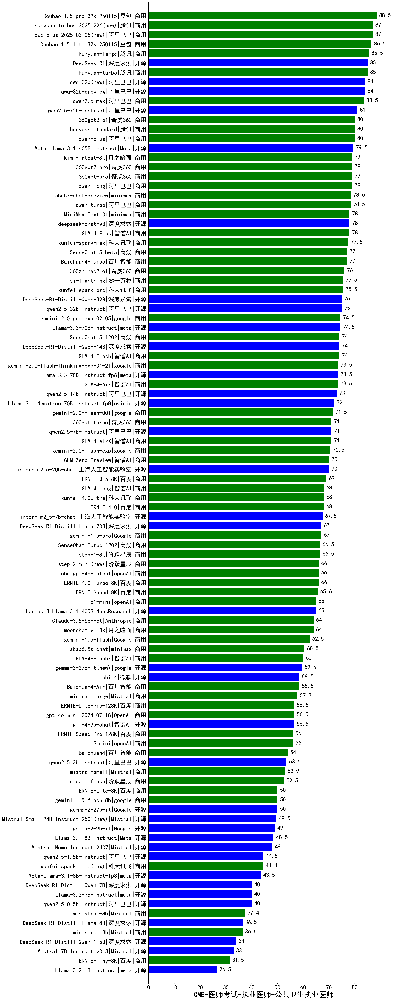

| 类别 | 大模型                         | CMB-医师考试-执业医师-公共卫生执业医师 | 排名 |
|-----|------------------------------|---------|----|
|商用|ERNIE-4.5-8K-Preview(new)|94.0|1|
|商用|Doubao-1.5-pro-32k-250115|88.5|2|
|商用|qwq-plus-2025-03-05(new)|87.0|3|
|商用|hunyuan-turbos-20250226(new)|87.0|4|
|商用|Doubao-1.5-lite-32k-250115|86.5|5|
|开源|hunyuan-large|85.5|6|
|商用|hunyuan-turbos-20250313(new)|85.5|7|
|开源|DeepSeek-R1|85.0|8|
|商用|hunyuan-turbo|85.0|9|
|开源|qwq-32b(new)|84.0|10|
|开源|qwq-32b-preview|84.0|11|
|商用|qwen2.5-max|83.5|12|
|开源|qwen2.5-72b-instruct|81.0|13|
|商用|qwen-plus|80.0|14|
|商用|360gpt2-o1|80.0|15|
|商用|hunyuan-standard|80.0|16|
|开源|Meta-Llama-3.1-405B-Instruct|79.5|17|
|商用|360gpt2-pro|79.0|18|
|商用|360gpt-pro|79.0|19|
|商用|kimi-latest-8k|79.0|20|
|商用|qwen-long|79.0|21|
|商用|qwen-turbo|78.5|22|
|商用|abab7-chat-preview|78.5|23|
|开源|MiniMax-Text-01|78.0|24|
|开源|deepseek-chat-v3|78.0|25|
|商用|GLM-4-Plus|78.0|26|
|商用|xunfei-spark-max|77.5|27|
|商用|Baichuan4-Turbo|77.0|28|
|商用|SenseChat-5-beta|77.0|29|
|商用|360zhinao2-o1|76.0|30|
|商用|yi-lightning|75.5|31|
|商用|xunfei-spark-pro|75.5|32|
|开源|DeepSeek-R1-Distill-Qwen-32B|75.0|33|
|开源|qwen2.5-32b-instruct|75.0|34|
|商用|gemini-2.0-pro-exp-02-05|74.5|35|
|开源|Llama-3.3-70B-Instruct|74.5|36|
|商用|GLM-4-Flash|74.0|37|
|商用|SenseChat-5-1202|74.0|38|
|开源|DeepSeek-R1-Distill-Qwen-14B|74.0|39|
|开源|Llama-3.3-70B-Instruct-fp8|73.5|40|
|商用|gemini-2.0-flash-thinking-exp-01-21|73.5|41|
|商用|GLM-4-Air|73.5|42|
|开源|qwen2.5-14b-instruct|73.0|43|
|开源|Llama-3.1-Nemotron-70B-Instruct-fp8|72.0|44|
|商用|gemini-2.0-flash-001|71.5|45|
|商用|GLM-4-AirX|71.0|46|
|商用|360gpt-turbo|71.0|47|
|开源|qwen2.5-7b-instruct|71.0|48|
|商用|gemini-2.0-flash-exp|70.5|49|
|商用|GLM-Zero-Preview|70.0|50|
|开源|internlm2_5-20b-chat|70.0|51|
|商用|ERNIE-3.5-8K|69.0|52|
|商用|GLM-4-Long|68.0|53|
|商用|ERNIE-4.0|68.0|54|
|商用|xunfei-4.0Ultra|68.0|55|
|开源|internlm2_5-7b-chat|67.5|56|
|商用|gemini-1.5-pro|67.0|57|
|开源|DeepSeek-R1-Distill-Llama-70B|67.0|58|
|商用|SenseChat-Turbo-1202|66.5|59|
|商用|step-1-8k|66.5|60|
|商用|step-2-mini(new)|66.0|61|
|商用|chatgpt-4o-latest|66.0|62|
|商用|ERNIE-4.0-Turbo-8K|66.0|63|
|商用|ERNIE-Speed-8K|65.6|64|
|开源|Hermes-3-Llama-3.1-405B|65.0|65|
|商用|o1-mini|65.0|66|
|商用|moonshot-v1-8k|64.0|67|
|商用|Claude-3.5-Sonnet|64.0|68|
|商用|gemini-1.5-flash|62.5|69|
|商用|abab6.5s-chat|60.5|70|
|商用|GLM-4-FlashX|60.0|71|
|开源|gemma-3-27b-it(new)|59.5|72|
|商用|Baichuan4-Air|58.5|73|
|开源|phi-4|58.5|74|
|商用|mistral-large|57.7|75|
|开源|glm-4-9b-chat|56.5|76|
|商用|gpt-4o-mini-2024-07-18|56.5|77|
|商用|ERNIE-Lite-Pro-128K|56.5|78|
|商用|ERNIE-Speed-Pro-128K|56.0|79|
|商用|o3-mini|56.0|80|
|商用|Baichuan4|54.0|81|
|开源|qwen2.5-3b-instruct|53.5|82|
|商用|mistral-small|52.9|83|
|商用|step-1-flash|52.5|84|
|商用|gemini-1.5-flash-8b|50.0|85|
|开源|gemma-2-27b-it|50.0|86|
|商用|ERNIE-Lite-8K|50.0|87|
|开源|Mistral-Small-24B-Instruct-2501(new)|49.5|88|
|开源|gemma-2-9b-it|49.0|89|
|开源|Llama-3.1-8B-Instruct|48.5|90|
|开源|Mistral-Nemo-Instruct-2407|48.0|91|
|开源|gemma-3-12b-it(new)|47.0|92|
|开源|qwen2.5-1.5b-instruct|44.5|93|
|商用|xunfei-spark-lite(new)|44.4|94|
|开源|Meta-Llama-3.1-8B-Instruct-fp8|43.5|95|
|开源|qwen2.5-0.5b-instruct|40.0|96|
|开源|DeepSeek-R1-Distill-Qwen-7B|40.0|97|
|开源|Llama-3.2-3B-Instruct|40.0|98|
|商用|ministral-8b|37.4|99|
|商用|ministral-3b|36.5|100|
|开源|DeepSeek-R1-Distill-Llama-8B|36.5|101|
|开源|gemma-3-4b-it(new)|35.5|102|
|开源|DeepSeek-R1-Distill-Qwen-1.5B|34.0|103|
|开源|Mistral-7B-Instruct-v0.3|33.0|104|
|商用|ERNIE-Tiny-8K|31.5|105|
|开源|Llama-3.2-1B-Instruct|26.5|106|
|开源|gemma-3-1b-it(new)|22.0|107|
|开源|qwen2.5-math-72b-instruct|/|108|

