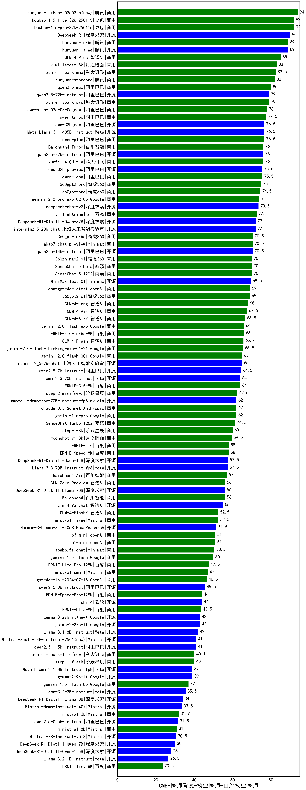

| 类别 | 大模型                         | CMB-医师考试-执业医师-口腔执业医师 | 排名 |
|-----|------------------------------|---------|----|
|商用|hunyuan-turbos-20250226(new)|94.0|1|
|商用|Doubao-1.5-pro-32k-250115|92.0|2|
|商用|Doubao-1.5-lite-32k-250115|92.0|3|
|开源|DeepSeek-R1|90.0|4|
|开源|hunyuan-large|89.0|5|
|商用|hunyuan-turbo|89.0|6|
|商用|GLM-4-Plus|85.0|7|
|商用|kimi-latest-8k|83.0|8|
|商用|xunfei-spark-max|82.5|9|
|商用|hunyuan-standard|82.0|10|
|商用|qwen2.5-max|80.0|11|
|商用|xunfei-spark-pro|79.0|12|
|开源|qwen2.5-72b-instruct|79.0|13|
|商用|qwq-plus-2025-03-05(new)|78.0|14|
|商用|qwen-turbo|77.5|15|
|开源|Meta-Llama-3.1-405B-Instruct|76.5|16|
|开源|qwq-32b(new)|76.5|17|
|商用|qwen-plus|76.5|18|
|开源|qwen2.5-32b-instruct|76.0|19|
|商用|Baichuan4-Turbo|76.0|20|
|商用|xunfei-4.0Ultra|76.0|21|
|商用|qwen-long|75.5|22|
|开源|qwq-32b-preview|75.5|23|
|商用|360gpt2-pro|75.0|24|
|商用|360gpt-pro|74.5|25|
|商用|gemini-2.0-pro-exp-02-05|74.0|26|
|开源|deepseek-chat-v3|73.5|27|
|商用|yi-lightning|72.5|28|
|开源|DeepSeek-R1-Distill-Qwen-32B|72.0|29|
|开源|internlm2_5-20b-chat|72.0|30|
|商用|360gpt-turbo|70.5|31|
|商用|abab7-chat-preview|70.5|32|
|开源|qwen2.5-14b-instruct|70.5|33|
|商用|SenseChat-5-beta|70.0|34|
|商用|360zhinao2-o1|70.0|35|
|商用|SenseChat-5-1202|70.0|36|
|开源|MiniMax-Text-01|69.5|37|
|商用|chatgpt-4o-latest|69.0|38|
|商用|360gpt2-o1|69.0|39|
|商用|GLM-4-Long|68.0|40|
|商用|GLM-4-Air|67.5|41|
|商用|GLM-4-AirX|66.5|42|
|商用|ERNIE-4.0-Turbo-8K|66.0|43|
|商用|gemini-2.0-flash-exp|66.0|44|
|商用|GLM-4-Flash|65.7|45|
|商用|gemini-2.0-flash-thinking-exp-01-21|65.5|46|
|商用|gemini-2.0-flash-001|65.0|47|
|开源|internlm2_5-7b-chat|65.0|48|
|开源|qwen2.5-7b-instruct|64.5|49|
|商用|ERNIE-3.5-8K|64.0|50|
|开源|Llama-3.3-70B-Instruct|64.0|51|
|商用|step-2-mini(new)|62.5|52|
|商用|Claude-3.5-Sonnet|62.0|53|
|开源|Llama-3.1-Nemotron-70B-Instruct-fp8|62.0|54|
|商用|gemini-1.5-pro|62.0|55|
|商用|SenseChat-Turbo-1202|61.5|56|
|商用|step-1-8k|60.0|57|
|商用|moonshot-v1-8k|59.5|58|
|商用|ERNIE-4.0|58.0|59|
|商用|ERNIE-Speed-8K|58.0|60|
|开源|Llama-3.3-70B-Instruct-fp8|57.5|61|
|开源|DeepSeek-R1-Distill-Qwen-14B|57.5|62|
|商用|Baichuan4-Air|57.0|63|
|开源|DeepSeek-R1-Distill-Llama-70B|56.0|64|
|商用|GLM-Zero-Preview|56.0|65|
|商用|Baichuan4|56.0|66|
|开源|glm-4-9b-chat|55.0|67|
|商用|GLM-4-FlashX|52.5|68|
|商用|mistral-large|52.5|69|
|开源|Hermes-3-Llama-3.1-405B|51.5|70|
|商用|o1-mini|51.0|71|
|商用|o3-mini|51.0|72|
|商用|abab6.5s-chat|50.5|73|
|商用|gemini-1.5-flash|50.0|74|
|商用|ERNIE-Lite-Pro-128K|47.5|75|
|商用|mistral-small|47.0|76|
|商用|gpt-4o-mini-2024-07-18|46.5|77|
|开源|qwen2.5-3b-instruct|45.5|78|
|商用|ERNIE-Speed-Pro-128K|44.0|79|
|开源|phi-4|44.0|80|
|商用|ERNIE-Lite-8K|43.5|81|
|开源|gemma-3-27b-it(new)|43.0|82|
|开源|gemma-2-27b-it|43.0|83|
|开源|Llama-3.1-8B-Instruct|42.0|84|
|开源|Mistral-Small-24B-Instruct-2501(new)|41.0|85|
|开源|qwen2.5-1.5b-instruct|41.0|86|
|商用|xunfei-spark-lite(new)|40.1|87|
|商用|step-1-flash|40.0|88|
|开源|gemma-2-9b-it|39.0|89|
|开源|Meta-Llama-3.1-8B-Instruct-fp8|39.0|90|
|商用|gemini-1.5-flash-8b|37.0|91|
|开源|Llama-3.2-3B-Instruct|35.5|92|
|开源|DeepSeek-R1-Distill-Llama-8B|34.0|93|
|开源|Mistral-Nemo-Instruct-2407|33.5|94|
|商用|ministral-3b|31.9|95|
|开源|qwen2.5-0.5b-instruct|31.5|96|
|商用|ministral-8b|31.0|97|
|开源|Mistral-7B-Instruct-v0.3|30.5|98|
|开源|DeepSeek-R1-Distill-Qwen-7B|30.0|99|
|开源|DeepSeek-R1-Distill-Qwen-1.5B|28.0|100|
|开源|Llama-3.2-1B-Instruct|26.5|101|
|商用|ERNIE-Tiny-8K|23.5|102|
|开源|Yi-1.5-34B-Chat|/|103|
|开源|Yi-1.5-9B-Chat|/|104|
|开源|qwen2.5-math-72b-instruct|/|105|

