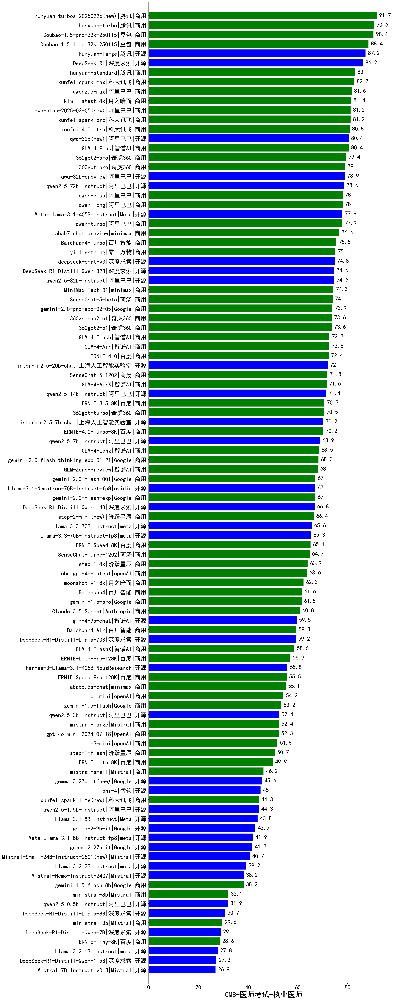

| 类别 | 大模型                         | CMB-医师考试-执业医师 | 排名 |
|-----|------------------------------|---------|----|
|商用|ERNIE-4.5-8K-Preview(new)|93.8|1|
|商用|hunyuan-turbos-20250226(new)|91.7|2|
|商用|hunyuan-turbo|90.6|3|
|商用|Doubao-1.5-pro-32k-250115|90.4|4|
|商用|Doubao-1.5-lite-32k-250115|88.4|5|
|商用|hunyuan-turbos-20250313(new)|87.8|6|
|开源|hunyuan-large|87.2|7|
|开源|DeepSeek-R1|86.2|8|
|商用|hunyuan-standard|83.0|9|
|商用|xunfei-spark-max|82.7|10|
|商用|qwen2.5-max|81.6|11|
|商用|kimi-latest-8k|81.4|12|
|商用|xunfei-spark-pro|81.2|13|
|商用|qwq-plus-2025-03-05(new)|81.2|14|
|商用|xunfei-4.0Ultra|80.8|15|
|商用|GLM-4-Plus|80.4|16|
|开源|qwq-32b(new)|80.4|17|
|商用|360gpt2-pro|79.4|18|
|商用|360gpt-pro|79.0|19|
|开源|qwq-32b-preview|78.9|20|
|开源|qwen2.5-72b-instruct|78.6|21|
|商用|qwen-long|78.0|22|
|商用|qwen-plus|78.0|23|
|商用|qwen-turbo|77.9|24|
|开源|Meta-Llama-3.1-405B-Instruct|77.9|25|
|商用|abab7-chat-preview|76.6|26|
|商用|Baichuan4-Turbo|75.5|27|
|商用|yi-lightning|75.1|28|
|开源|deepseek-chat-v3|74.8|29|
|开源|qwen2.5-32b-instruct|74.6|30|
|开源|DeepSeek-R1-Distill-Qwen-32B|74.6|31|
|开源|MiniMax-Text-01|74.3|32|
|商用|SenseChat-5-beta|74.0|33|
|商用|gemini-2.0-pro-exp-02-05|73.9|34|
|商用|360gpt2-o1|73.6|35|
|商用|360zhinao2-o1|73.6|36|
|商用|GLM-4-Flash|72.7|37|
|商用|GLM-4-Air|72.6|38|
|商用|ERNIE-4.0|72.4|39|
|开源|internlm2_5-20b-chat|72.0|40|
|商用|SenseChat-5-1202|71.8|41|
|商用|GLM-4-AirX|71.6|42|
|开源|qwen2.5-14b-instruct|71.4|43|
|商用|ERNIE-3.5-8K|70.7|44|
|商用|360gpt-turbo|70.5|45|
|开源|internlm2_5-7b-chat|70.2|46|
|商用|ERNIE-4.0-Turbo-8K|70.2|47|
|开源|qwen2.5-7b-instruct|68.9|48|
|商用|GLM-4-Long|68.5|49|
|商用|gemini-2.0-flash-thinking-exp-01-21|68.3|50|
|商用|GLM-Zero-Preview|68.0|51|
|商用|gemini-2.0-flash-001|67.0|52|
|开源|Llama-3.1-Nemotron-70B-Instruct-fp8|67.0|53|
|商用|gemini-2.0-flash-exp|67.0|54|
|开源|DeepSeek-R1-Distill-Qwen-14B|66.8|55|
|商用|step-2-mini(new)|66.4|56|
|开源|Llama-3.3-70B-Instruct|65.6|57|
|开源|Llama-3.3-70B-Instruct-fp8|65.3|58|
|商用|ERNIE-Speed-8K|65.1|59|
|商用|SenseChat-Turbo-1202|64.7|60|
|商用|step-1-8k|63.9|61|
|商用|chatgpt-4o-latest|63.6|62|
|商用|moonshot-v1-8k|62.3|63|
|商用|Baichuan4|61.6|64|
|商用|gemini-1.5-pro|61.5|65|
|商用|Claude-3.5-Sonnet|60.8|66|
|开源|glm-4-9b-chat|59.5|67|
|商用|Baichuan4-Air|59.3|68|
|开源|DeepSeek-R1-Distill-Llama-70B|59.2|69|
|商用|GLM-4-FlashX|58.6|70|
|商用|ERNIE-Lite-Pro-128K|56.9|71|
|开源|Hermes-3-Llama-3.1-405B|55.8|72|
|商用|ERNIE-Speed-Pro-128K|55.5|73|
|商用|abab6.5s-chat|55.1|74|
|商用|o1-mini|54.2|75|
|商用|gemini-1.5-flash|53.2|76|
|开源|qwen2.5-3b-instruct|52.4|77|
|商用|mistral-large|52.4|78|
|商用|gpt-4o-mini-2024-07-18|52.3|79|
|商用|o3-mini|51.8|80|
|商用|step-1-flash|50.7|81|
|商用|ERNIE-Lite-8K|49.9|82|
|商用|mistral-small|46.2|83|
|开源|gemma-3-27b-it(new)|45.6|84|
|开源|phi-4|45.0|85|
|商用|xunfei-spark-lite(new)|44.3|86|
|开源|qwen2.5-1.5b-instruct|44.3|87|
|开源|Llama-3.1-8B-Instruct|43.8|88|
|开源|gemma-2-9b-it|42.9|89|
|开源|Meta-Llama-3.1-8B-Instruct-fp8|41.9|90|
|开源|gemma-2-27b-it|41.7|91|
|开源|gemma-3-12b-it(new)|41.5|92|
|开源|Mistral-Small-24B-Instruct-2501(new)|40.7|93|
|开源|Llama-3.2-3B-Instruct|39.2|94|
|商用|gemini-1.5-flash-8b|38.2|95|
|开源|Mistral-Nemo-Instruct-2407|38.2|96|
|商用|ministral-8b|32.1|97|
|开源|qwen2.5-0.5b-instruct|31.9|98|
|开源|gemma-3-4b-it(new)|31.0|99|
|开源|DeepSeek-R1-Distill-Llama-8B|30.7|100|
|商用|ministral-3b|29.6|101|
|开源|DeepSeek-R1-Distill-Qwen-7B|29.0|102|
|商用|ERNIE-Tiny-8K|28.6|103|
|开源|Llama-3.2-1B-Instruct|27.8|104|
|开源|DeepSeek-R1-Distill-Qwen-1.5B|27.2|105|
|开源|Mistral-7B-Instruct-v0.3|26.9|106|
|开源|gemma-3-1b-it(new)|24.6|107|
|开源|qwen2.5-math-72b-instruct|/|108|
|开源|Yi-1.5-34B-Chat|/|109|
|开源|Yi-1.5-9B-Chat|/|110|

