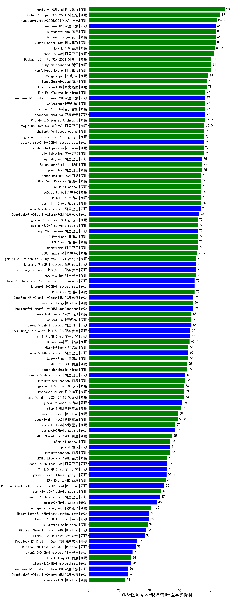

| 类别 | 大模型                         | CMB-医师考试-规培结业-医学影像科 | 排名 |
|-----|------------------------------|---------|----|
|商用|xunfei-4.0Ultra|90.0|1|
|商用|gemini-2.5-pro-preview-03-25(new)|90.0|2|
|商用|ERNIE-4.5-8K-Preview|90.0|3|
|商用|Doubao-1.5-pro-32k-250115|87.0|4|
|商用|hunyuan-turbos-20250226|84.7|5|
|商用|hunyuan-t1-20250321(new)|84.5|6|
|商用|hunyuan-turbo|84.0|7|
|开源|hunyuan-large|84.0|8|
|开源|DeepSeek-R1|84.0|9|
|商用|xunfei-spark-max|84.0|10|
|商用|ERNIE-4.0|83.3|11|
|商用|ERNIE-X1-32K-Preview(new)|83.3|12|
|商用|qwen2.5-max|83.0|13|
|商用|hunyuan-standard|81.0|14|
|商用|xunfei-spark-pro|81.0|15|
|商用|Doubao-1.5-lite-32k-250115|81.0|16|
|商用|hunyuan-turbos-20250313|81.0|17|
|开源|Llama-4-Maverick-17B-128E-Instruct-FP8(new)|79.0|18|
|商用|360gpt2-pro|79.0|19|
|商用|SenseChat-5-beta|78.0|20|
|开源|deepseek-chat-v3-0324(new)|78.0|21|
|商用|kimi-latest-8k|78.0|22|
|开源|DeepSeek-R1-Distill-Qwen-32B|77.0|23|
|开源|deepseek-chat-v3|77.0|24|
|商用|360gpt-pro|77.0|25|
|开源|MiniMax-Text-01|77.0|26|
|商用|Baichuan4-Turbo|77.0|27|
|商用|Claude-3.5-Sonnet|76.7|28|
|商用|qwq-plus-2025-03-05|76.5|29|
|商用|yi-lightning|76.0|30|
|商用|chatgpt-4o-latest|76.0|31|
|开源|Meta-Llama-3.1-405B-Instruct|76.0|32|
|商用|Baichuan4-Air|75.0|33|
|商用|qwen-plus|75.0|34|
|开源|qwq-32b|75.0|35|
|商用|SenseChat-5-1202|74.0|36|
|商用|GLM-Zero-Preview|74.0|37|
|商用|360gpt-turbo|74.0|38|
|商用|gemini-1.5-pro|74.0|39|
|商用|GLM-4-Plus|74.0|40|
|开源|qwen2.5-72b-instruct|74.0|41|
|开源|DeepSeek-R1-Distill-Llama-70B|73.0|42|
|商用|GLM-4-Long|72.0|43|
|商用|gemini-2.0-flash-001|72.0|44|
|开源|qwq-32b-preview|72.0|45|
|商用|qwen-long|72.0|46|
|商用|GLM-4-Air|72.0|47|
|开源|internlm2_5-7b-chat|71.0|48|
|商用|gemini-2.0-flash-thinking-exp-01-21|71.0|49|
|商用|qwen-turbo|71.0|50|
|开源|Llama-3.3-70B-Instruct-fp8|71.0|51|
|开源|Llama-3.3-70B-Instruct|70.0|52|
|商用|GLM-4-AirX|70.0|53|
|商用|360zhinao2-o1|70.0|54|
|商用|mistral-large|69.0|55|
|开源|DeepSeek-R1-Distill-Qwen-14B|69.0|56|
|开源|Hermes-3-Llama-3.1-405B|69.0|57|
|商用|360gpt2-o1|68.0|58|
|商用|SenseChat-Turbo-1202|68.0|59|
|开源|qwen2.5-32b-instruct|68.0|60|
|开源|internlm2_5-20b-chat|67.0|61|
|商用|Baichuan4|66.7|62|
|开源|Llama-4-Scout-17B-16E-Instruct(new)|66.0|63|
|商用|GLM-4-Flash|66.0|64|
|开源|qwen2.5-14b-instruct|66.0|65|
|商用|GLM-4-FlashX|66.0|66|
|商用|ERNIE-3.5-8K|65.0|67|
|商用|abab6.5s-chat|65.0|68|
|开源|qwen2.5-7b-instruct|64.0|69|
|商用|ERNIE-4.0-Turbo-8K|64.0|70|
|商用|gpt-4o-mini-2024-07-18|63.0|71|
|商用|moonshot-v1-8k|63.0|72|
|商用|gemini-1.5-flash|63.0|73|
|开源|glm-4-9b-chat|62.0|74|
|商用|step-1-8k|61.0|75|
|开源|Mistral-Small-3.1-24B-Instruct-2503(new)|61.0|76|
|商用|mistral-small|59.0|77|
|商用|step-2-mini|58.8|78|
|商用|step-1-flash|57.0|79|
|商用|ERNIE-Speed-Pro-128K|55.0|80|
|商用|ERNIE-Speed-8K|54.0|81|
|商用|o3-mini|54.0|82|
|开源|phi-4|54.0|83|
|商用|ERNIE-Lite-Pro-128K|52.0|84|
|开源|qwen2.5-3b-instruct|52.0|85|
|开源|gemma-3-27b-it|51.5|86|
|商用|ERNIE-Lite-8K|51.0|87|
|开源|Mistral-Small-24B-Instruct-2501|50.0|88|
|商用|gemini-1.5-flash-8b|48.0|89|
|开源|qwen2.5-1.5b-instruct|47.0|90|
|开源|gemma-3-12b-it|45.0|91|
|商用|xunfei-spark-lite|41.3|92|
|开源|Meta-Llama-3.1-8B-Instruct-fp8|40.0|93|
|开源|Llama-3.1-8B-Instruct|40.0|94|
|商用|ministral-8b|39.0|95|
|开源|Llama-3.2-3B-Instruct|37.0|96|
|开源|DeepSeek-R1-Distill-Qwen-7B|32.0|97|
|开源|Mistral-7B-Instruct-v0.3|31.0|98|
|开源|gemma-3-4b-it|31.0|99|
|开源|qwen2.5-0.5b-instruct|29.0|100|
|商用|ERNIE-Tiny-8K|28.0|101|
|开源|Llama-3.2-1B-Instruct|28.0|102|
|开源|gemma-3-1b-it|26.5|103|
|开源|DeepSeek-R1-Distill-Llama-8B|26.0|104|
|开源|DeepSeek-R1-Distill-Qwen-1.5B|26.0|105|
|商用|ministral-3b|24.0|106|

