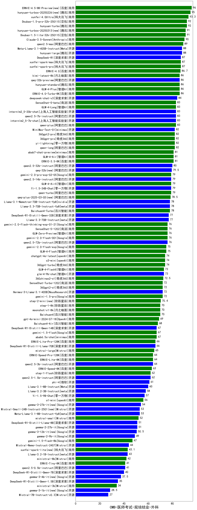

| 类别 | 大模型                         | CMB-医师考试-规培结业-外科 | 排名 |
|-----|------------------------------|---------|----|
|商用|ERNIE-4.5-8K-Preview(new)|96.0|1|
|商用|hunyuan-turbos-20250226(new)|95.0|2|
|商用|xunfei-4.0Ultra|93.3|3|
|商用|Doubao-1.5-pro-32k-250115|92.0|4|
|商用|hunyuan-turbo|92.0|5|
|商用|Doubao-1.5-lite-32k-250115|91.0|6|
|商用|hunyuan-turbos-20250313(new)|91.0|7|
|商用|Claude-3.5-Sonnet|90.0|8|
|商用|qwen2.5-max|89.0|9|
|开源|Meta-Llama-3.1-405B-Instruct|88.0|10|
|开源|hunyuan-large|88.0|11|
|开源|DeepSeek-R1|87.0|12|
|商用|xunfei-spark-max|87.0|13|
|商用|xunfei-spark-pro|87.0|14|
|商用|ERNIE-4.0|86.7|15|
|商用|kimi-latest-8k|86.0|16|
|商用|GLM-4-Plus|86.0|17|
|开源|qwq-32b-preview|86.0|18|
|商用|ERNIE-4.0-Turbo-8K|86.0|19|
|商用|hunyuan-standard|86.0|20|
|开源|deepseek-chat-v3|84.0|21|
|商用|SenseChat-5-beta|83.0|22|
|开源|internlm2_5-20b-chat|83.0|23|
|商用|GLM-4-Long|83.0|24|
|开源|internlm2_5-7b-chat|83.0|25|
|开源|qwen2.5-7b-instruct|83.0|26|
|商用|qwen-plus|83.0|27|
|商用|yi-lightning|82.0|28|
|商用|360gpt2-pro|82.0|29|
|商用|qwen-long|82.0|30|
|开源|MiniMax-Text-01|82.0|31|
|商用|360gpt-pro|82.0|32|
|商用|abab7-chat-preview|81.0|33|
|商用|GLM-4-Air|81.0|34|
|商用|ERNIE-3.5-8K|81.0|35|
|开源|qwen2.5-32b-instruct|80.0|36|
|开源|qwq-32b(new)|79.5|37|
|商用|gemini-2.0-pro-exp-02-05|79.0|38|
|商用|qwen-turbo|79.0|39|
|开源|Yi-1.5-34B-Chat|79.0|40|
|开源|qwen2.5-14b-instruct|79.0|41|
|商用|GLM-4-AirX|79.0|42|
|商用|qwq-plus-2025-03-05(new)|78.5|43|
|商用|Baichuan4-Turbo|78.0|44|
|开源|Llama-3.3-70B-Instruct-fp8|78.0|45|
|开源|Llama-3.1-Nemotron-70B-Instruct-fp8|78.0|46|
|开源|Llama-3.3-70B-Instruct|77.0|47|
|开源|DeepSeek-R1-Distill-Qwen-32B|77.0|48|
|商用|gemini-2.0-flash-001|76.0|49|
|开源|qwen2.5-72b-instruct|76.0|50|
|商用|SenseChat-5-1202|76.0|51|
|商用|GLM-Zero-Preview|76.0|52|
|商用|gemini-2.0-flash-thinking-exp-01-21|76.0|53|
|商用|GLM-4-Flash|75.0|54|
|商用|gemini-2.0-flash-exp|75.0|55|
|商用|360gpt-turbo|74.0|56|
|商用|chatgpt-4o-latest|74.0|57|
|商用|o3-mini|74.0|58|
|商用|GLM-4-FlashX|73.0|59|
|开源|glm-4-9b-chat|73.0|60|
|商用|360zhinao2-o1|72.5|61|
|商用|gemini-1.5-pro|72.0|62|
|商用|SenseChat-Turbo-1202|72.0|63|
|商用|360gpt2-o1|72.0|64|
|开源|Hermes-3-Llama-3.1-405B|72.0|65|
|商用|step-2-mini(new)|70.4|66|
|商用|moonshot-v1-8k|70.0|67|
|商用|Baichuan4|70.0|68|
|商用|step-1-8k|70.0|69|
|商用|gpt-4o-mini-2024-07-18|69.0|70|
|商用|Baichuan4-Air|68.0|71|
|开源|DeepSeek-R1-Distill-Qwen-14B|67.0|72|
|商用|gemini-1.5-flash|67.0|73|
|商用|abab6.5s-chat|67.0|74|
|商用|ERNIE-Lite-Pro-128K|66.0|75|
|开源|DeepSeek-R1-Distill-Llama-70B|66.0|76|
|商用|mistral-large|65.0|77|
|开源|qwen2.5-3b-instruct|64.0|78|
|商用|ERNIE-Speed-Pro-128K|64.0|79|
|商用|ERNIE-Lite-8K|64.0|80|
|商用|ERNIE-Speed-8K|63.0|81|
|商用|step-1-flash|62.0|82|
|开源|qwen2.5-1.5b-instruct|62.0|83|
|开源|phi-4|61.0|84|
|开源|Llama-3.1-8B-Instruct|60.0|85|
|开源|Llama-3.2-3B-Instruct|58.0|86|
|开源|Yi-1.5-9B-Chat|57.0|87|
|商用|o1-mini|56.0|88|
|开源|gemma-3-27b-it(new)|54.0|89|
|开源|Meta-Llama-3.1-8B-Instruct-fp8|53.0|90|
|开源|Mistral-Small-24B-Instruct-2501(new)|53.0|91|
|商用|mistral-small|52.0|92|
|开源|DeepSeek-R1-Distill-Llama-8B|51.0|93|
|开源|gemma-2-27b-it|51.0|94|
|开源|gemma-3-12b-it(new)|50.5|95|
|开源|gemma-2-9b-it|49.0|96|
|商用|gemini-1.5-flash-8b|47.0|97|
|开源|Mistral-Nemo-Instruct-2407|44.0|98|
|商用|xunfei-spark-lite(new)|43.1|99|
|开源|Llama-3.2-1B-Instruct|43.0|100|
|商用|ministral-8b|42.0|101|
|开源|qwen2.5-0.5b-instruct|41.0|102|
|商用|ERNIE-Tiny-8K|41.0|103|
|开源|DeepSeek-R1-Distill-Qwen-7B|40.0|104|
|开源|gemma-3-4b-it(new)|37.5|105|
|开源|DeepSeek-R1-Distill-Qwen-1.5B|35.0|106|
|商用|ministral-3b|34.0|107|
|开源|gemma-3-1b-it(new)|28.5|108|
|开源|Mistral-7B-Instruct-v0.3|27.0|109|
|开源|qwen2.5-math-72b-instruct|/|110|

