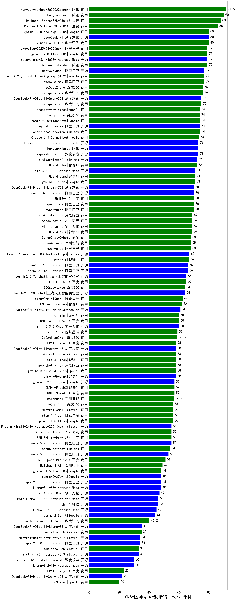

| 类别 | 大模型                         | CMB-医师考试-规培结业-小儿外科 | 排名 |
|-----|------------------------------|---------|----|
|商用|ERNIE-4.5-8K-Preview(new)|93.0|1|
|商用|hunyuan-turbos-20250226(new)|91.6|2|
|商用|hunyuan-turbo|90.0|3|
|商用|Doubao-1.5-pro-32k-250115|88.0|4|
|商用|Doubao-1.5-lite-32k-250115|86.0|5|
|商用|hunyuan-turbos-20250313(new)|80.5|6|
|开源|DeepSeek-R1|80.0|7|
|商用|gemini-2.0-pro-exp-02-05|80.0|8|
|商用|xunfei-4.0Ultra|80.0|9|
|商用|qwq-plus-2025-03-05(new)|79.0|10|
|商用|hunyuan-standard|79.0|11|
|开源|Meta-Llama-3.1-405B-Instruct|79.0|12|
|商用|gemini-2.0-flash-001|79.0|13|
|商用|qwen2.5-max|77.0|14|
|商用|gemini-2.0-flash-thinking-exp-01-21|77.0|15|
|开源|qwq-32b(new)|77.0|16|
|商用|xunfei-spark-max|76.0|17|
|商用|360gpt2-pro|76.0|18|
|开源|DeepSeek-R1-Distill-Qwen-32B|75.0|19|
|商用|xunfei-spark-pro|75.0|20|
|商用|gemini-2.0-flash-exp|74.0|21|
|商用|360gpt-pro|74.0|22|
|商用|abab7-chat-preview|74.0|23|
|开源|qwq-32b-preview|74.0|24|
|商用|chatgpt-4o-latest|74.0|25|
|商用|Claude-3.5-Sonnet|73.3|26|
|开源|Llama-3.3-70B-Instruct-fp8|73.0|27|
|开源|deepseek-chat-v3|73.0|28|
|开源|hunyuan-large|73.0|29|
|开源|MiniMax-Text-01|72.0|30|
|商用|GLM-4-Plus|72.0|31|
|商用|GLM-4-Long|71.0|32|
|开源|Llama-3.3-70B-Instruct|71.0|33|
|商用|gemini-1.5-pro|71.0|34|
|商用|qwen-long|70.0|35|
|商用|qwen-turbo|70.0|36|
|商用|ERNIE-4.0|70.0|37|
|开源|qwen2.5-32b-instruct|70.0|38|
|开源|DeepSeek-R1-Distill-Llama-70B|70.0|39|
|商用|SenseChat-5-1202|69.0|40|
|商用|yi-lightning|69.0|41|
|商用|kimi-latest-8k|69.0|42|
|商用|GLM-4-AirX|69.0|43|
|商用|qwen-plus|68.0|44|
|商用|Baichuan4-Turbo|68.0|45|
|商用|SenseChat-5-beta|68.0|46|
|商用|GLM-4-Air|67.0|47|
|开源|Llama-3.1-Nemotron-70B-Instruct-fp8|67.0|48|
|开源|qwen2.5-14b-instruct|66.0|49|
|开源|qwen2.5-72b-instruct|66.0|50|
|开源|internlm2_5-7b-chat|65.0|51|
|商用|ERNIE-3.5-8K|65.0|52|
|商用|360gpt-turbo|64.0|53|
|开源|internlm2_5-20b-chat|64.0|54|
|商用|step-2-mini(new)|62.5|55|
|商用|GLM-Zero-Preview|62.0|56|
|开源|Hermes-3-Llama-3.1-405B|61.0|57|
|商用|ERNIE-4.0-Turbo-8K|60.0|58|
|商用|o1-mini|60.0|59|
|商用|step-1-8k|59.0|60|
|商用|360zhinao2-o1|58.8|61|
|开源|DeepSeek-R1-Distill-Qwen-14B|58.0|62|
|商用|mistral-large|58.0|63|
|商用|ERNIE-Lite-8K|58.0|64|
|商用|gpt-4o-mini-2024-07-18|58.0|65|
|商用|GLM-4-Flash|58.0|66|
|商用|moonshot-v1-8k|58.0|67|
|开源|glm-4-9b-chat|58.0|68|
|开源|gemma-3-27b-it(new)|57.0|69|
|商用|GLM-4-FlashX|57.0|70|
|商用|ERNIE-Speed-8K|57.0|71|
|商用|Baichuan4|56.7|72|
|商用|step-1-flash|56.0|73|
|商用|gemini-1.5-flash|56.0|74|
|商用|360gpt2-o1|56.0|75|
|商用|mistral-small|56.0|76|
|开源|qwen2.5-7b-instruct|55.0|77|
|开源|Mistral-Small-24B-Instruct-2501(new)|55.0|78|
|商用|ERNIE-Lite-Pro-128K|55.0|79|
|商用|SenseChat-Turbo-1202|55.0|80|
|商用|abab6.5s-chat|54.0|81|
|开源|qwen2.5-3b-instruct|53.0|82|
|商用|ERNIE-Speed-Pro-128K|51.0|83|
|开源|gemma-3-12b-it(new)|51.0|84|
|商用|Baichuan4-Air|49.0|85|
|开源|Llama-3.1-8B-Instruct|48.0|86|
|开源|qwen2.5-1.5b-instruct|48.0|87|
|开源|gemma-2-27b-it|48.0|88|
|商用|gemini-1.5-flash-8b|48.0|89|
|开源|phi-4|46.0|90|
|开源|Meta-Llama-3.1-8B-Instruct-fp8|46.0|91|
|开源|Llama-3.2-3B-Instruct|45.0|92|
|开源|gemma-2-9b-it|44.0|93|
|商用|xunfei-spark-lite(new)|40.2|94|
|开源|gemma-3-4b-it(new)|38.5|95|
|开源|DeepSeek-R1-Distill-Llama-8B|35.0|96|
|商用|ministral-3b|35.0|97|
|开源|qwen2.5-0.5b-instruct|34.0|98|
|开源|Mistral-Nemo-Instruct-2407|34.0|99|
|开源|Mistral-7B-Instruct-v0.3|33.0|100|
|商用|ministral-8b|33.0|101|
|开源|gemma-3-1b-it(new)|31.5|102|
|开源|DeepSeek-R1-Distill-Qwen-7B|30.0|103|
|开源|Llama-3.2-1B-Instruct|30.0|104|
|商用|ERNIE-Tiny-8K|23.0|105|
|开源|DeepSeek-R1-Distill-Qwen-1.5B|22.0|106|
|商用|o3-mini|20.0|107|
|开源|qwen2.5-math-72b-instruct|/|108|

