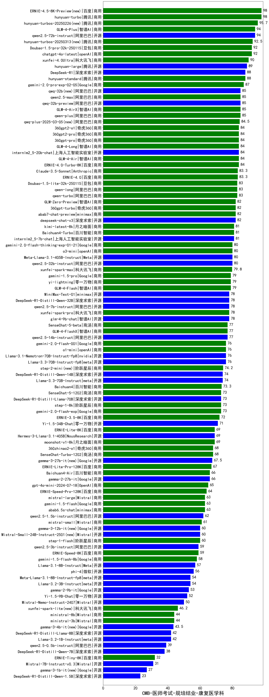

| 类别 | 大模型                         | CMB-医师考试-规培结业-康复医学科 | 排名 |
|-----|------------------------------|---------|----|
|商用|hunyuan-turbo|98.0|1|
|商用|ERNIE-4.5-8K-Preview(new)|98.0|2|
|商用|hunyuan-turbos-20250226(new)|95.7|3|
|开源|qwen2.5-72b-instruct|94.0|4|
|商用|GLM-4-Plus|94.0|5|
|商用|hunyuan-turbos-20250313(new)|92.5|6|
|商用|chatgpt-4o-latest|92.0|7|
|商用|Doubao-1.5-pro-32k-250115|92.0|8|
|商用|xunfei-4.0Ultra|90.0|9|
|开源|hunyuan-large|89.0|10|
|开源|DeepSeek-R1|88.0|11|
|商用|hunyuan-standard|88.0|12|
|商用|gemini-2.0-pro-exp-02-05|87.0|13|
|开源|qwq-32b(new)|85.0|14|
|商用|GLM-4-AirX|85.0|15|
|开源|qwq-32b-preview|85.0|16|
|商用|qwen-plus|85.0|17|
|商用|qwen2.5-max|85.0|18|
|商用|qwq-plus-2025-03-05(new)|84.5|19|
|商用|360gpt2-o1|84.0|20|
|商用|GLM-4-Long|84.0|21|
|商用|GLM-4-Air|84.0|22|
|商用|ERNIE-4.0-Turbo-8K|84.0|23|
|商用|360gpt-pro|84.0|24|
|商用|360gpt2-pro|84.0|25|
|开源|internlm2_5-20b-chat|84.0|26|
|商用|Claude-3.5-Sonnet|83.3|27|
|商用|ERNIE-4.0|83.3|28|
|商用|qwen-long|83.0|29|
|商用|qwen-turbo|83.0|30|
|商用|Doubao-1.5-lite-32k-250115|83.0|31|
|商用|360gpt-turbo|82.0|32|
|商用|GLM-Zero-Preview|82.0|33|
|开源|deepseek-chat-v3|82.0|34|
|商用|abab7-chat-preview|82.0|35|
|开源|internlm2_5-7b-chat|81.0|36|
|商用|Baichuan4-Turbo|81.0|37|
|商用|kimi-latest-8k|81.0|38|
|开源|qwen2.5-32b-instruct|80.0|39|
|开源|Meta-Llama-3.1-405B-Instruct|80.0|40|
|商用|o3-mini|80.0|41|
|商用|gemini-2.0-flash-thinking-exp-01-21|80.0|42|
|商用|xunfei-spark-max|79.8|43|
|商用|GLM-4-Flash|79.0|44|
|商用|yi-lightning|79.0|45|
|商用|gemini-1.5-pro|79.0|46|
|开源|glm-4-9b-chat|78.0|47|
|商用|xunfei-spark-pro|78.0|48|
|开源|DeepSeek-R1-Distill-Qwen-32B|78.0|49|
|开源|MiniMax-Text-01|78.0|50|
|开源|qwen2.5-7b-instruct|78.0|51|
|商用|GLM-4-FlashX|77.0|52|
|开源|qwen2.5-14b-instruct|77.0|53|
|商用|SenseChat-5-beta|77.0|54|
|开源|Llama-3.1-Nemotron-70B-Instruct-fp8|76.0|55|
|商用|o1-mini|76.0|56|
|商用|gemini-2.0-flash-001|76.0|57|
|开源|Llama-3.3-70B-Instruct-fp8|76.0|58|
|商用|step-2-mini(new)|74.2|59|
|开源|DeepSeek-R1-Distill-Qwen-14B|74.0|60|
|开源|Llama-3.3-70B-Instruct|74.0|61|
|商用|Baichuan4|73.3|62|
|开源|DeepSeek-R1-Distill-Llama-70B|73.0|63|
|商用|step-1-8k|73.0|64|
|商用|SenseChat-5-1202|73.0|65|
|商用|gemini-2.0-flash-exp|73.0|66|
|商用|ERNIE-3.5-8K|72.0|67|
|开源|Hermes-3-Llama-3.1-405B|69.0|68|
|商用|ERNIE-Lite-8K|69.0|69|
|商用|moonshot-v1-8k|69.0|70|
|商用|SenseChat-Turbo-1202|68.0|71|
|商用|360zhinao2-o1|68.0|72|
|开源|gemma-3-27b-it(new)|67.5|73|
|商用|ERNIE-Lite-Pro-128K|67.0|74|
|开源|gemma-2-27b-it|66.0|75|
|商用|Baichuan4-Air|66.0|76|
|商用|gpt-4o-mini-2024-07-18|65.0|77|
|商用|ERNIE-Speed-Pro-128K|64.0|78|
|商用|abab6.5s-chat|63.0|79|
|商用|mistral-large|63.0|80|
|商用|gemini-1.5-flash|63.0|81|
|开源|qwen2.5-1.5b-instruct|62.0|82|
|商用|mistral-small|61.0|83|
|商用|step-1-flash|60.0|84|
|开源|gemma-3-12b-it(new)|60.0|85|
|开源|Mistral-Small-24B-Instruct-2501(new)|60.0|86|
|开源|qwen2.5-3b-instruct|59.0|87|
|商用|ERNIE-Speed-8K|59.0|88|
|商用|gemini-1.5-flash-8b|58.0|89|
|开源|Llama-3.1-8B-Instruct|57.0|90|
|开源|phi-4|56.0|91|
|开源|Meta-Llama-3.1-8B-Instruct-fp8|54.0|92|
|开源|Llama-3.2-3B-Instruct|54.0|93|
|开源|gemma-2-9b-it|53.0|94|
|开源|Mistral-Nemo-Instruct-2407|50.0|95|
|商用|xunfei-spark-lite(new)|46.2|96|
|商用|ministral-3b|44.0|97|
|商用|ministral-8b|44.0|98|
|开源|gemma-3-4b-it(new)|43.5|99|
|开源|Llama-3.2-1B-Instruct|42.0|100|
|开源|DeepSeek-R1-Distill-Llama-8B|42.0|101|
|开源|qwen2.5-0.5b-instruct|39.0|102|
|开源|DeepSeek-R1-Distill-Qwen-7B|38.0|103|
|商用|ERNIE-Tiny-8K|32.0|104|
|开源|Mistral-7B-Instruct-v0.3|31.0|105|
|开源|gemma-3-1b-it(new)|27.0|106|
|开源|DeepSeek-R1-Distill-Qwen-1.5B|23.0|107|
|开源|qwen2.5-math-72b-instruct|/|108|

