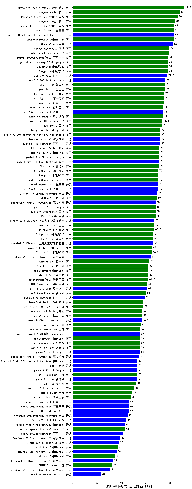

| 类别 | 大模型                         | CMB-医师考试-规培结业-眼科 | 排名 |
|-----|------------------------------|---------|----|
|商用|hunyuan-turbos-20250226(new)|91.3|1|
|商用|hunyuan-turbo|88.0|2|
|商用|Doubao-1.5-pro-32k-250115|86.0|3|
|商用|hunyuan-large|84.0|4|
|商用|abab7-chat-preview|83.0|5|
|商用|Doubao-1.5-lite-32k-250115|83.0|6|
|商用|qwen2.5-max|83.0|7|
|开源|Llama-3.1-Nemotron-70B-Instruct-fp8|83.0|8|
|开源|DeepSeek-R1|82.0|9|
|商用|xunfei-spark-max|79.0|10|
|商用|SenseChat-5-beta|79.0|11|
|商用|360gpt-pro|78.0|12|
|商用|gemini-2.0-pro-exp-02-05|78.0|13|
|商用|qwq-plus-2025-03-05(new)|78.0|14|
|商用|360gpt2-pro|78.0|15|
|开源|qwq-32b(new)|77.5|16|
|开源|Llama-3.3-70B-Instruct|76.0|17|
|商用|qwen-long|76.0|18|
|商用|GLM-4-Plus|76.0|19|
|商用|hunyuan-standard|75.0|20|
|商用|qwen-plus|75.0|21|
|商用|yi-lightning|75.0|22|
|开源|qwen2.5-72b-instruct|74.0|23|
|商用|Baichuan4-Turbo|74.0|24|
|商用|xunfei-spark-pro|74.0|25|
|商用|ERNIE-4.0|73.3|26|
|商用|xunfei-4.0Ultra|73.3|27|
|开源|deepseek-chat-v3|72.0|28|
|开源|qwen2.5-14b-instruct|72.0|29|
|商用|chatgpt-4o-latest|72.0|30|
|商用|gemini-2.0-flash-thinking-exp-01-21|72.0|31|
|商用|kimi-latest-8k|71.0|32|
|开源|Meta-Llama-3.1-405B-Instruct|71.0|33|
|商用|gemini-2.0-flash-exp|71.0|34|
|商用|MiniMax-Text-01|71.0|35|
|商用|GLM-4-AirX|71.0|36|
|商用|SenseChat-5-1202|70.0|37|
|商用|360gpt2-o1|70.0|38|
|开源|qwen2.5-32b-instruct|70.0|39|
|商用|Claude-3.5-Sonnet|70.0|40|
|开源|qwq-32b-preview|70.0|41|
|开源|Llama-3.3-70B-Instruct-fp8|69.0|42|
|商用|GLM-4-Air|69.0|43|
|商用|ERNIE-3.5-8K|68.0|44|
|商用|ERNIE-4.0-Turbo-8K|68.0|45|
|商用|gemini-1.5-pro|68.0|46|
|开源|DeepSeek-R1-Distill-Qwen-32B|68.0|47|
|开源|internlm2_5-7b-chat|67.0|48|
|商用|qwen-turbo|67.0|49|
|商用|Baichuan4|66.7|50|
|商用|GLM-4-Long|66.0|51|
|商用|360gpt-turbo|66.0|52|
|开源|internlm2_5-20b-chat|66.0|53|
|商用|gemini-2.0-flash-001|65.0|54|
|商用|360zhinao2-o1|64.8|55|
|开源|DeepSeek-R1-Distill-Llama-70B|64.0|56|
|商用|GLM-4-Flash|63.0|57|
|商用|step-1-8k|62.0|58|
|商用|mistral-large|62.0|59|
|商用|GLM-4-FlashX|62.0|60|
|商用|step-2-mini(new)|61.8|61|
|商用|ERNIE-Speed-Pro-128K|61.0|62|
|开源|Yi-1.5-34B-Chat|61.0|63|
|商用|GLM-Zero-Preview|60.0|64|
|开源|qwen2.5-7b-instruct|59.0|65|
|商用|SenseChat-Turbo-1202|58.0|66|
|商用|gpt-4o-mini-2024-07-18|58.0|67|
|商用|moonshot-v1-8k|57.0|68|
|商用|abab6.5s-chat|57.0|69|
|商用|o3-mini|56.0|70|
|商用|gemini-1.5-flash|55.0|71|
|商用|ERNIE-Lite-Pro-128K|55.0|72|
|开源|Hermes-3-Llama-3.1-405B|55.0|73|
|商用|Baichuan4-Air|55.0|74|
|商用|mistral-small|55.0|75|
|开源|gemma-2-9b-it|55.0|76|
|开源|DeepSeek-R1-Distill-Qwen-14B|54.0|77|
|开源|glm-4-9b-chat|53.0|78|
|商用|ERNIE-Speed-8K|53.0|79|
|开源|phi-4|53.0|80|
|开源|gemma-2-27b-it|53.0|81|
|商用|o1-mini|52.0|82|
|商用|gemini-1.5-flash-8b|50.0|83|
|商用|ERNIE-Lite-8K|49.0|84|
|商用|step-1-flash|48.0|85|
|开源|Llama-3.1-8B-Instruct|46.0|86|
|开源|qwen2.5-3b-instruct|46.0|87|
|开源|qwen2.5-1.5b-instruct|46.0|88|
|开源|Meta-Llama-3.1-8B-Instruct-fp8|45.0|89|
|开源|Yi-1.5-9B-Chat|44.0|90|
|开源|Mistral-Nemo-Instruct-2407|43.0|91|
|商用|xunfei-spark-lite(new)|42.7|92|
|开源|qwen2.5-0.5b-instruct|41.0|93|
|开源|DeepSeek-R1-Distill-Qwen-7B|39.0|94|
|开源|Llama-3.2-3B-Instruct|38.0|95|
|商用|ministral-3b|37.0|96|
|开源|Mistral-7B-Instruct-v0.3|36.0|97|
|商用|ministral-8b|35.0|98|
|开源|DeepSeek-R1-Distill-Llama-8B|33.0|99|
|商用|ERNIE-Tiny-8K|32.0|100|
|开源|DeepSeek-R1-Distill-Qwen-1.5B|31.0|101|
|开源|Llama-3.2-1B-Instruct|23.0|102|
|开源|qwen2.5-math-72b-instruct|/|103|

