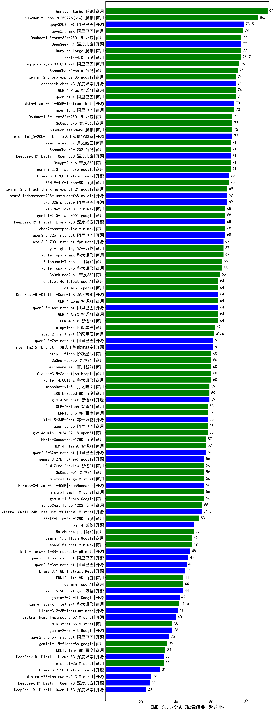

| 类别 | 大模型                         | CMB-医师考试-规培结业-超声科 | 排名 |
|-----|------------------------------|---------|----|
|商用|hunyuan-turbo|92.0|1|
|商用|hunyuan-turbos-20250226(new)|86.7|2|
|开源|qwq-32b(new)|78.5|3|
|商用|qwen2.5-max|78.0|4|
|开源|hunyuan-large|77.0|5|
|开源|DeepSeek-R1|77.0|6|
|商用|Doubao-1.5-pro-32k-250115|77.0|7|
|商用|ERNIE-4.0|76.7|8|
|商用|qwq-plus-2025-03-05(new)|76.0|9|
|商用|SenseChat-5-beta|75.0|10|
|商用|gemini-2.0-pro-exp-02-05|74.0|11|
|商用|GLM-4-Plus|74.0|12|
|开源|deepseek-chat-v3|74.0|13|
|商用|qwen-plus|74.0|14|
|商用|qwen-long|73.0|15|
|开源|Meta-Llama-3.1-405B-Instruct|73.0|16|
|商用|360gpt-pro|72.0|17|
|开源|internlm2_5-20b-chat|72.0|18|
|商用|Doubao-1.5-lite-32k-250115|72.0|19|
|商用|hunyuan-standard|72.0|20|
|商用|gemini-2.0-flash-exp|71.0|21|
|商用|360gpt2-pro|71.0|22|
|商用|kimi-latest-8k|71.0|23|
|开源|DeepSeek-R1-Distill-Qwen-32B|71.0|24|
|商用|SenseChat-5-1202|71.0|25|
|商用|ERNIE-4.0-Turbo-8K|70.0|26|
|开源|Llama-3.3-70B-Instruct|70.0|27|
|开源|qwq-32b-preview|69.0|28|
|开源|Llama-3.1-Nemotron-70B-Instruct-fp8|69.0|29|
|商用|gemini-2.0-flash-thinking-exp-01-21|69.0|30|
|开源|qwen2.5-72b-instruct|68.0|31|
|商用|abab7-chat-preview|68.0|32|
|开源|DeepSeek-R1-Distill-Llama-70B|68.0|33|
|开源|MiniMax-Text-01|68.0|34|
|商用|gemini-2.0-flash-001|68.0|35|
|开源|Llama-3.3-70B-Instruct-fp8|67.0|36|
|商用|xunfei-spark-max|67.0|37|
|商用|yi-lightning|67.0|38|
|商用|xunfei-spark-pro|66.0|39|
|商用|Baichuan4-Turbo|66.0|40|
|商用|360zhinao2-o1|65.0|41|
|商用|GLM-4-AirX|64.0|42|
|开源|qwen2.5-14b-instruct|64.0|43|
|开源|DeepSeek-R1-Distill-Qwen-14B|64.0|44|
|商用|chatgpt-4o-latest|64.0|45|
|商用|o1-mini|64.0|46|
|商用|GLM-4-Long|64.0|47|
|商用|GLM-4-Air|64.0|48|
|商用|step-1-8k|62.0|49|
|商用|step-2-mini(new)|61.6|50|
|开源|qwen2.5-7b-instruct|61.0|51|
|开源|internlm2_5-7b-chat|61.0|52|
|商用|xunfei-4.0Ultra|60.0|53|
|商用|step-1-flash|60.0|54|
|商用|Claude-3.5-Sonnet|60.0|55|
|商用|Baichuan4-Air|60.0|56|
|商用|360gpt-turbo|60.0|57|
|商用|ERNIE-Speed-8K|59.0|58|
|开源|glm-4-9b-chat|59.0|59|
|商用|moonshot-v1-8k|59.0|60|
|商用|ERNIE-3.5-8K|58.0|61|
|商用|qwen-turbo|58.0|62|
|商用|GLM-4-Flash|58.0|63|
|开源|Yi-1.5-34B-Chat|58.0|64|
|商用|gpt-4o-mini-2024-07-18|58.0|65|
|商用|GLM-4-FlashX|57.0|66|
|商用|ERNIE-Speed-Pro-128K|57.0|67|
|开源|qwen2.5-32b-instruct|57.0|68|
|商用|gemini-1.5-pro|56.0|69|
|开源|gemma-3-27b-it(new)|56.0|70|
|开源|Hermes-3-Llama-3.1-405B|56.0|71|
|商用|mistral-small|56.0|72|
|商用|GLM-Zero-Preview|56.0|73|
|商用|360gpt2-o1|56.0|74|
|商用|mistral-large|56.0|75|
|商用|SenseChat-Turbo-1202|55.0|76|
|开源|Mistral-Small-24B-Instruct-2501(new)|54.5|77|
|商用|ERNIE-Lite-Pro-128K|53.0|78|
|商用|Baichuan4|50.0|79|
|开源|phi-4|50.0|80|
|商用|gemini-1.5-flash|49.0|81|
|商用|abab6.5s-chat|49.0|82|
|开源|Meta-Llama-3.1-8B-Instruct-fp8|48.0|83|
|开源|qwen2.5-1.5b-instruct|47.0|84|
|开源|qwen2.5-3b-instruct|46.0|85|
|开源|Llama-3.1-8B-Instruct|45.0|86|
|商用|o3-mini|44.0|87|
|开源|Yi-1.5-9B-Chat|44.0|88|
|商用|ERNIE-Lite-8K|44.0|89|
|开源|gemma-2-9b-it|42.0|90|
|商用|xunfei-spark-lite(new)|41.6|91|
|开源|Llama-3.2-3B-Instruct|41.0|92|
|开源|Mistral-Nemo-Instruct-2407|40.0|93|
|商用|ministral-8b|38.0|94|
|开源|gemma-2-27b-it|38.0|95|
|开源|qwen2.5-0.5b-instruct|36.0|96|
|商用|gemini-1.5-flash-8b|35.0|97|
|商用|ERNIE-Tiny-8K|34.0|98|
|商用|ministral-3b|33.0|99|
|开源|DeepSeek-R1-Distill-Llama-8B|33.0|100|
|开源|Llama-3.2-1B-Instruct|31.0|101|
|开源|Mistral-7B-Instruct-v0.3|26.0|102|
|开源|DeepSeek-R1-Distill-Qwen-7B|25.0|103|
|开源|DeepSeek-R1-Distill-Qwen-1.5B|23.0|104|
|开源|qwen2.5-math-72b-instruct|/|105|

