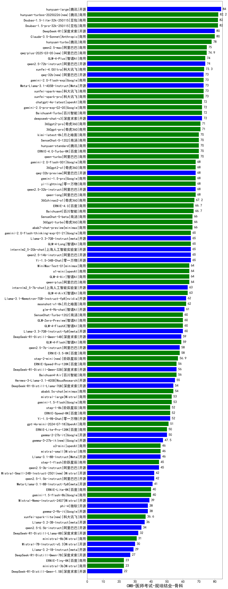

| 类别 | 大模型                         | CMB-医师考试-规培结业-骨科 | 排名 |
|-----|------------------------------|---------|----|
|商用|ERNIE-4.5-8K-Preview(new)|87.0|1|
|开源|hunyuan-large|84.0|2|
|商用|hunyuan-turbos-20250313(new)|83.5|3|
|商用|hunyuan-turbos-20250226(new)|82.2|4|
|商用|Doubao-1.5-pro-32k-250115|82.0|5|
|商用|Doubao-1.5-lite-32k-250115|82.0|6|
|开源|DeepSeek-R1|80.0|7|
|商用|Claude-3.5-Sonnet|80.0|8|
|商用|hunyuan-turbo|78.0|9|
|商用|qwen2.5-max|75.0|10|
|商用|qwq-plus-2025-03-05(new)|74.9|11|
|开源|qwen2.5-72b-instruct|74.0|12|
|商用|GLM-4-Plus|74.0|13|
|商用|xunfei-4.0Ultra|73.3|14|
|开源|Meta-Llama-3.1-405B-Instruct|73.0|15|
|商用|xunfei-spark-max|73.0|16|
|商用|xunfei-spark-pro|73.0|17|
|开源|qwq-32b(new)|73.0|18|
|商用|gemini-2.0-flash-exp|73.0|19|
|商用|Baichuan4-Turbo|72.0|20|
|商用|chatgpt-4o-latest|72.0|21|
|商用|gemini-2.0-pro-exp-02-05|72.0|22|
|开源|deepseek-chat-v3|72.0|23|
|商用|360gpt2-pro|71.0|24|
|商用|360gpt-pro|71.0|25|
|商用|SenseChat-5-1202|70.0|26|
|商用|ERNIE-4.0-Turbo-8K|70.0|27|
|商用|qwen-turbo|70.0|28|
|商用|hunyuan-standard|70.0|29|
|商用|kimi-latest-8k|70.0|30|
|开源|qwq-32b-preview|68.0|31|
|商用|gemini-1.5-pro|68.0|32|
|商用|yi-lightning|68.0|33|
|开源|qwen2.5-32b-instruct|68.0|34|
|商用|360gpt2-o1|68.0|35|
|商用|gemini-2.0-flash-001|68.0|36|
|商用|qwen-long|68.0|37|
|商用|360zhinao2-o1|67.2|38|
|商用|Baichuan4|66.7|39|
|商用|ERNIE-4.0|66.7|40|
|商用|SenseChat-5-beta|66.0|41|
|商用|360gpt-turbo|66.0|42|
|商用|abab7-chat-preview|66.0|43|
|开源|internlm2_5-20b-chat|65.0|44|
|商用|GLM-4-Long|65.0|45|
|开源|Yi-1.5-34B-Chat|65.0|46|
|商用|gemini-2.0-flash-thinking-exp-01-21|65.0|47|
|开源|qwen2.5-14b-instruct|65.0|48|
|开源|Llama-3.3-70B-Instruct|65.0|49|
|商用|o1-mini|64.0|50|
|商用|GLM-4-Air|64.0|51|
|开源|MiniMax-Text-01|64.0|52|
|商用|qwen-plus|64.0|53|
|开源|internlm2_5-7b-chat|63.0|54|
|商用|GLM-4-AirX|63.0|55|
|商用|moonshot-v1-8k|62.0|56|
|开源|Llama-3.1-Nemotron-70B-Instruct-fp8|62.0|57|
|开源|glm-4-9b-chat|61.0|58|
|商用|GLM-4-FlashX|60.0|59|
|商用|SenseChat-Turbo-1202|60.0|60|
|商用|GLM-Zero-Preview|60.0|61|
|开源|Llama-3.3-70B-Instruct-fp8|60.0|62|
|商用|GLM-4-Flash|59.0|63|
|开源|DeepSeek-R1-Distill-Qwen-14B|59.0|64|
|开源|qwen2.5-7b-instruct|58.0|65|
|商用|ERNIE-3.5-8K|58.0|66|
|商用|step-2-mini(new)|56.9|67|
|商用|ERNIE-Speed-Pro-128K|56.0|68|
|商用|Baichuan4-Air|56.0|69|
|开源|DeepSeek-R1-Distill-Qwen-32B|56.0|70|
|开源|Hermes-3-Llama-3.1-405B|55.0|71|
|开源|DeepSeek-R1-Distill-Llama-70B|54.0|72|
|商用|abab6.5s-chat|54.0|73|
|商用|gemini-1.5-flash|53.0|74|
|商用|mistral-large|53.0|75|
|开源|Yi-1.5-9B-Chat|52.0|76|
|商用|ERNIE-Speed-8K|52.0|77|
|商用|step-1-8k|52.0|78|
|商用|gpt-4o-mini-2024-07-18|51.0|79|
|商用|ERNIE-Lite-Pro-128K|50.0|80|
|开源|gemma-2-27b-it|50.0|81|
|开源|gemma-3-27b-it(new)|47.5|82|
|商用|o3-mini|46.0|83|
|开源|Llama-3.1-8B-Instruct|46.0|84|
|商用|mistral-small|46.0|85|
|开源|qwen2.5-3b-instruct|45.0|86|
|商用|step-1-flash|45.0|87|
|开源|Mistral-Small-24B-Instruct-2501(new)|42.0|88|
|开源|gemma-3-12b-it(new)|42.0|89|
|开源|qwen2.5-1.5b-instruct|42.0|90|
|开源|Meta-Llama-3.1-8B-Instruct-fp8|41.0|91|
|商用|gemini-1.5-flash-8b|40.0|92|
|商用|ERNIE-Lite-8K|40.0|93|
|开源|Mistral-Nemo-Instruct-2407|39.0|94|
|开源|gemma-2-9b-it|38.0|95|
|开源|phi-4|38.0|96|
|商用|xunfei-spark-lite(new)|36.6|97|
|开源|gemma-3-4b-it(new)|36.5|98|
|开源|Llama-3.2-3B-Instruct|36.0|99|
|开源|qwen2.5-0.5b-instruct|34.0|100|
|开源|DeepSeek-R1-Distill-Llama-8B|32.0|101|
|商用|ministral-8b|31.0|102|
|开源|Mistral-7B-Instruct-v0.3|30.0|103|
|开源|Llama-3.2-1B-Instruct|29.0|104|
|开源|DeepSeek-R1-Distill-Qwen-7B|27.0|105|
|开源|gemma-3-1b-it(new)|23.5|106|
|商用|ERNIE-Tiny-8K|23.0|107|
|商用|ministral-3b|23.0|108|
|开源|DeepSeek-R1-Distill-Qwen-1.5B|22.0|109|
|开源|qwen2.5-math-72b-instruct|/|110|

