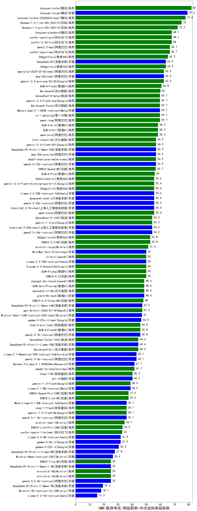

| 类别 | 大模型                         | CMB-医师考试-高级职称-内分泌科高级职称 | 排名 |
|-----|------------------------------|---------|----|
|商用|ERNIE-4.5-8K-Preview(new)|91.0|1|
|商用|hunyuan-turbo|82.0|2|
|开源|hunyuan-large|79.2|3|
|商用|hunyuan-turbos-20250226(new)|77.8|4|
|商用|Doubao-1.5-lite-32k-250115|75.0|5|
|商用|Doubao-1.5-pro-32k-250115|72.2|6|
|商用|hunyuan-turbos-20250313(new)|71.0|7|
|商用|hunyuan-standard|68.1|8|
|商用|xunfei-spark-pro|68.1|9|
|商用|xunfei-4.0Ultra|68.0|10|
|商用|qwen2.5-max|66.7|11|
|商用|xunfei-spark-max|66.7|12|
|商用|360gpt2-pro|65.3|13|
|商用|360gpt-pro|63.9|14|
|开源|DeepSeek-R1|63.9|15|
|开源|qwq-32b(new)|62.5|16|
|商用|qwq-plus-2025-03-05(new)|62.5|17|
|商用|gemini-2.0-pro-exp-02-05|62.5|18|
|商用|GLM-4-Flash|60.8|19|
|商用|Baichuan4|60.0|20|
|开源|Meta-Llama-3.1-405B-Instruct|59.7|21|
|商用|SenseChat-5-beta|59.7|22|
|商用|Baichuan4-Turbo|59.7|23|
|商用|gemini-2.0-flash-exp|59.7|24|
|商用|qwen-long|59.7|25|
|商用|yi-lightning|59.7|26|
|商用|GLM-4-AirX|58.3|27|
|商用|qwen-plus|58.3|28|
|商用|GLM-4-Air|58.3|29|
|开源|DeepSeek-R1-Distill-Qwen-32B|56.9|30|
|商用|abab7-chat-preview|56.9|31|
|开源|qwq-32b-preview|56.9|32|
|开源|qwen2.5-72b-instruct|56.9|33|
|商用|gemini-2.0-flash-001|56.9|34|
|商用|kimi-latest-8k|56.9|35|
|商用|ERNIE-Speed-8K|56.7|36|
|商用|GLM-4-Plus|56.0|37|
|开源|internlm2_5-7b-chat|55.6|38|
|开源|deepseek-chat-v3|55.6|39|
|开源|Llama-3.3-70B-Instruct-fp8|55.6|40|
|商用|360zhinao2-o1|55.6|41|
|商用|gemini-2.0-flash-thinking-exp-01-21|55.6|42|
|开源|qwen2.5-32b-instruct|55.6|43|
|商用|qwen-turbo|55.6|44|
|商用|360gpt2-o1|55.6|45|
|开源|internlm2_5-20b-chat|54.2|46|
|开源|qwen2.5-14b-instruct|54.2|47|
|商用|gemini-1.5-pro|54.2|48|
|商用|SenseChat-5-1202|54.2|49|
|商用|ERNIE-3.5-8K|52.8|50|
|商用|360gpt-turbo|52.8|51|
|商用|mistral-large|51.4|52|
|商用|ERNIE-4.0|50.0|53|
|开源|MiniMax-Text-01|50.0|54|
|开源|Llama-3.3-70B-Instruct|50.0|55|
|商用|o1-mini|50.0|56|
|商用|GLM-4-Long|50.0|57|
|商用|Claude-3.5-Sonnet|50.0|58|
|开源|glm-4-9b-chat|48.6|59|
|商用|moonshot-v1-8k|48.6|60|
|商用|GLM-Zero-Preview|48.6|61|
|商用|chatgpt-4o-latest|48.6|62|
|商用|ERNIE-4.0-Turbo-8K|48.0|63|
|商用|gpt-4o-mini-2024-07-18|47.2|64|
|开源|DeepSeek-R1-Distill-Qwen-14B|47.2|65|
|开源|Mistral-Small-24B-Instruct-2501(new)|47.0|66|
|开源|gemma-3-27b-it(new)|46.5|67|
|商用|GLM-4-FlashX|45.8|68|
|商用|step-2-mini(new)|45.8|69|
|开源|qwen2.5-7b-instruct|45.8|70|
|商用|SenseChat-Turbo-1202|44.4|71|
|开源|DeepSeek-R1-Distill-Llama-70B|44.4|72|
|商用|Baichuan4-Air|44.4|73|
|开源|qwen2.5-3b-instruct|43.1|74|
|开源|Llama-3.1-Nemotron-70B-Instruct-fp8|43.1|75|
|商用|abab6.5s-chat|41.7|76|
|开源|Hermes-3-Llama-3.1-405B|41.7|77|
|开源|phi-4|40.3|78|
|商用|step-1-8k|40.3|79|
|商用|gemini-1.5-flash|38.9|80|
|开源|Llama-3.1-8B-Instruct|38.9|81|
|商用|ERNIE-Speed-Pro-128K|37.5|82|
|开源|gemma-3-12b-it(new)|37.5|83|
|商用|ERNIE-Lite-8K|37.5|84|
|开源|qwen2.5-1.5b-instruct|36.1|85|
|商用|step-1-flash|36.1|86|
|开源|Meta-Llama-3.1-8B-Instruct-fp8|36.1|87|
|商用|gemini-1.5-flash-8b|36.1|88|
|商用|mistral-small|34.7|89|
|商用|ERNIE-Lite-Pro-128K|33.3|90|
|商用|xunfei-spark-lite(new)|33.0|91|
|开源|gemma-2-9b-it|31.9|92|
|开源|Llama-3.2-3B-Instruct|31.9|93|
|开源|gemma-3-4b-it(new)|31.5|94|
|开源|gemma-2-27b-it|30.6|95|
|开源|DeepSeek-R1-Distill-Llama-8B|27.8|96|
|开源|Mistral-Nemo-Instruct-2407|26.4|97|
|开源|qwen2.5-0.5b-instruct|25.0|98|
|商用|ministral-3b|25.0|99|
|开源|DeepSeek-R1-Distill-Qwen-1.5B|25.0|100|
|商用|ministral-8b|25.0|101|
|商用|ERNIE-Tiny-8K|25.0|102|
|开源|gemma-3-1b-it(new)|20.5|103|
|开源|DeepSeek-R1-Distill-Qwen-7B|19.4|104|
|开源|Mistral-7B-Instruct-v0.3|18.1|105|
|开源|Llama-3.2-1B-Instruct|15.3|106|
|开源|qwen2.5-math-72b-instruct|/|107|
|商用|o3-mini|/|108|

