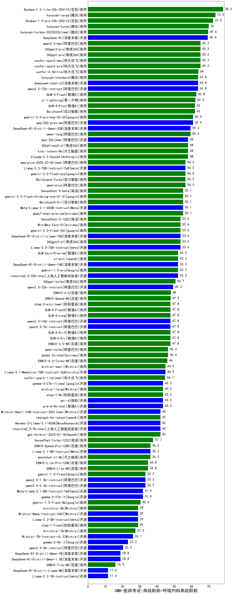

| 类别 | 大模型                         | CMB-医师考试-高级职称-呼吸内科高级职称 | 排名 |
|-----|------------------------------|---------|----|
|商用|ERNIE-4.5-8K-Preview(new)|90.0|1|
|商用|Doubao-1.5-lite-32k-250115|78.3|2|
|商用|hunyuan-turbos-20250313(new)|75.0|3|
|开源|hunyuan-large|73.9|4|
|商用|Doubao-1.5-pro-32k-250115|72.5|5|
|商用|hunyuan-turbo|70.0|6|
|商用|hunyuan-turbos-20250226(new)|69.6|7|
|开源|DeepSeek-R1|69.4|8|
|商用|360gpt2-pro|65.2|9|
|商用|360gpt-pro|65.2|10|
|商用|xunfei-spark-max|65.2|11|
|商用|xunfei-spark-pro|65.2|12|
|商用|qwen2.5-max|65.2|13|
|商用|xunfei-4.0Ultra|64.0|14|
|开源|deepseek-chat-v3|63.8|15|
|开源|qwen2.5-72b-instruct|63.8|16|
|商用|hunyuan-standard|63.8|17|
|商用|GLM-4-Flash|62.8|18|
|商用|yi-lightning|62.3|19|
|商用|GLM-4-Plus|62.0|20|
|商用|Baichuan4|62.0|21|
|开源|qwq-32b-preview|60.9|22|
|商用|gemini-2.0-pro-exp-02-05|60.9|23|
|商用|qwen-long|59.4|24|
|开源|DeepSeek-R1-Distill-Qwen-32B|59.4|25|
|商用|kimi-latest-8k|58.0|26|
|商用|Claude-3.5-Sonnet|58.0|27|
|开源|qwq-32b(new)|58.0|28|
|商用|360zhinao2-o1|58.0|29|
|开源|Llama-3.3-70B-Instruct-fp8|56.5|30|
|商用|gemini-2.0-flash-exp|56.5|31|
|商用|qwen-plus|56.5|32|
|商用|qwq-plus-2025-03-05(new)|56.5|33|
|商用|Baichuan4-Turbo|56.5|34|
|开源|Meta-Llama-3.1-405B-Instruct|55.1|35|
|商用|abab7-chat-preview|55.1|36|
|商用|gemini-2.0-flash-thinking-exp-01-21|55.1|37|
|商用|SenseChat-5-beta|55.1|38|
|商用|Baichuan4-Air|55.1|39|
|商用|SenseChat-5-1202|53.6|40|
|开源|MiniMax-Text-01|53.6|41|
|商用|gemini-2.0-flash-001|53.6|42|
|商用|360gpt2-o1|53.6|43|
|开源|DeepSeek-R1-Distill-Llama-70B|53.6|44|
|开源|Llama-3.3-70B-Instruct|53.6|45|
|开源|internlm2_5-20b-chat|52.2|46|
|商用|gemini-1.5-pro|52.2|47|
|开源|DeepSeek-R1-Distill-Qwen-14B|52.2|48|
|商用|o1-mini|52.2|49|
|商用|GLM-Zero-Preview|52.2|50|
|商用|360gpt-turbo|50.7|51|
|开源|qwen2.5-32b-instruct|49.3|52|
|商用|ERNIE-4.0|48.0|53|
|商用|ERNIE-Speed-8K|47.9|54|
|商用|GLM-4-FlashX|47.8|55|
|商用|GLM-4-Long|47.8|56|
|商用|GLM-4-Air|47.8|57|
|开源|qwen2.5-7b-instruct|47.8|58|
|商用|ERNIE-3.5-8K|47.8|59|
|开源|qwen2.5-14b-instruct|47.8|60|
|商用|GLM-4-AirX|47.8|61|
|商用|step-2-mini(new)|47.8|62|
|商用|abab6.5s-chat|46.4|63|
|商用|qwen-turbo|46.4|64|
|商用|ERNIE-4.0-Turbo-8K|46.0|65|
|开源|Llama-3.1-Nemotron-70B-Instruct-fp8|44.9|66|
|商用|mistral-small|44.9|67|
|商用|xunfei-spark-lite(new)|44.7|68|
|开源|gemma-3-27b-it(new)|43.5|69|
|商用|step-1-8k|43.5|70|
|开源|phi-4|43.5|71|
|开源|glm-4-9b-chat|43.5|72|
|商用|mistral-large|43.5|73|
|开源|Hermes-3-Llama-3.1-405B|42.0|74|
|商用|gpt-4o-mini-2024-07-18|42.0|75|
|开源|internlm2_5-7b-chat|42.0|76|
|开源|Mistral-Small-24B-Instruct-2501(new)|42.0|77|
|商用|chatgpt-4o-latest|42.0|78|
|开源|gemma-3-12b-it(new)|39.5|79|
|商用|SenseChat-Turbo-1202|37.7|80|
|开源|Llama-3.1-8B-Instruct|36.2|81|
|商用|ERNIE-Speed-Pro-128K|36.2|82|
|商用|moonshot-v1-8k|36.2|83|
|商用|ERNIE-Lite-Pro-128K|34.8|84|
|商用|ERNIE-Lite-8K|34.8|85|
|开源|qwen2.5-1.5b-instruct|33.3|86|
|商用|gemini-1.5-flash|33.3|87|
|开源|qwen2.5-0.5b-instruct|33.3|88|
|开源|Meta-Llama-3.1-8B-Instruct-fp8|31.9|89|
|开源|gemma-2-27b-it|31.9|90|
|商用|gemini-1.5-flash-8b|30.4|91|
|商用|step-1-flash|29.0|92|
|商用|ministral-8b|29.0|93|
|开源|Mistral-Nemo-Instruct-2407|29.0|94|
|开源|Llama-3.2-3B-Instruct|29.0|95|
|商用|ministral-3b|27.5|96|
|开源|Mistral-7B-Instruct-v0.3|26.1|97|
|开源|gemma-3-4b-it(new)|24.0|98|
|开源|gemma-2-9b-it|23.2|99|
|开源|qwen2.5-3b-instruct|20.3|100|
|开源|DeepSeek-R1-Distill-Qwen-1.5B|18.8|101|
|开源|DeepSeek-R1-Distill-Qwen-7B|18.8|102|
|开源|gemma-3-1b-it(new)|17.0|103|
|商用|ERNIE-Tiny-8K|15.9|104|
|开源|DeepSeek-R1-Distill-Llama-8B|11.6|105|
|开源|Llama-3.2-1B-Instruct|11.6|106|
|开源|qwen2.5-math-72b-instruct|/|107|
|商用|o3-mini|/|108|

