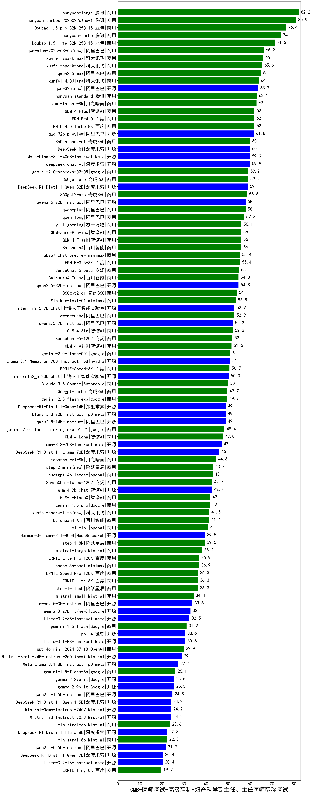

| 类别 | 大模型                         | CMB-医师考试-高级职称-妇产科学副主任、主任医师职称考试 | 排名 |
|-----|------------------------------|---------|----|
|商用|hunyuan-large|82.2|1|
|商用|hunyuan-turbos-20250226(new)|80.9|2|
|商用|Doubao-1.5-pro-32k-250115|76.4|3|
|商用|hunyuan-turbo|74.0|4|
|商用|Doubao-1.5-lite-32k-250115|71.3|5|
|商用|qwq-plus-2025-03-05(new)|66.2|6|
|商用|xunfei-spark-max|66.0|7|
|商用|xunfei-spark-pro|65.6|8|
|商用|qwen2.5-max|65.0|9|
|商用|xunfei-4.0Ultra|64.0|10|
|开源|qwq-32b(new)|63.7|11|
|商用|hunyuan-standard|63.1|12|
|商用|kimi-latest-8k|63.0|13|
|商用|ERNIE-4.0-Turbo-8K|62.0|14|
|商用|ERNIE-4.0|62.0|15|
|商用|GLM-4-Plus|62.0|16|
|开源|qwq-32b-preview|61.8|17|
|商用|360zhinao2-o1|60.0|18|
|开源|DeepSeek-R1|60.0|19|
|开源|deepseek-chat-v3|59.9|20|
|开源|Meta-Llama-3.1-405B-Instruct|59.9|21|
|商用|360gpt-pro|59.2|22|
|商用|gemini-2.0-pro-exp-02-05|59.2|23|
|开源|DeepSeek-R1-Distill-Qwen-32B|59.0|24|
|商用|360gpt2-pro|58.6|25|
|开源|qwen2.5-72b-instruct|58.0|26|
|商用|qwen-plus|58.0|27|
|商用|qwen-long|57.3|28|
|商用|yi-lightning|56.1|29|
|商用|GLM-Zero-Preview|56.0|30|
|商用|GLM-4-Flash|56.0|31|
|商用|Baichuan4|56.0|32|
|商用|abab7-chat-preview|55.4|33|
|商用|ERNIE-3.5-8K|55.4|34|
|商用|SenseChat-5-beta|55.0|35|
|商用|Baichuan4-Turbo|54.8|36|
|开源|qwen2.5-32b-instruct|54.8|37|
|商用|360gpt2-o1|54.0|38|
|商用|MiniMax-Text-01|53.5|39|
|开源|internlm2_5-7b-chat|52.9|40|
|商用|qwen-turbo|52.9|41|
|开源|qwen2.5-7b-instruct|52.2|42|
|商用|GLM-4-Air|52.2|43|
|商用|SenseChat-5-1202|52.0|44|
|商用|GLM-4-AirX|51.6|45|
|开源|Llama-3.1-Nemotron-70B-Instruct-fp8|51.0|46|
|商用|gemini-2.0-flash-001|51.0|47|
|商用|ERNIE-Speed-8K|50.7|48|
|开源|internlm2_5-20b-chat|50.3|49|
|商用|Claude-3.5-Sonnet|50.0|50|
|商用|gemini-2.0-flash-exp|49.7|51|
|商用|360gpt-turbo|49.7|52|
|开源|Llama-3.3-70B-Instruct-fp8|49.0|53|
|开源|qwen2.5-14b-instruct|49.0|54|
|开源|DeepSeek-R1-Distill-Qwen-14B|49.0|55|
|商用|gemini-2.0-flash-thinking-exp-01-21|48.4|56|
|商用|GLM-4-Long|47.8|57|
|开源|Llama-3.3-70B-Instruct|47.1|58|
|开源|DeepSeek-R1-Distill-Llama-70B|46.0|59|
|商用|moonshot-v1-8k|44.6|60|
|商用|step-2-mini(new)|43.3|61|
|商用|chatgpt-4o-latest|43.0|62|
|商用|SenseChat-Turbo-1202|42.7|63|
|开源|glm-4-9b-chat|42.7|64|
|商用|GLM-4-FlashX|42.0|65|
|商用|gemini-1.5-pro|42.0|66|
|商用|xunfei-spark-lite(new)|41.5|67|
|商用|Baichuan4-Air|41.4|68|
|商用|o1-mini|41.0|69|
|开源|Hermes-3-Llama-3.1-405B|39.5|70|
|商用|step-1-8k|39.5|71|
|商用|mistral-large|38.2|72|
|商用|abab6.5s-chat|36.9|73|
|商用|ERNIE-Lite-Pro-128K|36.9|74|
|商用|step-1-flash|36.3|75|
|商用|ERNIE-Lite-8K|36.3|76|
|商用|ERNIE-Speed-Pro-128K|36.3|77|
|商用|mistral-small|34.4|78|
|开源|qwen2.5-3b-instruct|33.8|79|
|开源|gemma-3-27b-it(new)|33.0|80|
|开源|Llama-3.2-3B-Instruct|32.5|81|
|商用|gemini-1.5-flash|31.2|82|
|开源|phi-4|30.6|83|
|开源|Llama-3.1-8B-Instruct|30.6|84|
|商用|gpt-4o-mini-2024-07-18|29.9|85|
|开源|Mistral-Small-24B-Instruct-2501(new)|29.0|86|
|开源|Meta-Llama-3.1-8B-Instruct-fp8|27.4|87|
|商用|gemini-1.5-flash-8b|26.1|88|
|开源|gemma-2-9b-it|25.5|89|
|开源|gemma-2-27b-it|25.5|90|
|开源|qwen2.5-1.5b-instruct|24.8|91|
|开源|DeepSeek-R1-Distill-Qwen-1.5B|24.2|92|
|开源|Mistral-7B-Instruct-v0.3|24.2|93|
|开源|Mistral-Nemo-Instruct-2407|24.2|94|
|商用|ministral-3b|23.6|95|
|商用|ministral-8b|22.3|96|
|开源|DeepSeek-R1-Distill-Llama-8B|22.3|97|
|开源|qwen2.5-0.5b-instruct|21.7|98|
|开源|Llama-3.2-1B-Instruct|20.4|99|
|开源|DeepSeek-R1-Distill-Qwen-7B|20.4|100|
|商用|ERNIE-Tiny-8K|19.7|101|
|开源|Yi-1.5-9B-Chat|/|102|
|开源|Yi-1.5-34B-Chat|/|103|
|开源|qwen2.5-math-72b-instruct|/|104|
|商用|o3-mini|/|105|

