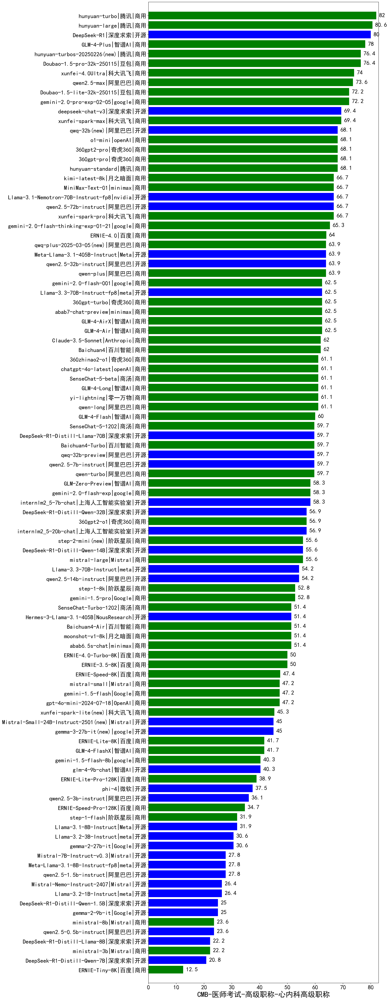

| 类别 | 大模型                         | CMB-医师考试-高级职称-心内科高级职称 | 排名 |
|-----|------------------------------|---------|----|
|商用|hunyuan-turbo|82.0|1|
|开源|hunyuan-large|80.6|2|
|开源|DeepSeek-R1|80.0|3|
|商用|GLM-4-Plus|78.0|4|
|商用|Doubao-1.5-pro-32k-250115|76.4|5|
|商用|hunyuan-turbos-20250226(new)|76.4|6|
|商用|xunfei-4.0Ultra|74.0|7|
|商用|qwen2.5-max|73.6|8|
|商用|gemini-2.0-pro-exp-02-05|72.2|9|
|商用|Doubao-1.5-lite-32k-250115|72.2|10|
|开源|deepseek-chat-v3|69.4|11|
|商用|xunfei-spark-max|69.4|12|
|商用|360gpt-pro|68.1|13|
|商用|360gpt2-pro|68.1|14|
|商用|hunyuan-standard|68.1|15|
|商用|o1-mini|68.1|16|
|开源|qwq-32b(new)|68.1|17|
|商用|kimi-latest-8k|66.7|18|
|开源|Llama-3.1-Nemotron-70B-Instruct-fp8|66.7|19|
|商用|xunfei-spark-pro|66.7|20|
|商用|MiniMax-Text-01|66.7|21|
|开源|qwen2.5-72b-instruct|66.7|22|
|商用|gemini-2.0-flash-thinking-exp-01-21|65.3|23|
|商用|ERNIE-4.0|64.0|24|
|商用|qwen-plus|63.9|25|
|开源|Meta-Llama-3.1-405B-Instruct|63.9|26|
|商用|qwq-plus-2025-03-05(new)|63.9|27|
|开源|qwen2.5-32b-instruct|63.9|28|
|商用|abab7-chat-preview|62.5|29|
|商用|GLM-4-AirX|62.5|30|
|商用|GLM-4-Air|62.5|31|
|商用|360gpt-turbo|62.5|32|
|开源|Llama-3.3-70B-Instruct-fp8|62.5|33|
|商用|gemini-2.0-flash-001|62.5|34|
|商用|Claude-3.5-Sonnet|62.0|35|
|商用|Baichuan4|62.0|36|
|商用|chatgpt-4o-latest|61.1|37|
|商用|yi-lightning|61.1|38|
|商用|GLM-4-Long|61.1|39|
|商用|SenseChat-5-beta|61.1|40|
|商用|qwen-long|61.1|41|
|商用|360zhinao2-o1|61.1|42|
|商用|GLM-4-Flash|60.0|43|
|开源|qwq-32b-preview|59.7|44|
|商用|qwen-turbo|59.7|45|
|开源|qwen2.5-7b-instruct|59.7|46|
|开源|DeepSeek-R1-Distill-Llama-70B|59.7|47|
|商用|SenseChat-5-1202|59.7|48|
|商用|Baichuan4-Turbo|59.7|49|
|商用|GLM-Zero-Preview|58.3|50|
|商用|gemini-2.0-flash-exp|58.3|51|
|开源|internlm2_5-7b-chat|58.3|52|
|开源|internlm2_5-20b-chat|56.9|53|
|商用|360gpt2-o1|56.9|54|
|开源|DeepSeek-R1-Distill-Qwen-32B|56.9|55|
|开源|DeepSeek-R1-Distill-Qwen-14B|55.6|56|
|商用|mistral-large|55.6|57|
|商用|step-2-mini(new)|55.6|58|
|开源|qwen2.5-14b-instruct|54.2|59|
|开源|Llama-3.3-70B-Instruct|54.2|60|
|商用|step-1-8k|52.8|61|
|商用|gemini-1.5-pro|52.8|62|
|开源|Hermes-3-Llama-3.1-405B|51.4|63|
|商用|SenseChat-Turbo-1202|51.4|64|
|商用|Baichuan4-Air|51.4|65|
|商用|abab6.5s-chat|51.4|66|
|商用|moonshot-v1-8k|51.4|67|
|商用|ERNIE-3.5-8K|50.0|68|
|商用|ERNIE-4.0-Turbo-8K|50.0|69|
|商用|ERNIE-Speed-8K|47.4|70|
|商用|gemini-1.5-flash|47.2|71|
|商用|gpt-4o-mini-2024-07-18|47.2|72|
|商用|mistral-small|47.2|73|
|商用|xunfei-spark-lite(new)|45.3|74|
|开源|gemma-3-27b-it(new)|45.0|75|
|开源|Mistral-Small-24B-Instruct-2501(new)|45.0|76|
|商用|GLM-4-FlashX|41.7|77|
|商用|ERNIE-Lite-8K|41.7|78|
|商用|gemini-1.5-flash-8b|40.3|79|
|开源|glm-4-9b-chat|40.3|80|
|商用|ERNIE-Lite-Pro-128K|38.9|81|
|开源|phi-4|37.5|82|
|开源|qwen2.5-3b-instruct|36.1|83|
|商用|ERNIE-Speed-Pro-128K|34.7|84|
|商用|step-1-flash|31.9|85|
|开源|Llama-3.1-8B-Instruct|31.9|86|
|开源|gemma-2-27b-it|30.6|87|
|开源|Llama-3.2-3B-Instruct|30.6|88|
|开源|qwen2.5-1.5b-instruct|27.8|89|
|开源|Meta-Llama-3.1-8B-Instruct-fp8|27.8|90|
|开源|Mistral-7B-Instruct-v0.3|27.8|91|
|开源|Llama-3.2-1B-Instruct|26.4|92|
|开源|Mistral-Nemo-Instruct-2407|26.4|93|
|开源|DeepSeek-R1-Distill-Qwen-1.5B|25.0|94|
|开源|gemma-2-9b-it|25.0|95|
|开源|qwen2.5-0.5b-instruct|23.6|96|
|商用|ministral-8b|23.6|97|
|商用|ministral-3b|22.2|98|
|开源|DeepSeek-R1-Distill-Llama-8B|22.2|99|
|开源|DeepSeek-R1-Distill-Qwen-7B|20.8|100|
|商用|ERNIE-Tiny-8K|12.5|101|
|开源|Yi-1.5-9B-Chat|/|102|
|开源|Yi-1.5-34B-Chat|/|103|
|开源|qwen2.5-math-72b-instruct|/|104|
|商用|o3-mini|/|105|

