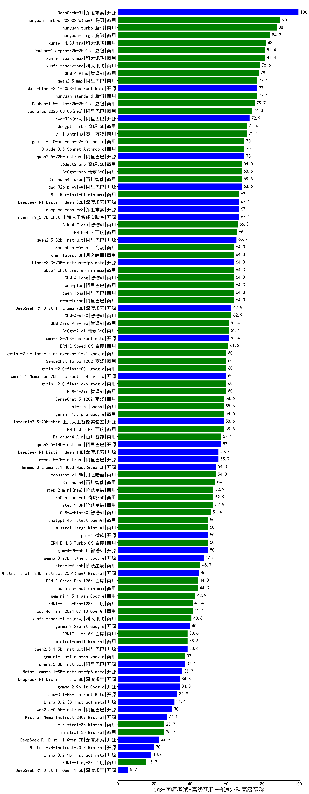

| 类别 | 大模型                         | CMB-医师考试-高级职称-普通外科高级职称 | 排名 |
|-----|------------------------------|---------|----|
|开源|DeepSeek-R1|100.0|1|
|商用|ERNIE-4.5-8K-Preview(new)|93.0|2|
|商用|hunyuan-turbos-20250226(new)|90.0|3|
|商用|hunyuan-turbo|88.0|4|
|开源|hunyuan-large|84.3|5|
|商用|hunyuan-turbos-20250313(new)|82.0|6|
|商用|xunfei-4.0Ultra|82.0|7|
|商用|Doubao-1.5-pro-32k-250115|81.4|8|
|商用|xunfei-spark-max|81.4|9|
|商用|xunfei-spark-pro|78.6|10|
|商用|GLM-4-Plus|78.0|11|
|商用|hunyuan-standard|77.1|12|
|商用|qwen2.5-max|77.1|13|
|开源|Meta-Llama-3.1-405B-Instruct|77.1|14|
|商用|Doubao-1.5-lite-32k-250115|75.7|15|
|商用|qwq-plus-2025-03-05(new)|74.3|16|
|开源|qwq-32b(new)|72.9|17|
|商用|yi-lightning|71.4|18|
|商用|360gpt-turbo|71.4|19|
|商用|gemini-2.0-pro-exp-02-05|70.0|20|
|商用|Claude-3.5-Sonnet|70.0|21|
|开源|qwen2.5-72b-instruct|70.0|22|
|商用|360gpt2-pro|68.6|23|
|商用|360gpt-pro|68.6|24|
|商用|Baichuan4-Turbo|68.6|25|
|开源|qwq-32b-preview|68.6|26|
|开源|deepseek-chat-v3|67.1|27|
|开源|internlm2_5-7b-chat|67.1|28|
|开源|DeepSeek-R1-Distill-Qwen-32B|67.1|29|
|开源|MiniMax-Text-01|67.1|30|
|商用|GLM-4-Flash|66.3|31|
|商用|ERNIE-4.0|66.0|32|
|开源|qwen2.5-32b-instruct|65.7|33|
|商用|qwen-long|64.3|34|
|商用|abab7-chat-preview|64.3|35|
|商用|qwen-plus|64.3|36|
|商用|qwen-turbo|64.3|37|
|商用|GLM-4-Long|64.3|38|
|商用|SenseChat-5-beta|64.3|39|
|商用|kimi-latest-8k|64.3|40|
|开源|Llama-3.3-70B-Instruct-fp8|64.3|41|
|开源|DeepSeek-R1-Distill-Llama-70B|62.9|42|
|商用|GLM-4-AirX|62.9|43|
|商用|360gpt2-o1|61.4|44|
|商用|GLM-Zero-Preview|61.4|45|
|开源|Llama-3.3-70B-Instruct|61.4|46|
|商用|ERNIE-Speed-8K|61.2|47|
|商用|GLM-4-Air|60.0|48|
|商用|gemini-2.0-flash-001|60.0|49|
|商用|SenseChat-Turbo-1202|60.0|50|
|商用|gemini-2.0-flash-exp|60.0|51|
|商用|gemini-2.0-flash-thinking-exp-01-21|60.0|52|
|开源|Llama-3.1-Nemotron-70B-Instruct-fp8|60.0|53|
|开源|internlm2_5-20b-chat|58.6|54|
|商用|ERNIE-3.5-8K|58.6|55|
|商用|gemini-1.5-pro|58.6|56|
|商用|o1-mini|58.6|57|
|商用|SenseChat-5-1202|58.6|58|
|商用|Baichuan4-Air|57.1|59|
|开源|qwen2.5-14b-instruct|57.1|60|
|开源|qwen2.5-7b-instruct|55.7|61|
|开源|DeepSeek-R1-Distill-Qwen-14B|55.7|62|
|开源|Hermes-3-Llama-3.1-405B|54.3|63|
|商用|moonshot-v1-8k|54.3|64|
|商用|Baichuan4|54.0|65|
|商用|360zhinao2-o1|52.9|66|
|商用|step-2-mini(new)|52.9|67|
|商用|step-1-8k|52.9|68|
|商用|GLM-4-FlashX|51.4|69|
|商用|chatgpt-4o-latest|50.0|70|
|开源|glm-4-9b-chat|50.0|71|
|商用|ERNIE-4.0-Turbo-8K|50.0|72|
|商用|mistral-large|50.0|73|
|开源|phi-4|50.0|74|
|开源|gemma-3-27b-it(new)|47.5|75|
|商用|step-1-flash|45.7|76|
|开源|Mistral-Small-24B-Instruct-2501(new)|45.0|77|
|商用|abab6.5s-chat|44.3|78|
|商用|ERNIE-Speed-Pro-128K|44.3|79|
|商用|gemini-1.5-flash|42.9|80|
|开源|gemma-3-12b-it(new)|42.0|81|
|商用|ERNIE-Lite-Pro-128K|41.4|82|
|商用|gpt-4o-mini-2024-07-18|41.4|83|
|商用|xunfei-spark-lite(new)|40.8|84|
|开源|gemma-2-27b-it|40.0|85|
|开源|qwen2.5-1.5b-instruct|38.6|86|
|商用|ERNIE-Lite-8K|38.6|87|
|商用|mistral-small|38.6|88|
|开源|qwen2.5-3b-instruct|37.1|89|
|商用|gemini-1.5-flash-8b|37.1|90|
|开源|Meta-Llama-3.1-8B-Instruct-fp8|35.7|91|
|开源|gemma-2-9b-it|34.3|92|
|开源|DeepSeek-R1-Distill-Llama-8B|34.3|93|
|开源|Llama-3.1-8B-Instruct|32.9|94|
|开源|Llama-3.2-3B-Instruct|31.4|95|
|开源|qwen2.5-0.5b-instruct|30.0|96|
|开源|gemma-3-4b-it(new)|29.5|97|
|开源|Mistral-Nemo-Instruct-2407|27.1|98|
|商用|ministral-3b|25.7|99|
|商用|ministral-8b|25.7|100|
|开源|DeepSeek-R1-Distill-Qwen-7B|22.9|101|
|开源|gemma-3-1b-it(new)|21.0|102|
|开源|Mistral-7B-Instruct-v0.3|20.0|103|
|开源|Llama-3.2-1B-Instruct|18.6|104|
|商用|ERNIE-Tiny-8K|15.7|105|
|开源|DeepSeek-R1-Distill-Qwen-1.5B|5.7|106|
|开源|qwen2.5-math-72b-instruct|/|107|
|商用|o3-mini|/|108|

