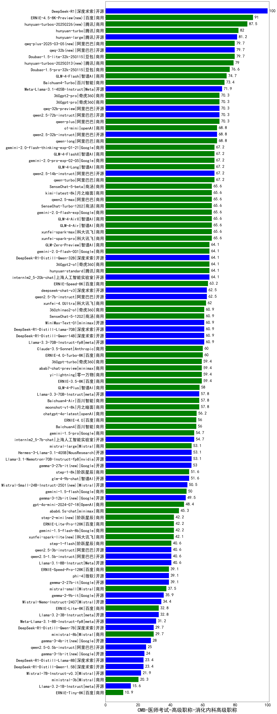

| 类别 | 大模型                         | CMB-医师考试-高级职称-消化内科高级职称 | 排名 |
|-----|------------------------------|---------|----|
|开源|DeepSeek-R1|100.0|1|
|商用|ERNIE-4.5-8K-Preview(new)|91.0|2|
|商用|hunyuan-turbos-20250226(new)|87.5|3|
|商用|hunyuan-turbo|82.0|4|
|开源|hunyuan-large|81.2|5|
|商用|Doubao-1.5-lite-32k-250115|79.7|6|
|商用|qwq-plus-2025-03-05(new)|79.7|7|
|开源|qwq-32b(new)|79.7|8|
|商用|hunyuan-turbos-20250313(new)|79.0|9|
|商用|Doubao-1.5-pro-32k-250115|76.6|10|
|商用|GLM-4-Flash|74.7|11|
|商用|Baichuan4-Turbo|73.4|12|
|开源|Meta-Llama-3.1-405B-Instruct|71.9|13|
|商用|qwen-plus|70.3|14|
|开源|qwen2.5-72b-instruct|70.3|15|
|商用|360gpt-pro|70.3|16|
|商用|360gpt2-pro|70.3|17|
|开源|qwq-32b-preview|70.3|18|
|商用|o1-mini|68.8|19|
|开源|qwen2.5-32b-instruct|68.8|20|
|商用|qwen-long|68.8|21|
|商用|gemini-2.0-pro-exp-02-05|67.2|22|
|商用|qwen-turbo|67.2|23|
|商用|GLM-4-FlashX|67.2|24|
|商用|gemini-2.0-flash-thinking-exp-01-21|67.2|25|
|开源|qwen2.5-14b-instruct|67.2|26|
|商用|GLM-4-Long|67.2|27|
|商用|xunfei-spark-max|65.6|28|
|商用|kimi-latest-8k|65.6|29|
|商用|SenseChat-Turbo-1202|65.6|30|
|商用|gemini-2.0-flash-exp|65.6|31|
|商用|xunfei-spark-pro|65.6|32|
|商用|GLM-4-AirX|65.6|33|
|商用|GLM-4-Air|65.6|34|
|商用|SenseChat-5-beta|65.6|35|
|商用|qwen2.5-max|65.6|36|
|商用|hunyuan-standard|64.1|37|
|开源|internlm2_5-20b-chat|64.1|38|
|商用|360gpt2-o1|64.1|39|
|开源|DeepSeek-R1-Distill-Qwen-32B|64.1|40|
|商用|GLM-Zero-Preview|64.1|41|
|商用|gemini-2.0-flash-001|64.1|42|
|商用|ERNIE-Speed-8K|63.2|43|
|开源|qwen2.5-7b-instruct|62.5|44|
|开源|deepseek-chat-v3|62.5|45|
|商用|xunfei-4.0Ultra|62.0|46|
|开源|Llama-3.3-70B-Instruct-fp8|60.9|47|
|开源|DeepSeek-R1-Distill-Qwen-14B|60.9|48|
|开源|DeepSeek-R1-Distill-Llama-70B|60.9|49|
|商用|SenseChat-5-1202|60.9|50|
|开源|MiniMax-Text-01|60.9|51|
|商用|360zhinao2-o1|60.9|52|
|商用|Claude-3.5-Sonnet|60.0|53|
|商用|ERNIE-4.0-Turbo-8K|60.0|54|
|商用|yi-lightning|59.4|55|
|商用|abab7-chat-preview|59.4|56|
|商用|360gpt-turbo|59.4|57|
|商用|ERNIE-3.5-8K|59.4|58|
|商用|GLM-4-Plus|58.0|59|
|商用|moonshot-v1-8k|57.8|60|
|商用|Baichuan4-Air|57.8|61|
|开源|Llama-3.3-70B-Instruct|57.8|62|
|商用|chatgpt-4o-latest|56.2|63|
|商用|Baichuan4|56.0|64|
|商用|ERNIE-4.0|56.0|65|
|商用|gemini-1.5-pro|54.7|66|
|开源|internlm2_5-7b-chat|54.7|67|
|商用|mistral-large|53.1|68|
|开源|Hermes-3-Llama-3.1-405B|53.1|69|
|开源|Llama-3.1-Nemotron-70B-Instruct-fp8|53.1|70|
|开源|gemma-3-27b-it(new)|53.0|71|
|开源|glm-4-9b-chat|51.6|72|
|商用|step-1-8k|51.6|73|
|开源|Mistral-Small-24B-Instruct-2501(new)|50.5|74|
|商用|gemini-1.5-flash|50.0|75|
|开源|gemma-3-12b-it(new)|49.5|76|
|商用|gpt-4o-mini-2024-07-18|48.4|77|
|商用|abab6.5s-chat|45.3|78|
|商用|step-2-mini(new)|42.2|79|
|商用|gemini-1.5-flash-8b|42.2|80|
|商用|ERNIE-Lite-Pro-128K|42.2|81|
|商用|xunfei-spark-lite(new)|42.1|82|
|开源|qwen2.5-1.5b-instruct|40.6|83|
|商用|step-1-flash|40.6|84|
|开源|Llama-3.1-8B-Instruct|40.6|85|
|开源|qwen2.5-3b-instruct|40.6|86|
|商用|ERNIE-Speed-Pro-128K|39.1|87|
|开源|gemma-2-27b-it|39.1|88|
|开源|phi-4|39.1|89|
|商用|mistral-small|37.5|90|
|开源|gemma-2-9b-it|35.9|91|
|开源|Mistral-Nemo-Instruct-2407|34.4|92|
|开源|Llama-3.2-3B-Instruct|32.8|93|
|商用|ERNIE-Lite-8K|32.8|94|
|开源|Meta-Llama-3.1-8B-Instruct-fp8|31.2|95|
|商用|ministral-8b|29.7|96|
|开源|DeepSeek-R1-Distill-Qwen-7B|29.7|97|
|开源|gemma-3-4b-it(new)|28.0|98|
|开源|qwen2.5-0.5b-instruct|25.0|99|
|开源|gemma-3-1b-it(new)|24.0|100|
|开源|DeepSeek-R1-Distill-Qwen-1.5B|23.4|101|
|开源|DeepSeek-R1-Distill-Llama-8B|23.4|102|
|开源|Mistral-7B-Instruct-v0.3|21.9|103|
|商用|ministral-3b|20.3|104|
|开源|Llama-3.2-1B-Instruct|15.6|105|
|商用|ERNIE-Tiny-8K|10.9|106|
|开源|qwen2.5-math-72b-instruct|/|107|
|开源|Yi-1.5-9B-Chat|/|108|
|开源|Yi-1.5-34B-Chat|/|109|
|商用|o3-mini|/|110|

