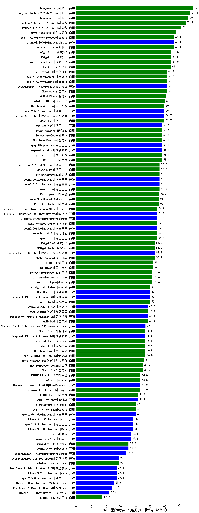

| 类别 | 大模型                         | CMB-医师考试-高级职称-骨科高级职称 | 排名 |
|-----|------------------------------|---------|----|
|商用|ERNIE-4.5-8K-Preview(new)|91.0|1|
|开源|hunyuan-large|79.0|2|
|商用|hunyuan-turbos-20250226(new)|77.4|3|
|商用|hunyuan-turbo|76.0|4|
|商用|hunyuan-turbos-20250313(new)|74.5|5|
|商用|Doubao-1.5-lite-32k-250115|74.2|6|
|商用|Doubao-1.5-pro-32k-250115|71.0|7|
|商用|xunfei-spark-pro|67.7|8|
|开源|Llama-3.3-70B-Instruct|66.1|9|
|商用|gemini-2.0-pro-exp-02-05|66.1|10|
|商用|hunyuan-standard|66.1|11|
|商用|360gpt-pro|64.5|12|
|商用|xunfei-spark-max|64.5|13|
|商用|360gpt2-pro|64.5|14|
|商用|GLM-4-Plus|64.0|15|
|开源|Meta-Llama-3.1-405B-Instruct|61.3|16|
|商用|kimi-latest-8k|61.3|17|
|商用|GLM-4-Long|61.3|18|
|商用|gemini-2.0-flash-exp|61.3|19|
|商用|gemini-2.0-flash-001|61.3|20|
|商用|GLM-4-Flash|60.9|21|
|商用|xunfei-4.0Ultra|60.0|22|
|开源|internlm2_5-7b-chat|59.7|23|
|开源|qwen2.5-7b-instruct|59.7|24|
|商用|qwen-long|59.7|25|
|商用|Baichuan4-Turbo|59.7|26|
|开源|deepseek-chat-v3|58.1|27|
|开源|qwq-32b-preview|58.1|28|
|商用|yi-lightning|58.1|29|
|商用|GLM-Zero-Preview|58.1|30|
|商用|SenseChat-5-beta|58.1|31|
|开源|qwq-32b(new)|58.1|32|
|商用|360zhinao2-o1|58.1|33|
|商用|ERNIE-3.5-8K|58.1|34|
|开源|qwen2.5-72b-instruct|56.5|35|
|开源|qwen2.5-32b-instruct|56.5|36|
|商用|qwen2.5-max|56.5|37|
|商用|qwen-turbo|56.5|38|
|商用|qwq-plus-2025-03-05(new)|56.5|39|
|商用|SenseChat-5-1202|56.5|40|
|商用|ERNIE-Speed-8K|56.3|41|
|商用|Claude-3.5-Sonnet|56.0|42|
|商用|ERNIE-4.0-Turbo-8K|56.0|43|
|商用|moonshot-v1-8k|54.8|44|
|商用|abab7-chat-preview|54.8|45|
|开源|qwen2.5-14b-instruct|54.8|46|
|商用|gemini-2.0-flash-thinking-exp-01-21|54.8|47|
|开源|Llama-3.3-70B-Instruct-fp8|54.8|48|
|开源|Llama-3.1-Nemotron-70B-Instruct-fp8|54.8|49|
|商用|qwen-plus|54.8|50|
|商用|360gpt2-o1|53.2|51|
|商用|abab6.5s-chat|53.2|52|
|开源|internlm2_5-20b-chat|53.2|53|
|商用|360gpt-turbo|53.2|54|
|商用|ERNIE-4.0|52.0|55|
|商用|Baichuan4|52.0|56|
|开源|MiniMax-Text-01|51.6|57|
|商用|SenseChat-Turbo-1202|51.6|58|
|商用|gemini-1.5-pro|51.6|59|
|商用|chatgpt-4o-latest|50.0|60|
|开源|DeepSeek-R1-Distill-Qwen-14B|50.0|61|
|开源|DeepSeek-R1|50.0|62|
|商用|step-1-flash|50.0|63|
|开源|gemma-3-27b-it(new)|48.5|64|
|商用|step-2-mini(new)|48.4|65|
|开源|DeepSeek-R1-Distill-Llama-70B|48.4|66|
|商用|GLM-4-Air|48.4|67|
|开源|Mistral-Small-24B-Instruct-2501(new)|47.0|68|
|商用|step-1-8k|46.8|69|
|商用|Baichuan4-Air|46.8|70|
|商用|gpt-4o-mini-2024-07-18|46.8|71|
|开源|DeepSeek-R1-Distill-Qwen-32B|46.8|72|
|商用|GLM-4-FlashX|46.8|73|
|商用|mistral-large|46.8|74|
|商用|xunfei-spark-lite(new)|46.0|75|
|商用|ERNIE-Speed-Pro-128K|45.2|76|
|商用|GLM-4-AirX|45.2|77|
|商用|gemini-1.5-flash-8b|43.5|78|
|开源|Hermes-3-Llama-3.1-405B|43.5|79|
|商用|o1-mini|43.5|80|
|商用|ERNIE-Lite-Pro-128K|43.5|81|
|开源|glm-4-9b-chat|41.9|82|
|商用|ERNIE-Lite-8K|41.9|83|
|开源|gemma-3-12b-it(new)|40.5|84|
|商用|mistral-small|40.3|85|
|开源|qwen2.5-1.5b-instruct|40.3|86|
|商用|gemini-1.5-flash|40.3|87|
|开源|Llama-3.2-3B-Instruct|38.7|88|
|开源|qwen2.5-3b-instruct|38.7|89|
|开源|Llama-3.1-8B-Instruct|38.7|90|
|开源|phi-4|37.1|91|
|开源|gemma-2-27b-it|37.1|92|
|开源|gemma-2-9b-it|35.5|93|
|商用|ministral-3b|35.5|94|
|开源|Meta-Llama-3.1-8B-Instruct-fp8|33.9|95|
|商用|ministral-8b|29.0|96|
|开源|DeepSeek-R1-Distill-Llama-8B|29.0|97|
|开源|gemma-3-4b-it(new)|28.5|98|
|开源|Llama-3.2-1B-Instruct|27.4|99|
|开源|DeepSeek-R1-Distill-Qwen-1.5B|27.4|100|
|开源|qwen2.5-0.5b-instruct|27.4|101|
|开源|Mistral-Nemo-Instruct-2407|25.8|102|
|开源|DeepSeek-R1-Distill-Qwen-7B|24.2|103|
|开源|Mistral-7B-Instruct-v0.3|22.6|104|
|开源|gemma-3-1b-it(new)|21.0|105|
|商用|ERNIE-Tiny-8K|17.7|106|
|开源|qwen2.5-math-72b-instruct|/|107|
|开源|Yi-1.5-9B-Chat|/|108|
|开源|Yi-1.5-34B-Chat|/|109|
|商用|o3-mini|/|110|

