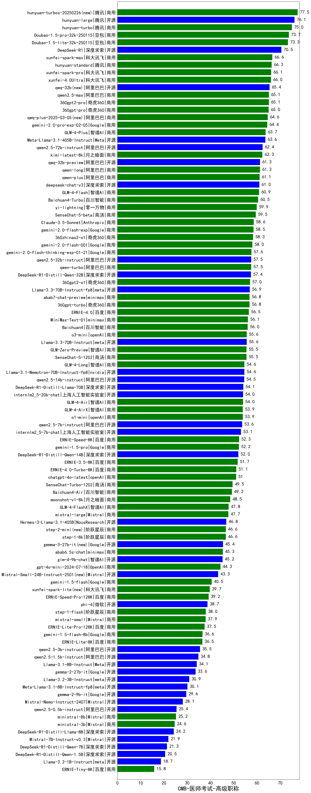

| 类别 | 大模型                         | CMB-医师考试-高级职称 | 排名 |
|-----|------------------------------|---------|----|
|商用|ERNIE-4.5-8K-Preview(new)|87.2|1|
|商用|hunyuan-turbos-20250226(new)|77.5|2|
|开源|hunyuan-large|76.1|3|
|商用|hunyuan-turbo|75.0|4|
|商用|hunyuan-turbos-20250313(new)|74.1|5|
|商用|Doubao-1.5-pro-32k-250115|73.7|6|
|商用|Doubao-1.5-lite-32k-250115|73.3|7|
|开源|DeepSeek-R1|70.5|8|
|商用|xunfei-spark-max|66.6|9|
|商用|hunyuan-standard|66.3|10|
|商用|xunfei-spark-pro|66.1|11|
|商用|xunfei-4.0Ultra|66.0|12|
|开源|qwq-32b(new)|65.4|13|
|商用|qwen2.5-max|65.1|14|
|商用|360gpt2-pro|65.1|15|
|商用|360gpt-pro|65.0|16|
|商用|qwq-plus-2025-03-05(new)|64.6|17|
|商用|gemini-2.0-pro-exp-02-05|64.4|18|
|商用|GLM-4-Plus|63.7|19|
|开源|Meta-Llama-3.1-405B-Instruct|63.6|20|
|开源|qwen2.5-72b-instruct|62.4|21|
|商用|kimi-latest-8k|62.3|22|
|开源|qwq-32b-preview|61.3|23|
|商用|qwen-long|61.3|24|
|商用|qwen-plus|61.1|25|
|开源|deepseek-chat-v3|61.0|26|
|商用|GLM-4-Flash|60.9|27|
|商用|Baichuan4-Turbo|60.5|28|
|商用|yi-lightning|59.9|29|
|商用|SenseChat-5-beta|59.5|30|
|商用|Claude-3.5-Sonnet|58.6|31|
|商用|gemini-2.0-flash-exp|58.5|32|
|商用|360zhinao2-o1|58.3|33|
|商用|gemini-2.0-flash-001|58.0|34|
|商用|gemini-2.0-flash-thinking-exp-01-21|57.6|35|
|开源|qwen2.5-32b-instruct|57.5|36|
|商用|qwen-turbo|57.5|37|
|开源|DeepSeek-R1-Distill-Qwen-32B|57.4|38|
|商用|360gpt2-o1|57.0|39|
|开源|Llama-3.3-70B-Instruct-fp8|56.9|40|
|商用|abab7-chat-preview|56.8|41|
|商用|360gpt-turbo|56.8|42|
|商用|ERNIE-4.0|56.5|43|
|开源|MiniMax-Text-01|56.1|44|
|商用|Baichuan4|56.0|45|
|商用|o3-mini|55.6|46|
|开源|Llama-3.3-70B-Instruct|55.6|47|
|商用|GLM-Zero-Preview|55.5|48|
|商用|SenseChat-5-1202|55.5|49|
|商用|GLM-4-Long|54.6|50|
|开源|Llama-3.1-Nemotron-70B-Instruct-fp8|54.6|51|
|开源|qwen2.5-14b-instruct|54.5|52|
|开源|DeepSeek-R1-Distill-Llama-70B|54.1|53|
|开源|internlm2_5-20b-chat|54.0|54|
|商用|GLM-4-Air|54.0|55|
|商用|GLM-4-AirX|53.9|56|
|商用|o1-mini|53.9|57|
|开源|qwen2.5-7b-instruct|53.6|58|
|开源|internlm2_5-7b-chat|53.1|59|
|商用|ERNIE-Speed-8K|52.3|60|
|商用|gemini-1.5-pro|52.2|61|
|开源|DeepSeek-R1-Distill-Qwen-14B|52.0|62|
|商用|ERNIE-3.5-8K|51.7|63|
|商用|ERNIE-4.0-Turbo-8K|51.1|64|
|商用|chatgpt-4o-latest|51.0|65|
|商用|SenseChat-Turbo-1202|49.5|66|
|商用|Baichuan4-Air|49.2|67|
|商用|moonshot-v1-8k|48.5|68|
|商用|GLM-4-FlashX|47.8|69|
|商用|mistral-large|47.7|70|
|开源|Hermes-3-Llama-3.1-405B|46.8|71|
|商用|step-2-mini(new)|46.6|72|
|商用|step-1-8k|46.6|73|
|开源|gemma-3-27b-it(new)|45.4|74|
|商用|abab6.5s-chat|45.3|75|
|开源|glm-4-9b-chat|45.2|76|
|商用|gpt-4o-mini-2024-07-18|44.3|77|
|开源|Mistral-Small-24B-Instruct-2501(new)|43.3|78|
|商用|gemini-1.5-flash|40.5|79|
|商用|xunfei-spark-lite(new)|39.7|80|
|商用|ERNIE-Speed-Pro-128K|39.2|81|
|开源|gemma-3-12b-it(new)|38.8|82|
|开源|phi-4|38.7|83|
|商用|step-1-flash|38.0|84|
|商用|mistral-small|37.9|85|
|商用|ERNIE-Lite-Pro-128K|37.5|86|
|商用|gemini-1.5-flash-8b|36.6|87|
|商用|ERNIE-Lite-8K|36.5|88|
|开源|qwen2.5-3b-instruct|35.5|89|
|开源|qwen2.5-1.5b-instruct|34.8|90|
|开源|Llama-3.1-8B-Instruct|34.1|91|
|开源|gemma-2-27b-it|33.6|92|
|开源|Llama-3.2-3B-Instruct|30.9|93|
|开源|Meta-Llama-3.1-8B-Instruct-fp8|30.1|94|
|开源|gemma-2-9b-it|29.6|95|
|开源|Mistral-Nemo-Instruct-2407|28.1|96|
|开源|gemma-3-4b-it(new)|25.8|97|
|开源|qwen2.5-0.5b-instruct|25.4|98|
|商用|ministral-8b|25.2|99|
|商用|ministral-3b|24.6|100|
|开源|DeepSeek-R1-Distill-Llama-8B|24.2|101|
|开源|Mistral-7B-Instruct-v0.3|21.9|102|
|开源|DeepSeek-R1-Distill-Qwen-7B|21.3|103|
|开源|DeepSeek-R1-Distill-Qwen-1.5B|20.5|104|
|开源|gemma-3-1b-it(new)|18.9|105|
|开源|Llama-3.2-1B-Instruct|18.7|106|
|商用|ERNIE-Tiny-8K|15.8|107|
|开源|qwen2.5-math-72b-instruct|/|108|

