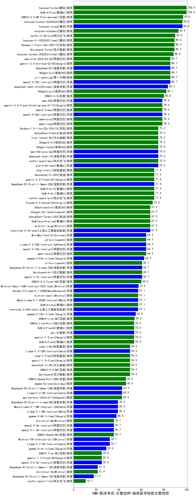

| 类别 | 大模型                         | CMB-医技考试-主管技师-临床医学检验主管技师 | 排名 |
|-----|------------------------------|---------|----|
|商用|GLM-4-Plus|100.0|1|
|商用|hunyuan-turbo|100.0|2|
|商用|ERNIE-4.5-8K-Preview|97.0|3|
|商用|hunyuan-turbos-20250226|96.4|4|
|开源|hunyuan-large|96.4|5|
|商用|ERNIE-X1-32K-Preview(new)|93.3|6|
|商用|hunyuan-standard|92.9|7|
|商用|gemini-2.5-pro-preview-03-25(new)|90.0|8|
|商用|xunfei-4.0Ultra|90.0|9|
|商用|hunyuan-t1-20250321(new)|89.4|10|
|商用|Baichuan4-Turbo|89.3|11|
|商用|Doubao-1.5-pro-32k-250115|89.3|12|
|商用|hunyuan-turbos-20250313|88.5|13|
|开源|Llama-4-Maverick-17B-128E-Instruct-FP8(new)|87.0|14|
|开源|qwen2.5-72b-instruct|85.7|15|
|开源|DeepSeek-R1|85.7|16|
|商用|qwq-plus-2025-03-05|85.7|17|
|商用|yi-lightning|85.7|18|
|开源|deepseek-chat-v3-0324(new)|83.5|19|
|商用|360gpt2-pro|82.1|20|
|开源|qwq-32b|78.6|21|
|商用|gemini-2.0-flash-thinking-exp-01-21|78.6|22|
|商用|qwen2.5-max|78.6|23|
|商用|qwen-plus|78.6|24|
|开源|qwen2.5-32b-instruct|78.6|25|
|商用|qwen-long|78.6|26|
|开源|Llama-4-Scout-17B-16E-Instruct(new)|77.5|27|
|商用|xunfei-spark-max|75.0|28|
|商用|SenseChat-5-beta|75.0|29|
|商用|Doubao-1.5-lite-32k-250115|75.0|30|
|商用|360gpt2-o1|75.0|31|
|商用|360gpt-turbo|75.0|32|
|开源|glm-4-9b-chat|75.0|33|
|商用|kimi-latest-8k|75.0|34|
|商用|GLM-4-AirX|71.4|35|
|商用|SenseChat-5-1202|71.4|36|
|商用|step-2-mini|71.4|37|
|开源|DeepSeek-R1-Distill-Qwen-32B|71.4|38|
|商用|gemini-2.0-flash-001|71.4|39|
|商用|GLM-4-Air|71.4|40|
|商用|xunfei-spark-pro|71.4|41|
|商用|Claude-3.5-Sonnet|70.0|42|
|开源|internlm2_5-7b-chat|67.9|43|
|商用|chatgpt-4o-latest|67.9|44|
|商用|mistral-large|67.9|45|
|商用|GLM-Zero-Preview|67.9|46|
|商用|SenseChat-Turbo-1202|67.9|47|
|商用|360zhinao2-o1|67.9|48|
|开源|MiniMax-Text-01|64.3|49|
|开源|Llama-3.3-70B-Instruct-fp8|64.3|50|
|商用|o3-mini|64.3|51|
|商用|qwen-turbo|64.3|52|
|开源|qwen2.5-14b-instruct|64.3|53|
|开源|Mistral-Small-3.1-24B-Instruct-2503(new)|63.5|54|
|开源|gemma-3-27b-it|62.5|55|
|开源|DeepSeek-R1-Distill-Llama-70B|60.7|56|
|开源|qwen2.5-7b-instruct|60.7|57|
|商用|Baichuan4-Air|60.7|58|
|商用|ERNIE-4.0-Turbo-8K|60.0|59|
|开源|Mistral-Small-24B-Instruct-2501|57.5|60|
|开源|Hermes-3-Llama-3.1-405B|57.1|61|
|开源|Meta-Llama-3.1-405B-Instruct|57.1|62|
|商用|GLM-4-Long|57.1|63|
|开源|internlm2_5-20b-chat|57.1|64|
|商用|mistral-small|57.1|65|
|开源|gemma-3-12b-it|55.0|66|
|商用|ERNIE-Lite-8K|54.0|67|
|开源|phi-4|53.6|68|
|商用|gemini-1.5-pro|53.6|69|
|商用|GLM-4-Flash|53.6|70|
|商用|ERNIE-Lite-Pro-128K|53.6|71|
|商用|GLM-4-FlashX|53.6|72|
|商用|ERNIE-3.5-8K|50.0|73|
|商用|moonshot-v1-8k|50.0|74|
|商用|gemini-1.5-flash|50.0|75|
|商用|step-1-8k|50.0|76|
|开源|Llama-3.3-70B-Instruct|50.0|77|
|商用|ERNIE-Speed-Pro-128K|46.4|78|
|商用|abab6.5s-chat|46.4|79|
|商用|gpt-4o-mini-2024-07-18|42.9|80|
|开源|DeepSeek-R1-Distill-Qwen-14B|42.9|81|
|开源|Llama-3.2-3B-Instruct|42.9|82|
|开源|Meta-Llama-3.1-8B-Instruct-fp8|39.3|83|
|开源|DeepSeek-R1-Distill-Llama-8B|39.3|84|
|开源|Llama-3.1-8B-Instruct|39.3|85|
|开源|gemma-3-4b-it|38.0|86|
|商用|ERNIE-Speed-8K|35.7|87|
|开源|qwen2.5-1.5b-instruct|35.7|88|
|开源|qwen2.5-3b-instruct|35.7|89|
|商用|ministral-8b|35.7|90|
|开源|Llama-3.2-1B-Instruct|32.1|91|
|开源|gemma-3-1b-it|29.0|92|
|开源|qwen2.5-0.5b-instruct|25.0|93|
|商用|ERNIE-Tiny-8K|25.0|94|
|商用|gemini-1.5-flash-8b|25.0|95|
|商用|ministral-3b|21.4|96|
|开源|DeepSeek-R1-Distill-Qwen-1.5B|21.4|97|
|开源|DeepSeek-R1-Distill-Qwen-7B|17.9|98|
|商用|xunfei-spark-lite|10.7|99|

