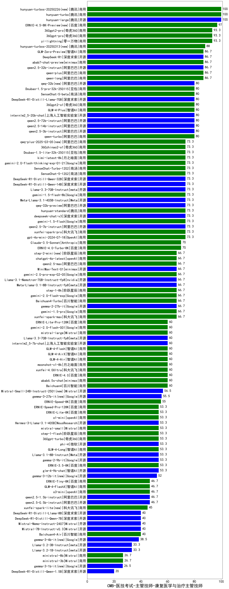

| 类别 | 大模型                         | CMB-医技考试-主管技师-康复医学与治疗主管技师 | 排名 |
|-----|------------------------------|---------|----|
|商用|hunyuan-large|100.0|1|
|商用|hunyuan-turbo|100.0|2|
|商用|hunyuan-turbos-20250226(new)|100.0|3|
|商用|360gpt-pro|93.3|4|
|商用|yi-lightning|93.3|5|
|商用|360gpt2-pro|93.3|6|
|开源|qwen2.5-32b-instruct|86.7|7|
|商用|qwen-plus|86.7|8|
|商用|abab7-chat-preview|86.7|9|
|开源|DeepSeek-R1|86.7|10|
|商用|qwen-long|86.7|11|
|商用|GLM-Zero-Preview|86.7|12|
|开源|internlm2_5-20b-chat|80.0|13|
|商用|GLM-4-Plus|80.0|14|
|开源|qwen2.5-72b-instruct|80.0|15|
|商用|Doubao-1.5-pro-32k-250115|80.0|16|
|开源|qwq-32b(new)|80.0|17|
|商用|SenseChat-5-beta|80.0|18|
|商用|360gpt2-o1|80.0|19|
|开源|DeepSeek-R1-Distill-Llama-70B|80.0|20|
|开源|qwen2.5-14b-instruct|80.0|21|
|开源|qwen2.5-3b-instruct|80.0|22|
|商用|qwen-turbo|80.0|23|
|开源|qwen2.5-7b-instruct|73.3|24|
|商用|gpt-4o-mini-2024-07-18|73.3|25|
|商用|gemini-2.0-flash-thinking-exp-01-21|73.3|26|
|开源|Meta-Llama-3.1-405B-Instruct|73.3|27|
|商用|gemini-1.5-flash-8b|73.3|28|
|开源|Llama-3.3-70B-Instruct|73.3|29|
|开源|qwq-32b-preview|73.3|30|
|开源|DeepSeek-R1-Distill-Qwen-32B|73.3|31|
|商用|xunfei-spark-pro|73.3|32|
|商用|gemini-1.5-flash|73.3|33|
|商用|hunyuan-standard|73.3|34|
|开源|deepseek-chat-v3|73.3|35|
|商用|kimi-latest-8k|73.3|36|
|商用|Doubao-1.5-lite-32k-250115|73.3|37|
|商用|SenseChat-5-1202|73.3|38|
|开源|DeepSeek-R1-Distill-Qwen-14B|73.3|39|
|商用|360zhinao2-o1|73.3|40|
|商用|qwq-plus-2025-03-05(new)|73.3|41|
|商用|SenseChat-Turbo-1202|73.3|42|
|商用|ERNIE-4.0-Turbo-8K|70.0|43|
|商用|Claude-3.5-Sonnet|70.0|44|
|商用|step-2-mini(new)|66.7|45|
|商用|gemini-1.5-pro|66.7|46|
|商用|qwen2.5-max|66.7|47|
|商用|chatgpt-4o-latest|66.7|48|
|商用|xunfei-spark-max|66.7|49|
|商用|step-1-8k|66.7|50|
|商用|gemini-2.0-flash-exp|66.7|51|
|商用|Baichuan4-Turbo|66.7|52|
|开源|gemma-2-27b-it|66.7|53|
|开源|Meta-Llama-3.1-8B-Instruct-fp8|66.7|54|
|开源|Llama-3.1-Nemotron-70B-Instruct-fp8|66.7|55|
|商用|gemini-2.0-pro-exp-02-05|66.7|56|
|商用|MiniMax-Text-01|66.7|57|
|商用|abab6.5s-chat|60.0|58|
|商用|GLM-4-Air|60.0|59|
|商用|Baichuan4|60.0|60|
|开源|Llama-3.3-70B-Instruct-fp8|60.0|61|
|商用|mistral-large|60.0|62|
|商用|gemini-2.0-flash-001|60.0|63|
|商用|ERNIE-Lite-Pro-128K|60.0|64|
|开源|internlm2_5-7b-chat|60.0|65|
|商用|xunfei-4.0Ultra|60.0|66|
|商用|moonshot-v1-8k|60.0|67|
|商用|GLM-4-Flash|60.0|68|
|商用|ERNIE-4.0|60.0|69|
|商用|GLM-4-AirX|60.0|70|
|开源|Mistral-Small-24B-Instruct-2501(new)|56.5|71|
|开源|gemma-3-27b-it(new)|55.5|72|
|商用|ERNIE-Speed-8K|55.0|73|
|商用|ERNIE-Lite-8K|53.3|74|
|商用|ERNIE-Speed-Pro-128K|53.3|75|
|商用|o1-mini|53.3|76|
|开源|Hermes-3-Llama-3.1-405B|53.3|77|
|开源|gemma-2-9b-it|53.3|78|
|商用|ERNIE-3.5-8K|53.3|79|
|商用|GLM-4-Long|53.3|80|
|开源|Llama-3.1-8B-Instruct|53.3|81|
|开源|glm-4-9b-chat|53.3|82|
|商用|360gpt-turbo|53.3|83|
|商用|mistral-small|53.3|84|
|商用|step-1-flash|53.3|85|
|开源|phi-4|53.3|86|
|商用|ERNIE-Tiny-8K|46.7|87|
|开源|qwen2.5-0.5b-instruct|46.7|88|
|开源|qwen2.5-1.5b-instruct|46.7|89|
|商用|o3-mini|46.7|90|
|商用|GLM-4-FlashX|46.7|91|
|商用|xunfei-spark-lite(new)|45.0|92|
|开源|DeepSeek-R1-Distill-Llama-8B|40.0|93|
|开源|DeepSeek-R1-Distill-Qwen-7B|40.0|94|
|开源|Mistral-Nemo-Instruct-2407|40.0|95|
|商用|Baichuan4-Air|40.0|96|
|开源|Mistral-7B-Instruct-v0.3|40.0|97|
|开源|Llama-3.2-1B-Instruct|33.3|98|
|开源|Llama-3.2-3B-Instruct|33.3|99|
|商用|ministral-3b|26.7|100|
|商用|ministral-8b|26.7|101|
|开源|DeepSeek-R1-Distill-Qwen-1.5B|20.0|102|
|开源|Yi-1.5-34B-Chat|/|103|
|开源|Yi-1.5-9B-Chat|/|104|
|开源|qwen2.5-math-72b-instruct|/|105|

