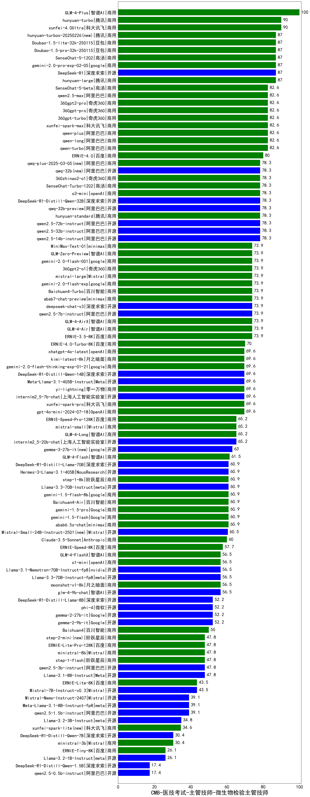

| 类别 | 大模型                         | CMB-医技考试-主管技师-微生物检验主管技师 | 排名 |
|-----|------------------------------|---------|----|
|商用|GLM-4-Plus|100.0|1|
|商用|ERNIE-4.5-8K-Preview(new)|98.0|2|
|商用|hunyuan-turbo|90.0|3|
|商用|xunfei-4.0Ultra|90.0|4|
|开源|DeepSeek-R1|87.0|5|
|开源|hunyuan-large|87.0|6|
|商用|Doubao-1.5-lite-32k-250115|87.0|7|
|商用|gemini-2.0-pro-exp-02-05|87.0|8|
|商用|Doubao-1.5-pro-32k-250115|87.0|9|
|商用|SenseChat-5-1202|87.0|10|
|商用|hunyuan-turbos-20250313(new)|87.0|11|
|商用|hunyuan-turbos-20250226(new)|87.0|12|
|商用|qwen-long|82.6|13|
|商用|qwen-turbo|82.6|14|
|商用|xunfei-spark-max|82.6|15|
|商用|qwen-plus|82.6|16|
|商用|360gpt-turbo|82.6|17|
|商用|SenseChat-5-beta|82.6|18|
|商用|360gpt-pro|82.6|19|
|商用|360gpt2-pro|82.6|20|
|商用|qwen2.5-max|82.6|21|
|商用|ERNIE-4.0|80.0|22|
|开源|qwq-32b(new)|78.3|23|
|商用|360zhinao2-o1|78.3|24|
|开源|DeepSeek-R1-Distill-Qwen-32B|78.3|25|
|商用|hunyuan-standard|78.3|26|
|开源|qwen2.5-32b-instruct|78.3|27|
|商用|o3-mini|78.3|28|
|商用|SenseChat-Turbo-1202|78.3|29|
|商用|qwq-plus-2025-03-05(new)|78.3|30|
|开源|qwen2.5-14b-instruct|78.3|31|
|开源|qwen2.5-72b-instruct|78.3|32|
|开源|qwq-32b-preview|78.3|33|
|商用|ERNIE-3.5-8K|73.9|34|
|商用|GLM-4-AirX|73.9|35|
|开源|qwen2.5-7b-instruct|73.9|36|
|开源|deepseek-chat-v3|73.9|37|
|商用|abab7-chat-preview|73.9|38|
|商用|Baichuan4-Turbo|73.9|39|
|商用|gemini-2.0-flash-exp|73.9|40|
|商用|mistral-large|73.9|41|
|商用|GLM-Zero-Preview|73.9|42|
|商用|gemini-2.0-flash-001|73.9|43|
|商用|GLM-4-Air|73.9|44|
|开源|MiniMax-Text-01|73.9|45|
|商用|360gpt2-o1|73.9|46|
|商用|ERNIE-4.0-Turbo-8K|70.0|47|
|商用|gpt-4o-mini-2024-07-18|69.6|48|
|商用|chatgpt-4o-latest|69.6|49|
|开源|DeepSeek-R1-Distill-Qwen-14B|69.6|50|
|商用|xunfei-spark-pro|69.6|51|
|开源|internlm2_5-7b-chat|69.6|52|
|商用|yi-lightning|69.6|53|
|开源|Meta-Llama-3.1-405B-Instruct|69.6|54|
|商用|kimi-latest-8k|69.6|55|
|商用|gemini-2.0-flash-thinking-exp-01-21|69.6|56|
|开源|internlm2_5-20b-chat|65.2|57|
|商用|GLM-4-Long|65.2|58|
|商用|mistral-small|65.2|59|
|商用|ERNIE-Speed-Pro-128K|65.2|60|
|开源|gemma-3-27b-it(new)|63.0|61|
|商用|GLM-4-Flash|61.5|62|
|商用|abab6.5s-chat|60.9|63|
|商用|Baichuan4-Air|60.9|64|
|商用|gemini-1.5-flash-8b|60.9|65|
|商用|step-1-8k|60.9|66|
|开源|DeepSeek-R1-Distill-Llama-70B|60.9|67|
|开源|Llama-3.3-70B-Instruct|60.9|68|
|开源|Hermes-3-Llama-3.1-405B|60.9|69|
|商用|gemini-1.5-flash|60.9|70|
|商用|gemini-1.5-pro|60.9|71|
|开源|Mistral-Small-24B-Instruct-2501(new)|60.5|72|
|商用|Claude-3.5-Sonnet|60.0|73|
|开源|gemma-3-12b-it(new)|59.5|74|
|商用|ERNIE-Speed-8K|57.7|75|
|商用|GLM-4-FlashX|56.5|76|
|开源|glm-4-9b-chat|56.5|77|
|商用|moonshot-v1-8k|56.5|78|
|开源|Llama-3.1-Nemotron-70B-Instruct-fp8|56.5|79|
|开源|Llama-3.3-70B-Instruct-fp8|56.5|80|
|商用|o1-mini|56.5|81|
|开源|gemma-2-27b-it|52.2|82|
|开源|gemma-2-9b-it|52.2|83|
|开源|DeepSeek-R1-Distill-Llama-8B|52.2|84|
|开源|phi-4|52.2|85|
|商用|Baichuan4|50.0|86|
|商用|ministral-8b|47.8|87|
|商用|step-2-mini(new)|47.8|88|
|商用|ERNIE-Lite-Pro-128K|47.8|89|
|商用|step-1-flash|47.8|90|
|开源|qwen2.5-3b-instruct|47.8|91|
|开源|Llama-3.1-8B-Instruct|47.8|92|
|开源|Mistral-7B-Instruct-v0.3|43.5|93|
|商用|ERNIE-Lite-8K|43.5|94|
|开源|gemma-3-4b-it(new)|40.0|95|
|开源|qwen2.5-1.5b-instruct|39.1|96|
|开源|Mistral-Nemo-Instruct-2407|39.1|97|
|开源|Meta-Llama-3.1-8B-Instruct-fp8|39.1|98|
|开源|Llama-3.2-3B-Instruct|34.8|99|
|商用|xunfei-spark-lite(new)|34.6|100|
|开源|gemma-3-1b-it(new)|31.5|101|
|开源|DeepSeek-R1-Distill-Qwen-7B|30.4|102|
|商用|ministral-3b|30.4|103|
|开源|Llama-3.2-1B-Instruct|26.1|104|
|商用|ERNIE-Tiny-8K|26.1|105|
|开源|qwen2.5-0.5b-instruct|17.4|106|
|开源|DeepSeek-R1-Distill-Qwen-1.5B|17.4|107|
|开源|qwen2.5-math-72b-instruct|/|108|
|开源|Yi-1.5-34B-Chat|/|109|
|开源|Yi-1.5-9B-Chat|/|110|

